> **Scalable Diffusion Models with Transformers** ([arXiv](https://arxiv.org/abs/2212.09748))  
> Year : 2023  
> Author : William Peebles, Saining Xie  
> Conference : ICCV  
{: .paper-info-box }

---

## Motivation

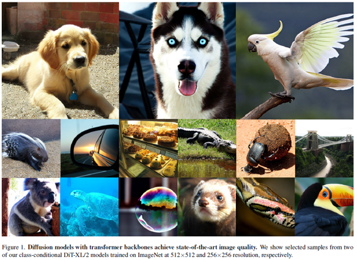_Motivation._

DiT (Diffusion Transformer)는 기존 U-Net 기반 diffusion 모델보다 더 자연스럽고 고품질의 이미지를 생성할 수 있음을 보여준다.  
이는 기존에 diffusion 모델의 성능에 필수적이라고 여겨졌던 U-Net의 inductive bias가 사실 필수적이지 않음을 시사하며, transformer 기반 아키텍처로도 충분히 경쟁력 있는 성능을 낼 수 있음을 증명합니다.

- 기존 diffusion 모델의 default backbone이었던 U-Net의 inductive bias를 제거하고자 제안된 모델
- Transformer의 scaling property를 diffusion에 적용하여 성능을 더욱 끌어올림

### Inductive Bias

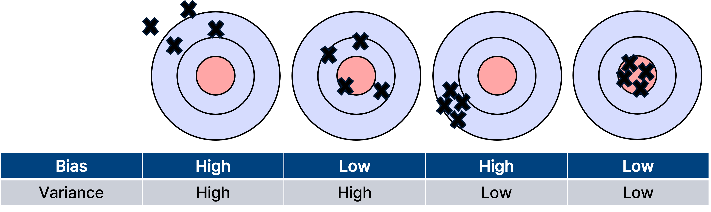_Bias._

기본적으로 bias는 타겟과 예측들의 평균의 차이를 의미하며 bias가 크다면 모델의 underfitting 가능성이 높아진다.

이때, inductive bias는 모델이 훈련 시 본 적 없는 입력에 대해 예측을 할 때 사용하는 사전적인 가정(prior assumption)을 의미한다.  
모델의 일반화 성능을 높이기 위해 의도적으로 부여되며, 학습 데이터로부터 얻을 수 없는 정보를 보완하는 역할을 한다다.

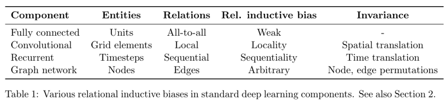_출처 : Google Research "Relational inductive biases, deep learning, and graph networks"._

이때 google research 에서 발표현 relational inductive biases, deep learning, and graph network 논문에 따르면, vision 정보는 인접 픽셀간의 locality가 존재한다.
따라서 convolutional component는 인접 픽셀간의 정보를 추출하기 위한 목적으로 설계되어 conv의 inductive bias가 local 영역에서 spatial 정보를 잘 뽑아낸다.
이와 반대로 Fully connected 즉 MLP는 all input to all output 관계로 모든 weight가 독립적이며 공유되지 않아 inductive bias가 매우 약하다.
이와 유사하게, transformer는 attention을 통해 입력 데이터의 모든 요소간의 관계를 계산하므로 CNN보다는 inductive bias가 작다.

결론적으로 CNN의 inductive bias는 "locality"에 기반하지만, transformer는 global 관계를 모델링하고 inductive bias가 약하다.  
이는 diffusion 모델에서 U-Net의 inductive bias가 없어도 global attention만으로 충분한 표현력을 가질 수 있음을 뒷받침한다.

### Scaling Law

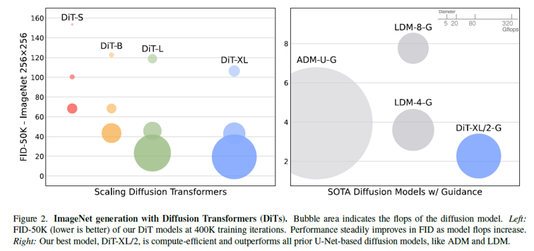_ImageNet generation with Diffusion Transformers._

기존 U-Net 기반 모델은 모델 크기를 늘릴 때 성능이 포화되는 문제가 있었지만 Transformer의 scaling law에 따라 모델 크기, depth, token 수가 증가할수록 성능이 향상되는 것을 확인할 수 있다.

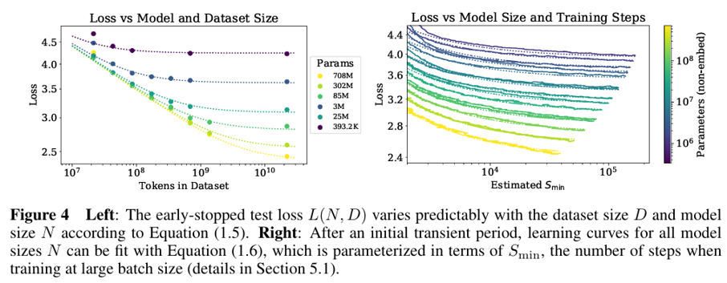_출처 : Scaling Laws for Neural Language Models._

Scaling Laws for Neural Language Models 논문을 통해 transformer은 모델의 크기, 데이터 양, 학습 연산량이 커질수록 성능이 좋아짐을 확인할 수 있다.
이에 Diffusion 모델의 backbone을 Transformer로 대체하면 scaling law의 이점을 diffusion에도 가져올 수 있으며, 더 큰 모델 → 더 많은 token → 더 깊은 layer가 곧 더 좋은 샘플 품질로 이어질 수 있음을 증명한한다.

--- 

## Diffusion

### Diffusion formulation(DDPMs)

1. Forward Process

Forward Process에서는 깨끗한 이미지에 점진적으로 노이즈를 추가하여 \( x_t \)를 만들어간다. 
이 과정은 다음과 같은 확률분포로 정의된다:

$$
q(x_t | x_0) = \mathcal{N}(x_t; \sqrt{\bar{\alpha}_t} x_0, (1 - \bar{\alpha}_t) I)
$$

- $x_0$: 원본 이미지
- $\bar{\alpha}_t$: time step $t$에서의 누적 noise scheduling 계수
- $I$: 단위 행렬

이 식은 정규분포로, mean과 variance로 forward 과정의 분포를 정의한다.

또한 reparameterization trick을 사용하여 다음과 같이 샘플링할 수 있다:

$$
x_t = \sqrt{\bar{\alpha}_t} x_0 + \sqrt{1 - \bar{\alpha}_t} \, \epsilon_t, \quad \epsilon_t \sim \mathcal{N}(0, I)
$$

여기서:

- $\epsilon_t$: $\mathcal{N}(0, 1)$로부터 샘플링된 Gaussian noise

forward 과정에서는 깨끗한 데이터 $x_0$에 noise $\epsilon_t$를 점진적으로 섞어 noisy sample $x_t$를 생성한다다.

1. Backward Process

Backward process는 noisy한 상태 $x_t$로부터 더 clean한 $x_{t-1}$를 복원하는 확률분포를 학습하는 과정이다:

$$
p_\theta(x_{t-1} | x_t) = \mathcal{N}(\mu_\theta(x_t), \Sigma_\theta(x_t))
$$

- $\mu_\theta(x_t)$: neural network가 예측하는 mean
- $\Sigma_\theta(x_t)$: neural network가 예측하는 variance

forward로 노이즈를 추가한 분포를 반대로 되돌리기 위해 mean과 variance를 neural network로 학습한다다.

3. Loss (Noise Prediction)

Diffusion 모델은 noise 예측 모델로 훈련되며, loss function은 다음과 같다다:

$$
L_{\text{simple}}(\theta) = \left\| \epsilon_\theta(x_t) - \epsilon_t \right\|^2
$$

- $\epsilon_\theta(x_t)$: 모델이 예측한 noise
- $\epsilon_t$: ground truth noise

모델은 $x_t$에서 noise를 얼마나 정확하게 예측했는지를 MSE loss로 학습합니다.

### Classifier-free guidance

Classifier-free guidance에서는 다음과 같은 gradient를 기반으로 guidance를 적용한다:

$$
\nabla_x \log p(c | x) = \nabla_x \log p(x | c) - \nabla_x \log p(x)
$$

이는 Bayes Rule에서 유도되며, 원하는 조건에 맞는 샘플을 생성하도록 gradient를 조정한다.

Diffusion 모델의 출력은 사실상 score function $\nabla_x \log p(x | c)$과 유사하다고 해석할 수 있다.

이때, noise prediction은 다음과 같이 수정된다:

$$
\hat{\epsilon}_\theta(x_t, c) = \epsilon_\theta(x_t, \emptyset) + s \left( \epsilon_\theta(x_t, c) - \epsilon_\theta(x_t, \emptyset) \right)
$$

- $\epsilon_\theta(x_t, \emptyset)$: 조건 없이 (unconditional) 예측된 noise
- $\epsilon_\theta(x_t, c)$: 조건부 (conditional)로 예측된 noise
- $s$: guidance scale (스케일이 1보다 클수록 조건을 더 강하게 반영)

조건 없는 예측과 조건 있는 예측의 차이를 스케일링하여 샘플링 시 조건에 더 부합하도록 조정합니다.

예를 들어:

- $s = 1$: 일반적인 샘플링
- $s > 1$: 더 조건에 맞춘 샘플링 (강한 guidance)

### Latent diffusion models

고해상도 이미지에서 직접 diffusion을 적용하면 계산량이 매우 큼
이를 해결하기 위해 Latent Diffusion Model (LDM)을 사용함
이미지를 먼저 VAE Encoder를 통해 압축된 latent space로 매핑하고, 이 latent 공간에서 diffusion 모델을 학습함
이후 샘플링된 latent를 VAE Decoder로 다시 복원하여 최종 이미지를 얻음
덕분에 연산량이 대폭 줄어들면서도 고해상도 이미지를 생성할 수 있음

## Proposed Method

### Overview

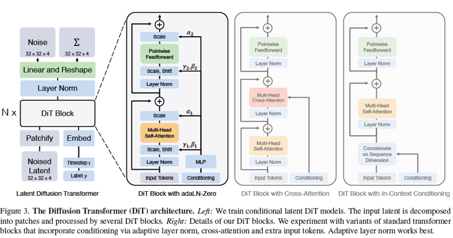_Overview._

1. Input Image (256x256x3)

2. VAE Encoder -> Latent (32x32x4)

3. DiT

4. VAE Decoder -> construct Image

### Diffusion Transformer Design Space

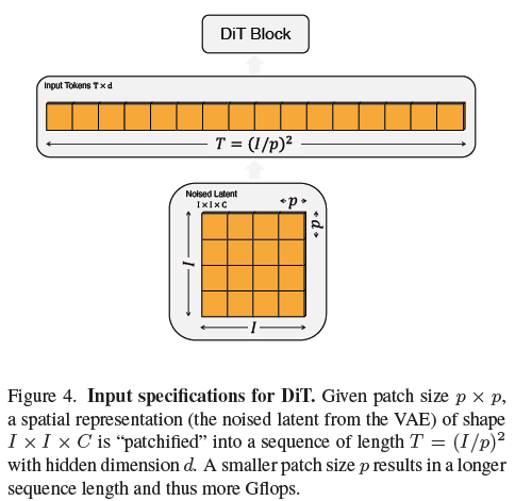_Patchify._

- Sequence 형태로 처리
- Patch size가 감소할 시 token이 늘어남
  - 모델의 표현력 증가
  - 연산량 증가

이때 transformer block을 다양하게 구성하여 실험을 진행한다.

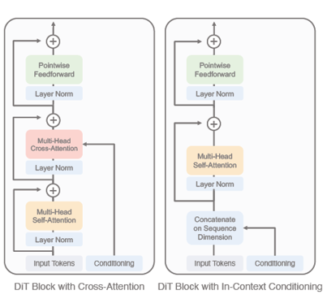_cross attention, in-context conditioning block._

Cross-attention block
- timestep과 class embedding을 별도의 sequence로 생성
- Transforemr block안에 cross attention 구조를 추가
- 추가적인 Gflops는 들짐나 conditioning 효과는 좀 더 명확함

In-context conditioning
- timestep과 class label embedding을 CLS 토큰과 유사한 방식으로 추가
- 일반 ViT 스타일로 함께 transformer에 입력
- 별도의 cross-attention layer 없이 간단하게 구현 가능하다는 장점이 있음

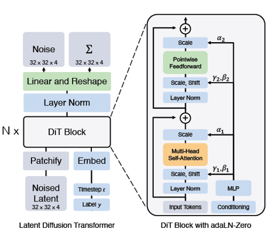_adaLN, adaLN-Zero block._

Adaptive layer norm (adaLN) block
- 일반적인 layer norm을 adaptive normalization layer로 교체 
- timestep과 class 정보를 받아서 scale(γ), shift(β)를 동적으로 결정
- 적은 Gflops와 높은 계산 효율성을 보임

adaLN-Zero block
- adaLN을 확장해서, residual connection 직전 스케일 파라미터(α)를 추가
- 초기에는 α를 0으로 설정, 이후에 최적값으로 학습
- 학습 안정성이 대폭 향상되고, 최종 성능도 향상됨

기본적으로 normalization layer는 입력을 평균 0, 분산 1로 정규화 하는 과정을 의미하는데 이때 scale과 shift를 고정시킨다.
이때 Adaptive normalization은 scale과 shift를 timestep 정보, class conditioning 정보를 받아 동적으로 활용한다.

---

## Experiment

### DiT block result

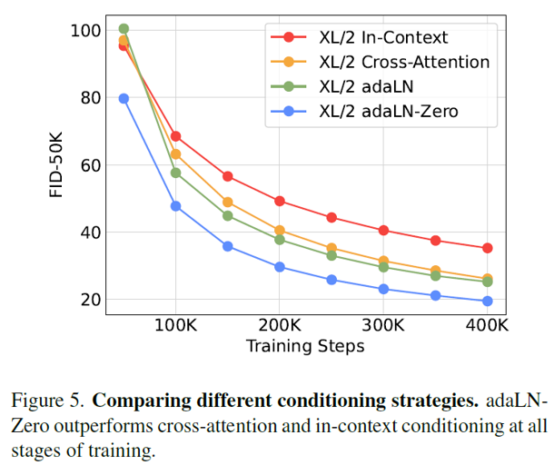_Comparing block._

### Ablation analysis

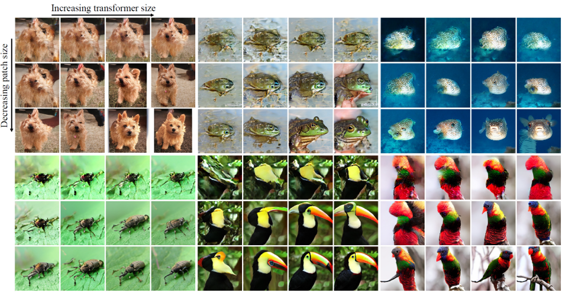_result visualize._

_model scale._

Transformer 크기를 키우거나, 더 많은 토큰을 사용하면, diffusion 모델의 성능(FID)이 전반적으로 좋아짐
모델을 더 크게 만들면 (depth/width 키우기): Training iteration이 같아도 FID가 훨씬 낮아짐
Patch size를 줄이면 (더 많은 token 사용): 모델 사이즈는 비슷하지만 성능이 더 좋아짐

_model size._

작은 모델은 아무리 오래 학습해도, 결국 큰 모델을 넘어설 수 없음
Training compute가 커질수록, 큰 DiT 모델이 훨씬 더 효율적임

### Comparison

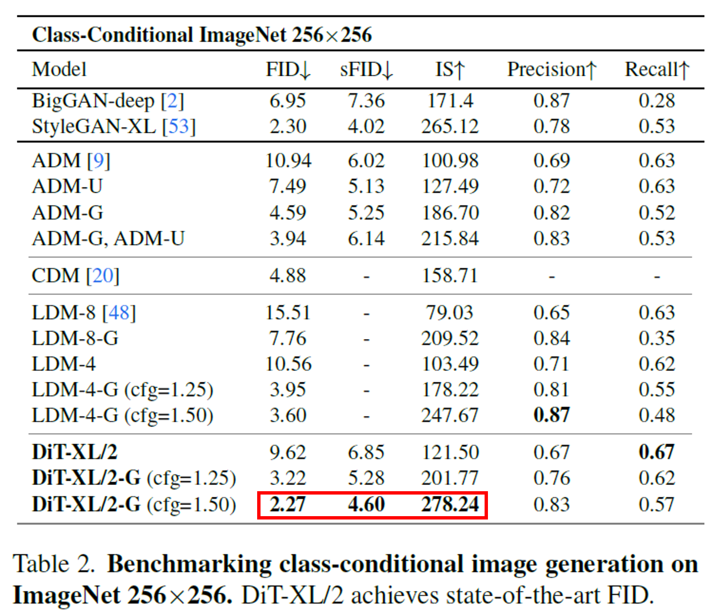_SOTA comparison._

DiT는 U-Net을 쓰지 않고도 기존 SOTA를 넘어섰다.
Guidance를 적용했을 때 성능이 극적으로 올라간다.

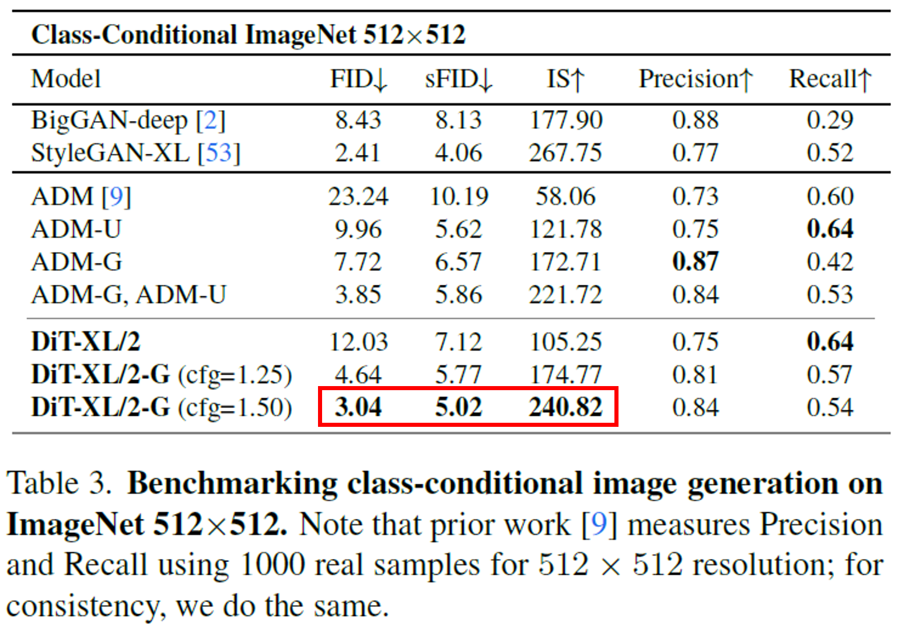_SOTA comparison._

역시 guidance를 사용하면 성능이 크게 향상됨.
계산량(Flops) 대비 성능 효율성도 여전히 매우 뛰어남.

---

## Conclusion
