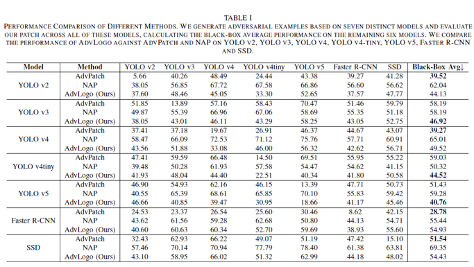

> **AdvLogo: Adversarial Patch Attack against Object Detectors based on Diffusion Models** ([arXiv](https://arxiv.org/abs/2409.07002))  
> Year : 2025  
> Author : Boming Miao et al.  
> arxiv  
{: .paper-info-box }

---

## Motivation

_Fig 1._

기존의 적대적 패치(Adversarial Patch)는 물리적 환경(실제 환경)에도 사용 가능하다는 장점이 있지만, 시각적으로 눈에 띄는 패턴이 많아 실제 환경에서 방어에 취약하다는 단점이 있다. 
본 논문은 이러한 한계를 극복하고자 시멘틱 관점에서의 패치 생성을 제안한다.

> 핵심적으로 시멘틱 공간(semantic space)에는 detector를 혼란스럽게 만드는 적대적 하위 공간(adversarial subspace)이 존재하며, 이를 diffusion 모델의 디노이징 과정에서 유도할 수 있음을 가정한다.

---

## Diffusion

### Forward process

디퓨전 모델의 forward process 과정은 다음과 같이 정의된다:

$$
\alpha_t = \prod_{s=1}^{t}(1 - \beta_s), \quad z_t = \sqrt{\alpha_T} z_0 + \sqrt{1 - \alpha_T} \epsilon, \quad \epsilon \sim \mathcal{N}(0, I)
$$

해당 수식은 클린 이미지에 점진적으로 가우시안 노이즈를 추가하여 완전히 랜덤한 latent로 만들어가는 과정을 나타낸다.

### Conditional distribution

조건부 분포를 예측하는 네트워크는 다음과 같이 정의된다:

$$
\epsilon_\theta(z_t, C, \phi_t) = \epsilon_\theta(z_t, \phi_t) + \omega \cdot (\epsilon_\theta(z_t, C) - \epsilon_\theta(z_t, \phi_t))
$$

- $\epsilon_\theta$: 조건부 분포 예측 네트워크  
- $\omega$: guidance scale  
- $C$: 고정된 텍스트 임베딩  
- $\phi_t$: timestep $t$에서의 unconditional embedding  

해당 수식은 classifier-free guidance 구조를 기반으로, 조건이 주어졌을 때의 예측과 조건이 없는 경우의 예측간의 차이를 통해 조건의 효과를 강화한다.
$\omega$ 값이 클수록 조거의 영향을 강하게 반영하며, 작은 값을수록 unconditional 결과에 더 가깝게 denoising이 진행된다.

### Last step

마지막 스텝 $T$에서 latent와 unconditional embedding을 동시에 최적화하여 adversarial logo를 생성한한다:

$$
z_T^*, \phi_T^* = \arg\min_{z_T, \phi_T} \mathcal{L}_{det}(f_\theta, x, \Omega(z_T, C, \phi_T, ..., \phi_1))
$$

대퓨전의 마지막 스템에서만 latent 와 unconditional embedding을 조정하여 공격 성능을 높이고자 한다.
전체 스텝에서 매번 최적화를 하기에는 계산량이 매우 크기 때문에, 가장 효율적인 시점인 마지막 스텝에서만 최적화를 수행한다.

---

## Method

_Overview._

전체적인 방법론은 위의 그림과 같다.

방법론은 다음과 같다.

우선, 클린한 이미지에 forward process를 통해 노이즈를 추가하여 noisy latent를 생성한다.
그 후 노이즈 latent를 frequency domain으로 변환한다. 이는 시각적 품질을 유지하며 perturbation을 가하기 위한 핵심 과정이다.
변환한 latent는 detection loss를 기준으로 최적화를 진행한다. 이때 frequency domain latent와 unconditional embedding 두 요소를 동시에 최적화하여 object detector를 혼란스럽게 유도한다.
다음으로, perturbation이 적용된 frequency latent를 spatial domain으로 변환하며, 최적화된 결과를 text prompt embedding을 기반으로 DDIM을 통해 이미지를 복원하고 패치 형태로 출력한다.
패치를 최적화 하기 위해 입력 이미지의 타겟 객체 위에 부착하며 패치가 적용된 이미지를 detector에 넣고 해당 결과의 confidence를 기반으로 loss를 계산하다.
이 과정을 반복하여 최적화를 진행한다. 

### Latent Frequency Domain

latent $z_T$를 4차원 푸리에 변환하여 frequency domain으로 변환하고, 그 위에서 perturbation을 적용한다:

$$
\tilde{z}_T(k_1, k_2, k_3, k_4) = \sum_{n_1=1}^{d_1} \sum_{n_2=1}^{d_2} \sum_{n_3=1}^{d_3} \sum_{n_4=1}^{d_4} z_T(n_1, n_2, n_3, n_4) \cdot \exp\left(-2\pi i \sum_{l=1}^4 \frac{k_l n_l}{d_l} \right)
$$

이때 $\tilde{z}_T$의 각 주파수 성분은 $z_T$의 모든 위치 정보를 통합하고 있는 것을 수식으로 확인할 수 있다. 
이에 단일 frequency component를 조작하는 것만으로도 이미지 전체의 의미적 구조에 영향을 줄 수 있음을 알 수 있다.  
따라서 frequency domain에서의 perturbation은 더 정교하고 전역적인 조정이 가능하며, 이는 latent 분포를 크게 흔들지 않으면서도 더 자연스럽고 은닉적인 adversarial 패치 생성을 가능하게 한다.

이후 PGD 방식으로 다음과 같이 업데이트된다:

$$
\tilde{z}_T \leftarrow \tilde{z}_T - \alpha \cdot \text{sign}\left( \nabla_{\tilde{z}_T} \mathcal{L}_{det} \right)
$$

최종적으로 IFFT를 통해 spatial domain으로 복원:

$$
z_T(n_1, ..., n_4) = \frac{1}{\prod d_l} \sum_{k_1=1}^{d_1} \cdots \sum_{k_4=1}^{d_4} \tilde{z}_T(k_1, ..., k_4) \cdot \exp\left(2\pi i \sum_{l=1}^4 \frac{k_l n_l}{d_l} \right)
$$

### Unconditional Embedings Optimization

Unconditional embedding $\phi_T$ 역시 detection loss에 대해 다음과 같이 업데이트된다:

$$
\phi_T \leftarrow \phi_T - \beta \nabla_{\phi_T} \mathcal{L}_{det}
$$

### Gradient Approximation

전체 denoising 과정을 고려한 gradient 계산은 아래와 같이 chain rule을 따른다:

$$
\nabla_{\tilde{z}_T} \mathcal{L}_{det} = \frac{\partial \mathcal{L}_{det}}{\partial z_0} \cdot \frac{\partial z_0}{\partial z_1} \cdots \frac{\partial z_{T-1}}{\partial z_T} \cdot \frac{\partial z_T}{\partial \tilde{z}_T}
$$

이를 근사화하면:

$$
\nabla_{\tilde{z}_T} \mathcal{L}_{det} \approx \nabla_{z_0} \mathcal{L}_{det} \left( \sqrt{\frac{1}{\alpha_{T-1}}} \frac{\partial z_T}{\partial \tilde{z}_T} + \sqrt{\frac{\alpha_T - \alpha_{T-1}}{\alpha_T \alpha_{T-1}}} \frac{\partial \epsilon_\theta(z_T)}{\partial \tilde{z}_T} \right)
$$

---

### Algorithm

_Algorithm._

위의 방법론을 알고리즘으로 나타내면 위의 그림으로 나타낼 수 있다.

---

## Experiments

### Setup
- **Dataset**: INRIA Person  
- **Target Class**: Person  
- **Base Diffusion**: Stable Diffusion v2.1  
- **Detection Models**: YOLO v2/v3/v4/v5, YOLO v4-tiny, Faster R-CNN, SSD  
- **Patch Size**: \(512 \times 512\)

### Result

_Main Result._

- AdvLogo는 NAP보다 전반적으로 더 높은 black-box 공격 성능을 보였고, AdvPatch보다 시각적 품질이 뛰어남을 알 수 있음.
- 특히 YOLO v2 및 v4에서 NAP 대비 각각 17.91%, 15.49%의 성능 향상을 보임.

_Visual Quality._

- AdvLogo-Hybrid는 NAP보다 높은 aesthetic score를 달성함.
- Frequency domain에서의 perturbation은 spatial domain보다 시각적 손실이 적음.

_Optimization Strategy 비교._

- latent와 embedding을 동시에 최적화했을 때 성능이 가장 높음.
- 단독 최적화보다 복합 전략이 효과적임을 검증.

---

## Conclusion

AdvLogo는 diffusion 기반의 semantic 공간을 활용하여 새로운 적대적 패치 공격 프레임워크를 제안하였다. 
다음과 같은 강점을 가진다:

- Latent의 frequency domain에서 perturbation을 적용하여 시각적 품질을 보존
- Unconditional embedding을 함께 최적화하여 공격 성능 강화
- 다양한 object detector에 대해 강한 transferability와 robustness

해당 접근은 추후 semantic space 기반의 공격 설계와 방어 전략 수립에 있어서 중요한 통찰을 제공할 수 있다.
