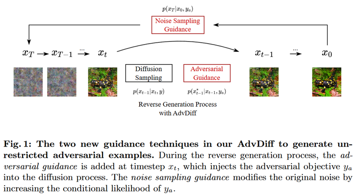
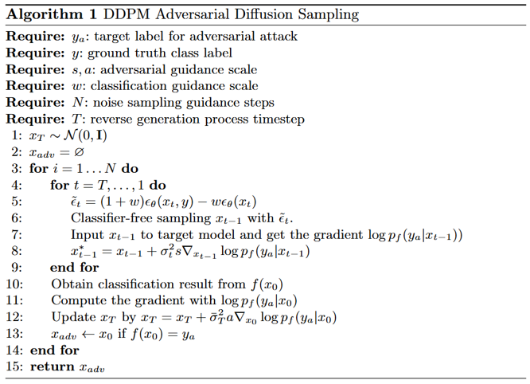
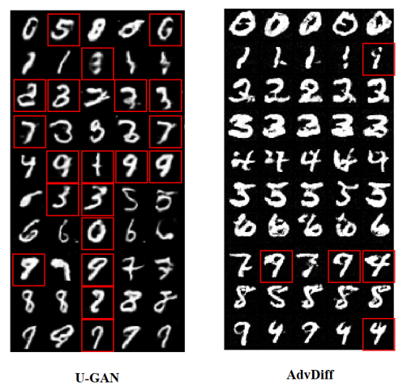
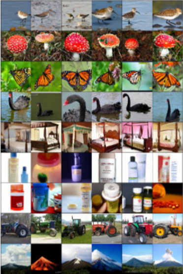
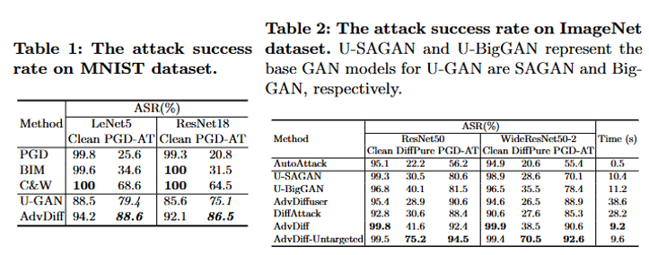
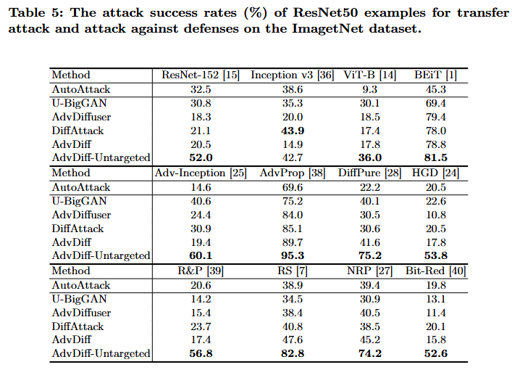
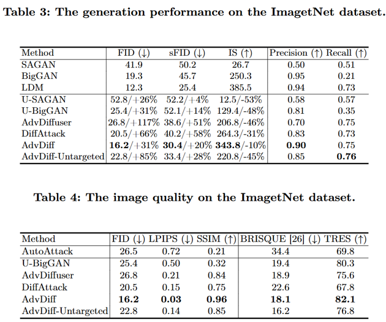

> **AdvDiff: Generating Unrestricted Adversarial Examples using Diffusion Models** ([arXiv](https://arxiv.org/abs/2307.12499))  
> Year : 2024  
> Author : Xuelong Dai et al.  
> ECCV
{: .paper-info-box }

---

## Introduction

### Key Idea
_Fig 1._

AdvDiff는 pre-trained diffusion model을 이용하여 Unrestricted Adversarial Examples (UAE)를 생성하는 기법이다. 
기존의 GAN 기반 공격은 저차원 latent에 직접 gradient를 더함으로써 이미지 품질 저하와 레이블 전도(flipped-label) 문제가 발생했다. 
이에 반해, AdvDiff는 확산 모델의 해석 가능한 샘플링 과정에 gradient를 삽입하여 고품질의 adversarial example을 생성한다.

---

## Background

### Diffusion(DDPM)

Diffusion 모델은 데이터 $x_0 \sim q(x_0)$를 가우시안 노이즈를 더하며, 이를 역으로 복원하는 방식으로 학습된다.

#### Forward Process

$$
q(\mathbf{x}_t | \mathbf{x}_{t-1}) := \mathcal{N}(\mathbf{x}_t; \sqrt{1 - \beta_t} \mathbf{x}_{t-1}, \beta_t \mathbf{I})
$$

- $\mathbf{x}_{t-1}$: 이전 timestep의 이미지
- $\mathbf{x}_t$: 현재 timestep의 이미지
- $\beta_t$: timestep $t$에서 사용하는 noise intensity (스케줄링됨)
- $\mathcal{N}(\mu, \Sigma)$: 평균 $\mu$, 공분산 $\Sigma$를 갖는 가우시안 분포

해당 수식은 이전 이미지에 약간의 노이즈를 추가해 다음 timestep 이미지를 생성하는 과정으로, $\sqrt{1 - \beta_t}$는 signal을 유지하고, $\beta_t$는 noise를 제어하는 역할을 가진다.

#### Backward Process

$$
p_\theta(\mathbf{x}_{t-1} | \mathbf{x}_t) := \mathcal{N}(\mathbf{x}_{t-1}; \mu_\theta(\mathbf{x}_t, t), \Sigma_\theta(\mathbf{x}_t, t))
$$

- $\mu_\theta$: 학습된 평균 예측 함수 (Neural Network)
- $\Sigma_\theta$: 학습된 분산 예측 함수 (일반적으로 고정됨)

해당 과정은 노이즈 상태의 이미지 $\mathbf{x}_t$로부터 원래의 이미지 $\mathbf{x}_0$를 복원하는 denoising sampling이다.

#### Loss Function

$$
L_{\text{DDPM}} := \mathbb{E}_{t \sim [1,T], \epsilon \sim \mathcal{N}(0, \mathbf{I})} \| \epsilon - \epsilon_\theta(\mathbf{x}_t, t) \|^2
$$

- $\epsilon$: 실제로 더해진 noise (ground truth)
- $\epsilon_\theta(\mathbf{x}_t, t)$: 모델이 timestep $t$에서 예측한 noise
- $\| \cdot \|^2$: L2 loss (MSE)

diffusion model은 복원하고자 하는 이미지를 직접 예측하는 것이 아니라, 얼마나 noise가 섞였는지를 예측하여 이미지를 복원한다.

### Classifier-Guided Guidance

$$
\hat{\mu}_\theta(\mathbf{x}_t, t) = \mu_\theta(\mathbf{x}_t, t) + s \cdot \nabla_{\mathbf{x}_t} \log p_\phi(y | \mathbf{x}_t)
$$

- $p_\phi(y|\mathbf{x}_t)$: classifier가 $\mathbf{x}_t$를 클래스 $y$로 분류할 확률
- $\nabla_{\mathbf{x}_t}$: 입력에 대한 gradient
- $s$: guidance scale (크면 classifier의 영향을 많이 받음)

classifier의 로그 확률을 증가시키는 방향으로 샘플을 수정함으로써, 조건부 생성(class-conditional generation)을 가능하게한다.

### Classifier-Free Guidance

$$
\hat{\epsilon}_\theta(\mathbf{x}_t | y) = \epsilon_\theta(\mathbf{x}_t | \emptyset) + w \cdot (\epsilon_\theta(\mathbf{x}_t | y) - \epsilon_\theta(\mathbf{x}_t | \emptyset))
$$

- $w$: guidance weight
- $\epsilon_\theta(\cdot | y)$: label-conditioned noise prediction
- $\epsilon_\theta(\cdot | \emptyset)$: unconditional noise prediction

classifier 없이도 label 정보를 활용할 수 있게 해주는 구조로 $\epsilon_\theta(\cdot | y)$가 생성하고자 하는 클래스의 특성을 반영한다.

---

## AdvDiff: Adversarial Guidance

### 1. Reverse Process에 adversarial gradient 주입

기존 샘플링:

$$
\mathbf{x}_{t-1} = \mu(\mathbf{x}_t, y) + \sigma_t \epsilon
$$

Adversarial guidance 적용:

$$
\mathbf{x}_{t-1}^* = \mathbf{x}_{t-1} + \sigma_t^2 s \cdot \nabla_{\mathbf{x}_{t-1}} \log p_f(y_a | \mathbf{x}_{t-1})
$$

- $y_a$: 공격 대상 클래스
- $p_f(y_a|\cdot)$: target classifier의 예측 확률
- $\nabla_{\mathbf{x}} \log p$: 예측 확률을 높이는 방향의 gradient

Reverse sampling 중간에 adversarial objective를 삽입함으로써 공격력이 생기고, 동시에 생성 품질은 유지한다.

---

### 2. Initial Noise에 공격적 prior 삽입

$$
\mathbf{x}_T = (\mu(x_0, y) + \sigma_T \epsilon) + \sigma_T^2 a \cdot \nabla_{x_0} \log p_f(y_a | x_0)
$$

- $x_T$: sampling 시작 시점의 노이즈
- $a$: noise guidance scale

시작 노이즈 단계에서부터 adversarial signal을 주입해 sampling 전체 경로를 목표 label로 유도한다.

---

## Regularization (Optional)

### Total Variation (TV) Loss

$$
TV(m_{ij}) = \sum_{m=-1}^{1} \sum_{n=-1}^{1} |m_{i+m,j+n} - m_{ij}|
$$

- $m_{ij}$: 이미지의 픽셀 intensity
- 주변 이웃과의 차이의 절댓값 합

TV는 이미지의 스무딩(smoothness)을 기법으로, 불필요한 노이즈 제거에 유리하다. 
AdvDiff가 추가할 수 있는 regularizer이다.

---

## Algorithm

_Algorithm._

---

## Experiments

### Visualization

_Mnist visualization._

_ImageNet visualization._

### Attack Success Rates

_Attack success rates (Table 1, Table 2)._

Table 1
- PGD, BIM, C&W는 perturbation 기반 공격이며, adversarial training (PGD-AT)된 모델에 대해 방어에 성공하는 모습을 보임 (ASR 급감).
- U-GAN과 AdvDiff는 unrestricted attack 방식으로, perturbation 공격보다 훨씬 높은 ASR 유지.
- 특히 AdvDiff는 U-GAN보다도 높은 ASR을 보여주며, MNIST에서도 강력한 성능을 입증.

Table 2
- AdvDiff는 모든 방어 기법에 대해 최고 또는 최상위 수준의 공격 성공률을 기록.
- U-GAN 대비 이미지 품질 향상, DiffAttack 대비 속도 향상, Diffuser 대비 효율성 우위.

AdvDiff가 PGD-AT처럼 방어된 모델도 AdvDiff는 86~88% 공격 성공률을 보이며 우회 가능함을 보여주며 ImageNet의 대규모 복잡한 분류 모델에도 우수한 공격 성공률과 효율적인 속도를 동시에 달성함을 보임

_Transferability (Table 5)._

Table 5
- advDiff-Untargeted가 대부분의 모델에 대해 가장 높은 전이 성능을 보임.
- BEiT, ViT-B 같은 Vision Transformer 계열에도 잘 작동함

현존하는 대부분의 방어 기법조차 AdvDiff를 완전히 막지 못하며, 특히 untargeted 설정에서 압도적인 우회 성공률을 보임.

### Image Quality

_Image Quality (Table 3, Table 4)._

AdvDiff는 U-GAN 대비 훨씬 높은 precision과 IS, 그리고 적절한 recall로 시각 품질을 유지하면서도 공격 효과를 높이며 거의 원본 수준의 품질(높은 SSIM, 낮은 LPIPS)을 유지하면서도 공격 효과를 달성함을 보임

---

## Conclusion

AdvDiff는 diffusion 모델의 확률적 샘플링을 그대로 유지하면서 공격 목적의 gradient를 세밀하게 주입함으로써 unrestricted adversarial example을 생성한다. 
AdvDiff는 수식 기반으로 해석 가능하며, classifier-guided / classifier-free guidance 모두 적용할 수 있는 구조를 가진다. 
