## VLM

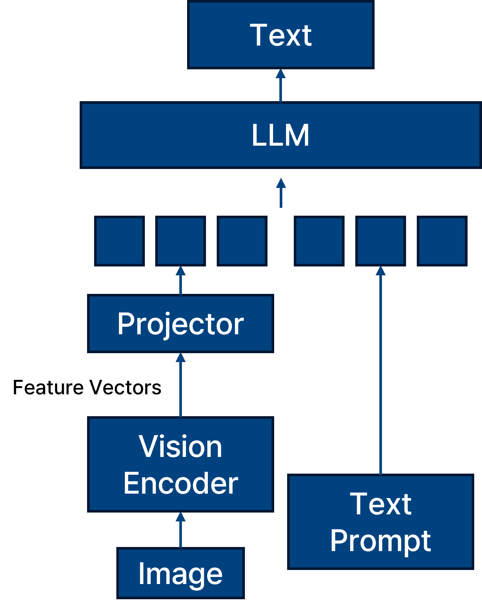_Vision Language Model._

VLM은 Vision-Language Model로, vision encoder와 text prompt를 결합하여 LLM 모델에 입력하는 멀티모달 구조를 가진다.

이러한 구조는 텍스트와 이미지 간의 상호작용을 학습하여, 이미지 설명 생성, VQA(Visual Question Answering), 이미지 기반 추론 등 다양한 task에서 활용된다. 
따라서 VLM은 vision과 language의 representation learning이 결합된 형태이며, 두 modality 각각과 상호작용 구조에서의 취약점이 존재할 수 있다.

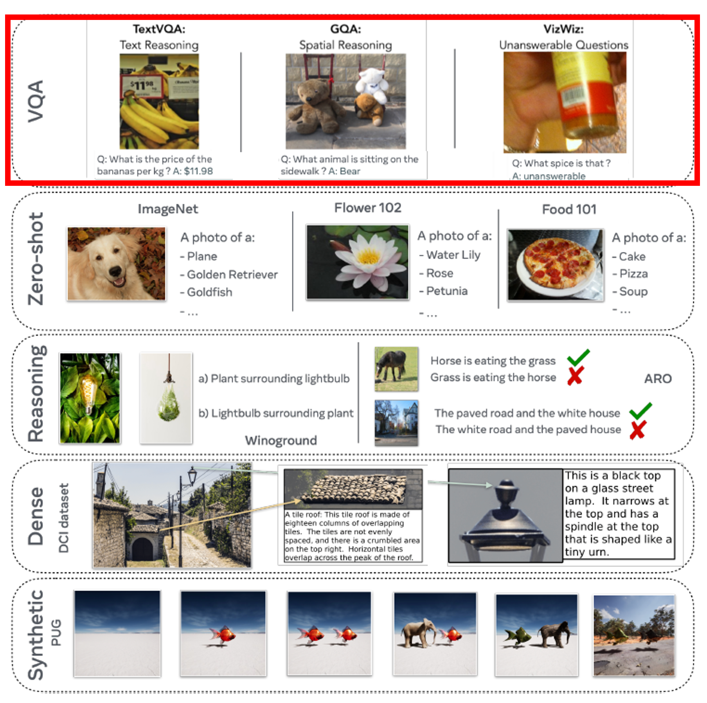_Bordes, Florian, et al. "An introduction to vision-language modeling." arXiv preprint arXiv:2405.17247 (2024)._

Privacy 연구에서는 주로 VQA (Visual Question Answering) task를 활용한다.

그 이유는 VQA task는 입력 이미지와 질문(prompt)을 바탕으로 정답을 생성해야 하므로, 입력-출력 간의 관계가 직관적으로 드러난다. 이로 인해 membership inference, memorization 등 privacy 공격에 대한 분석이 용이하다.

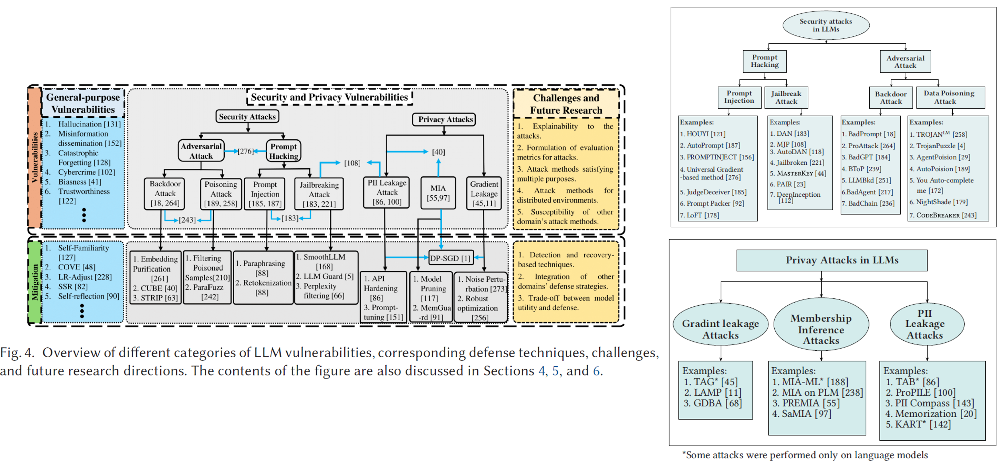_Das, Badhan Chandra, M. Hadi Amini, and Yanzhao Wu. "Security and privacy challenges of large language models: A survey." ACM Computing Surveys 57.6 (2025): 1-39._

LLM 기반 VLM 모델도 기존의 vision model과 유사한 보안 취약점(Security) 및 개인정보 침해 취약점(Privacy)을 함께 가진다.

특히 Security 측면에서는 Prompt Injection (또는 Prompt Hacking) 이라는 새로운 공격 유형이 존재한다. 이는 모델의 기대된 동작을 유도하거나 무력화하기 위해 crafted prompt를 사용하는 공격 방식으로, LLM이 자연어 명령에 민감하게 반응하는 특성을 악용한다.

## SVLM

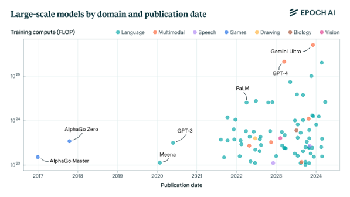_Epoch AI._

LLM 모델의 크기가 커짐에 따라 VLM 역시 크기가 커지고 있으며 최근 많이 사용하고 있는 GPT-4 가 그 예이다. 

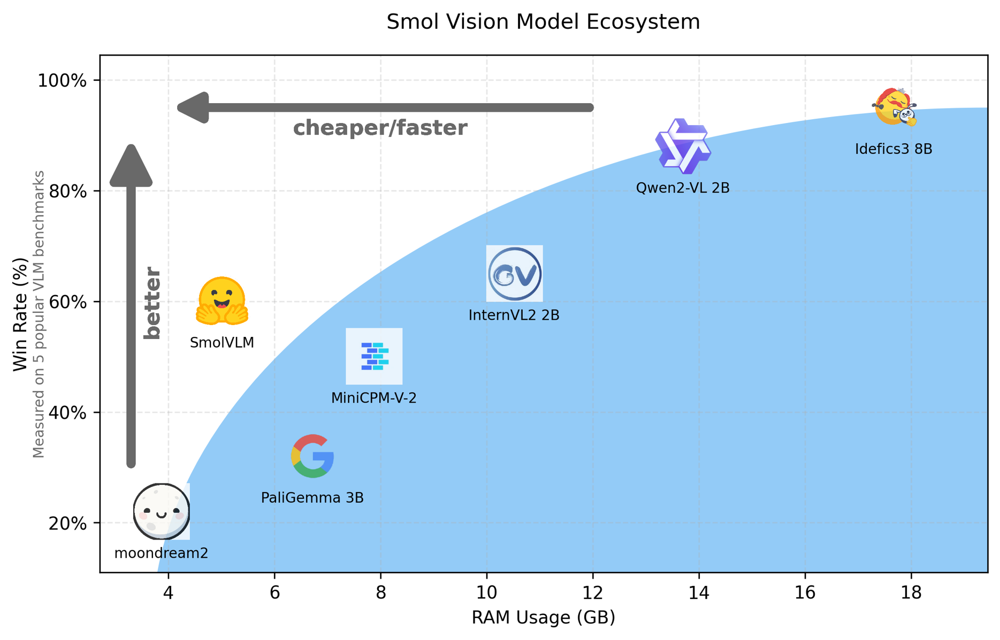_Marafioti, Andrés, et al. "Smolvlm: Redefining small and efficient multimodal models." arXiv preprint arXiv:2504.05299 (2025)._

동시에 연산 자원이 한정된 환경에서도 사용할 수 있도록 SVLM에 대한 연구도 증가하고 있다.
이러한 SVLM은 학습 및 추론에 드는 자원을 줄이고 모바일, 엣지 디바이스, 의료기기 등에서 실용성을 확보하려는 목적을 가진다.

대표적인 크기가 작은 svlm 모델로는 

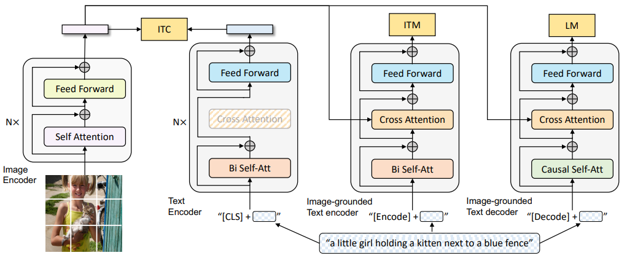_BILD._

2022년에 발표된 BILD.
BILD는 서로 짝지어져 있지 않은 텍스트와 이미지 데이터만으로 vision language 모델을 사전학습할 수 있는 방법을 제안한다.
이는 기존 VLM이 대규모의 짝지어진 이미지-텍스트 쌍을 필요로 하는 한게점을 극복한 접근인다.

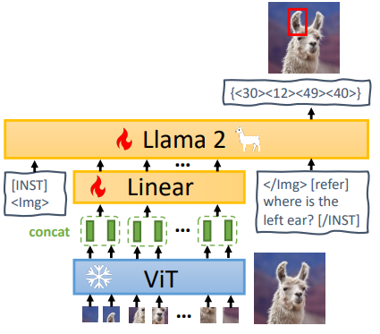_MiniGPT-2._

2023년에 발표된 MiniGPT-2.
MiniGPT는 LLM과 ViT기반 Vision Encoder를 결합한 경량화된 vision language 모델로 대규모 LLM을 그대로 쓰는 대신 경량화된 GPT와 사전학습된 vision encoder를 연결하여 학습 비용을 낮췄다.

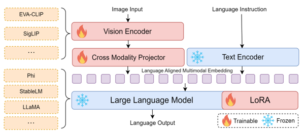_nanoLLava._

2024년에 발표된 nanoLLava
nanoLLava는 LLaVA의 경량화된 버전으로, 모델 크기가 1B이하이며 모바일 장치나 경량 서버에서 실행 가능하다.
모델의 구조는 LLaVA의 구조를 계승했다.

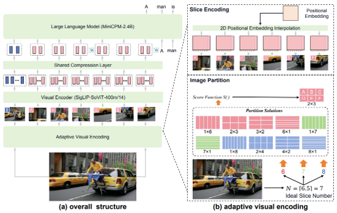_miniCPM._
2024년에 발표된 miniCPM
miniCPM은 CPM 게열의 경량화된 모델로, 일부 버전은 vision encoder를 연결하여 VQA, image caption등의 태스크도 수행이 가능하며 스마트노, 로컬 서버에서 실행 가능한 수준이다.

소개한 모델 이외에도 다양한 모델들이 개발되며 발표되고 있다.

## SVLM 취약점

기존의 VLM 모델은 모델의 크기가 매우 크기 때문에 일반화 성능이 뛰어나며 모델 학습 시 많은 epoch을 돌리지 않는 특성 때문에 모델의 과적합 정도가 낮다고 평가된다.
그러나 SVLM은 용도 자체가 큰 모델보다 작은 모델로 더 많은 활용을 하기 위함이기 때문에 이는 곧 모델의 과적합 정도가 VLM 대비 높다고 할 수 있다.
또한 특정 Task에 적용하기 위해 경량화를 시키는 경우 또한 존재하기 때문에 이도 역시 모델의 취약성이 높다는 것을 의미할 수 있다.

다음은 네 가지 종류의 고려해야할 취약성에 대해 작성한다.

1. 모델 경량화와 프라이버시 취약점

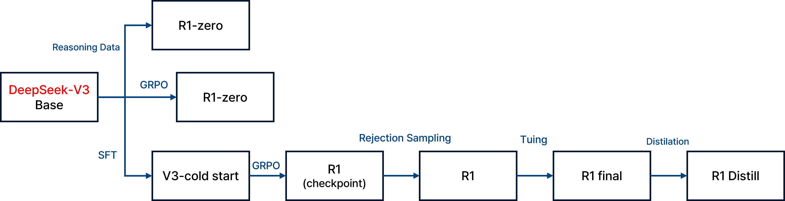_DeepSeek._

위의 사진은 DeepSeek가 발표한 경량화 모델에 대한 경량화 방법이다. 
KD를 활용한 방법을 활용했다.
이는 모델 압축, distillation, pruning등을 통해 경량화 하면 모델의 capacity가 줄며 일반화 능력이 약화된다.
또한, 경량화 과정에서 overfitting된 feature가 남을 가능성이 높아 privacy 공격에 더 취약할 수 있다.
경량화 모델은 본래의 robustness, regularization이 약해지기 때문에, 특정 학습 데이터의 정보가 유출되기 쉬울 수 있다.
또한 KD과정에서 teacher 모델의 학습 데이터가 student 모델로 유출될 가능성이 있다.

그러나 Smolvlm 모델과 같이 현재 KD를 활용한 방법과 달리 모델 자체의 크기를 작게 만들어 End-to-End로 학습하는 방식을 많이 사용하고 있기 때문에 KD 과정이 아닌 모델 자체에 대한 취약점을 알아보아야한다.

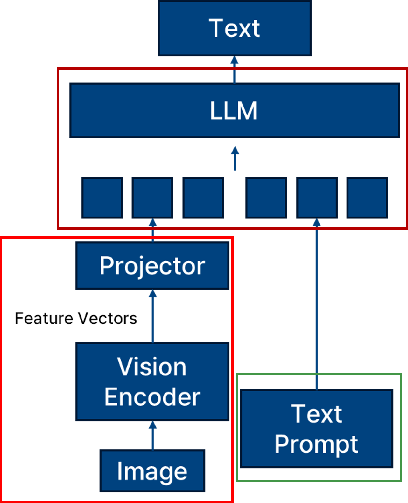_Svlm 취약점._

2. Vision Encoder의 취약점

사진의 빨간 부분에 해당하는 vision encoder에 대한 취약점도 svlm 모델의 취약점이다.
이미지 분류, 생성, 검색 등의 task에서 vision encoder는 feature representation을 직접적으로 학습하므로, training data에 대한 memorization이 일어나기 쉽다.

- adversarial patch, model inversion 등 다양한 공격 방식이 vision encoder를 겨냥
- shadow 이미지가 노출될 경우, 동일한 embedding을 통해 정보 유출 발생 가능
  
3. Text Encoder의 취약점

Text Encoder는 사진의 초록 박스 부분에 해당한다.
텍스트 encoder는 학습 과정에서 시퀀스 데이터를 직접적으로 입력받아 memorization 현상이 심화될 수 있다.

- GPT 계열 모델은 token 단위로 학습하여 특정 표현에 대한 민감도가 높음
- 유니크하거나 민감한 단어 혹은 표현이 training set에 존재할 경우, 직접 노출될 수 있음

4. Multi-Modal 학습 방식의 취약점 

사진의 갈색 박스 부분에 해당하는 LLM 모델은 이미지-텍스트 쌍을 매칭하는 과정에서 특정 쌍의 존재 유무가 embedding space에 과도하게 반영되면 privacy 측면에서 취약할 수 있다.
멀티모달 모델은 이미지와 텍스트를 동시에 학습하는 과정에서 다음과 같은 문제가 발생할 수 있다.

- 특정 image-text 쌍이 overly aligned 되어 embedding space에 과하게 각인될 수 있음
- 하나의 modality (예: 이미지)의 member 정보가 다른 modality (예: 텍스트)로 전파될 수 있음
- fusion layer에서의 modality bias로 인해 정보 노출 편향 발생 가능

## Membership Inference Attack - VLM

인공지능 모델에 대한 privacy 공격을 진행하기 위해서 활용되는 것들은 모델의 입력 변화에 따른 결과를 활용한다.
예를 들어 prediction score, output entropy, rank, margin, confidence gap 등을 활용한다. 

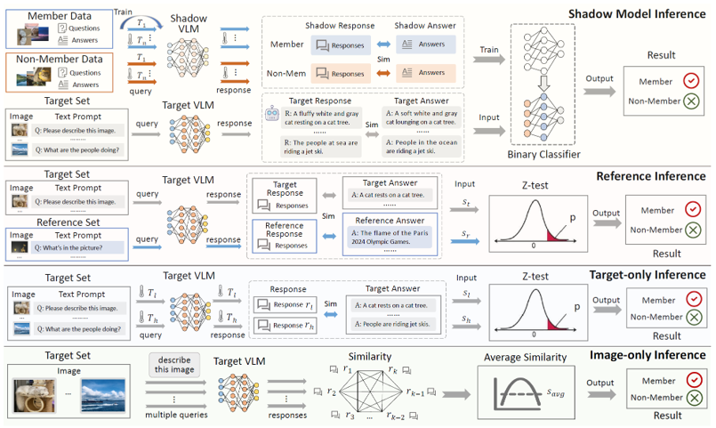_Hu, Yuke, et al. "Membership Inference Attacks Against Vision-Language Models." arXiv preprint arXiv:2501.18624 (2025)._

VLM 모델에 대해 membership inference attack을 진행하기 위해 적용했을 때 Temperature 정보를 활용하여 공격을 진행한다.

_Temperature 예시 사진._

Temperature는 LLM의 텍스트 생성 과정에서 다음 단어를 샘플링할 때의 무작위성을 조절하는 파라미터를 말한다.
낮은 temperature로 설정 시 정확하고 일관된 답변을 작성하여 출력이 된다.
높은 temperature를 설정할 때는 창의적이고 독창적인 답변을 작성하게 된다.
예를 들어 해당 사진을 VLM 모델에 입력하여 VQA를 진행한다면, 낮은 temperature 설정 시 "She is riding a bike" 정도의 출력이 나오게 된다면, 높은 temperature 설정 시 "She is pedaling on a two-wheeled vehicle" 정도의 상대적으로 창의적이고 독창적인 답변이 출력된다고 이해하면 된다.

해당 temperature 특성을 활용하여 실험 진행 시

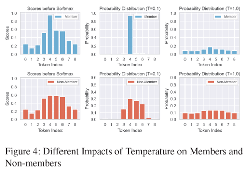_Temperature 활용 MIA 결과._

같은 입력에 대한 여러 temperature 값을 설정하여 출력의 일관성을 측정한다.
그래서 일관된 출력을 내뱉을 경우 member로 인식하며 일관되지 않을 경우 non-member로 인식하게 된다.

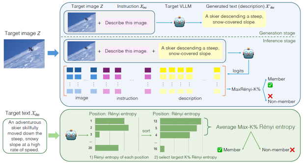_Li, Zhan, et al. "Membership inference attacks against large vision-language models." Advances in Neural Information Processing Systems 37 (2024): 98645-98674._

해당 논문에서는 입력 이미지와 instruction prompt로 description 텍스트를 생성한 후, 해당 결과물을 다시 입력으로 넣어 output logits을 추출하여 metric을 계산한다.

## Conclusion

VLM은 Vision + Language의 융합 모델로서 다양한 modality 간의 결합 구조에서 privacy와 security 취약점이 발생할 수 있다. 특히 SVLM처럼 모델 크기를 줄인 경우, 일반화 성능 저하 및 과적합 증가로 인해 MIA와 같은 공격에 더욱 취약해질 수 있다.

따라서 VLM에 대한 보안 연구는 다음 방향으로 확장될 수 있다.

- SVLM에 특화된 privacy attack/defense 기법 연구
- temperature, alignment consistency 등 multimodal 특징을 활용한 attack metric 제안
- modality 간 정보 전파 경로에 대한 분석 및 방어 메커니즘 개발
