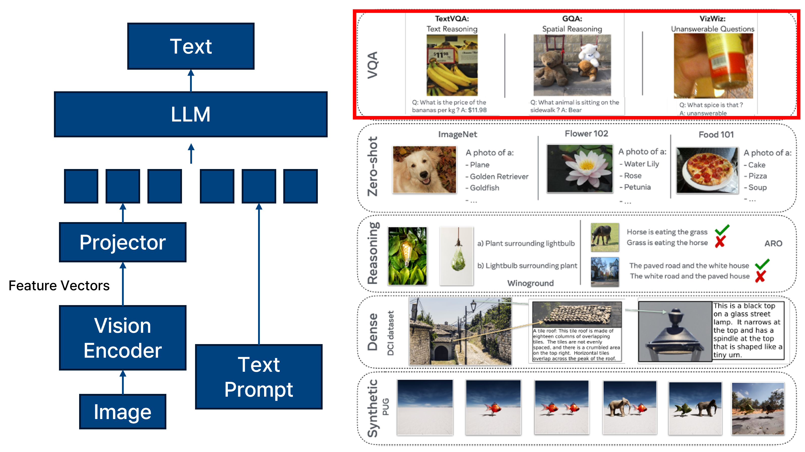
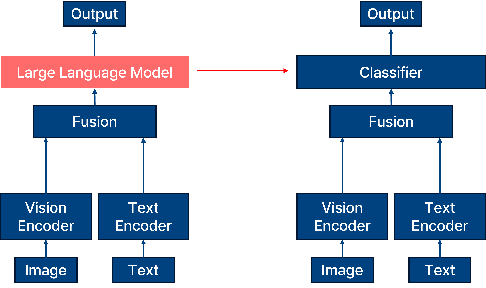
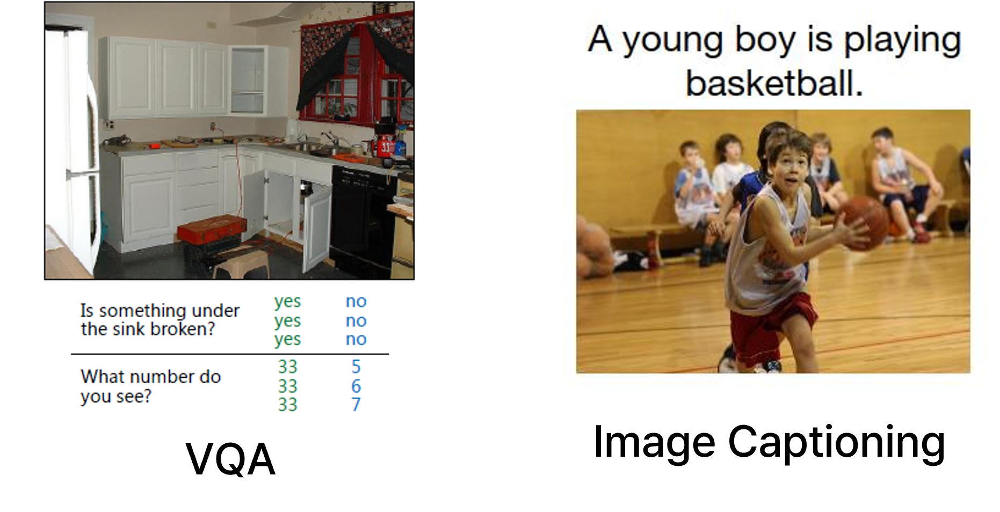
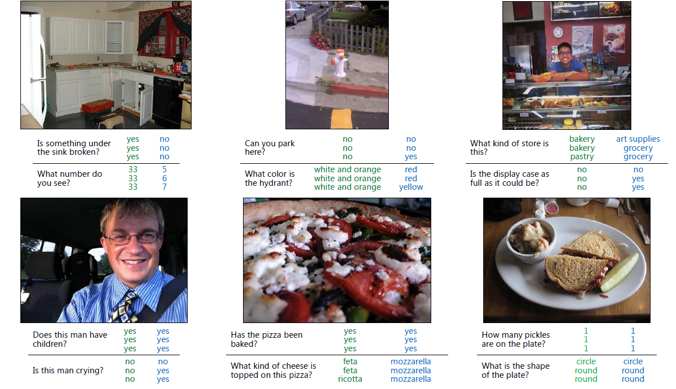
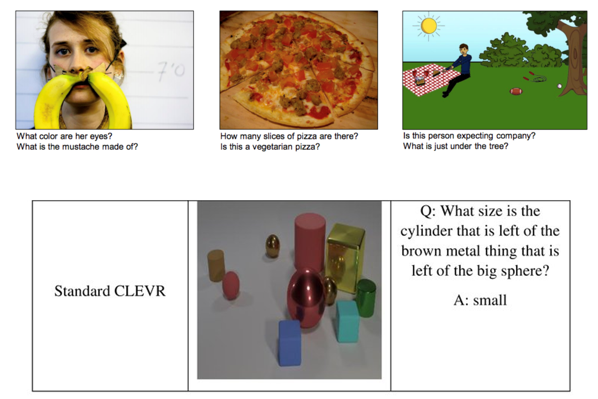

# VQA

## Model

_vision language model tasks._

Vision-Language Model(VLM)은 이미지와 텍스트라는 이질적인 입력을 함께 처리하기 위한 모델로, 다양한 멀티모달 task에 활용된다.
대표적인 예로는 Visual Question Answering(VQA), Image Captioning, Visual Reasoning, Visual Grounding, Text-to-Image Generation, Zero-shot Classification 등이 있다.

이러한 VLM 모델은 일반적으로 vision encoder (예: ResNet, ViT 등)와 language encoder (예: BERT, T5 등), 그리고 두 modality를 융합하는 fusion module로 구성된다. 이후 task-specific head를 통해 결과를 출력하게 된다.

이때 VQA는 VLM의 대표적인 downstream task 중 하나로, 주어진 이미지와 질문을 바탕으로 해당 질문에 대한 정답을 추론하는 문제다. 
VLM의 최상단에는 일반적으로 대규모 LLM이 배치되지만, VQA task에서는 보통 작은 크기의 classifier 또는 decoder가 활용된다. 
이는 특히 보안(Security) 및 프라이버시(Privacy) 연구 측면에서 중요한데, LLM의 대규모 매개변수 수로 인해 발생하는 높은 계산 비용, 오용 가능성, 정보 노출 우려 등에서 벗어나기 위해 경량화된 task-specific 모델을 실험 환경으로 활용하는 경우가 많기 때문이다.

_difference between vlm and vqa model._

크게 봤을 때, vlm 과 vqa의 차이는 fusion 과정까지는 동일하지만 해당 결과를 출력하기 위해서 vlm은 large language model을 사용하는 반면, vqa 모델은 classifier를 사용하여 훨씬 모델의 크기가 작은 것이 차이점이다.
물론 vqa도 특정 문장을 출력하기 위해서는 decoder 를 활용하여 모델을 sequential 하게 출력을 뽑아내지만, 주로 security privacy에서의 실험을 진행하기 위해서는 classifier로 여러 가지의 클래스로 구성된 출력을 내뱉도록 한다.

## VQA vs Image Captioning

_vqa vs image captioning._

주로 visual question answering은 image captioning과도 유사한 측면을 가진다.
Image Captioning은 이미지 전반에 대한 일반적인 설명을 생성하는 task로, 이미지 내부의 주요 시각 요소(객체, 색상, 배경 등)에 대해 객관적인 서술을 생성하는 데 초점을 둔다. 
예: “A man riding a bike on the beach.”

반면, VQA는 이미지와 함께 제공된 텍스트 기반의 질문을 이해하고, 이에 대해 적절한 시각 정보를 선택적으로 추론하여 질문에 해당하는 답을 출력해야 한다. 
예: “What color is the man’s shirt?” → “Red”.

따라서, VQA는 Image Captioning에 비해 더 정교한 조건부 시각 추론이 요구되며, 텍스트-이미지 간의 상호작용 이해가 필수적이다. 
이로 인해 VQA는 Vision-Language 모델의 reasoning 능력과 상호작용 해석 능력을 평가하기 위한 중요한 벤치마크로 활용된다.

_example of vqa._

vqa에 대한 예시는 위의 사진과 같으며 vqa 모델의 출력 유형으로는 두 가지로 분류할 수 있다.

1. Closed-ended (Classification 기반)

- 미리 정의된 답변 집합(예: yes, no, 1~10 등) 중 하나를 선택하는 방식.

- 모델 구조: 주로 MLP classifier 사용.

- 장점: 단순하고 빠르며 평가 지표가 명확함.

- 보안/프라이버시 연구에 적합함 (공격 성공률 측정 용이).

2. Open-ended (Generative 기반)

- 모델이 자유롭게 텍스트를 생성함.

- 예: "a red apple", "on the left", "two people holding hands".

- 최근 GPT 계열 모델(BLIP, BILD, Flamingo 등)이 이에 해당.

- 평가 방식이 더 복잡하며, BLEU, ROUGE, METEOR 등과 같은 언어 기반 유사도 지표 사용.

## Dataset

_vqa dataset._

앞서서 말했듯, security, privacy 측면에서의 연구를 진행하기 위해서는 조금 더 단순한 모델인 classification 단에서 부터 복잡한 단계로 올라가는 사용하기 때문에 해당 task에 맞는 데이터를 소개한다.
첫번째를 VQA 데이터셋으로 ms coco 기반의 이미지와 사람이 직접 작성한 질문 및 답변을 가지고 있는 데이터셋이다.
v1과 v2가 존재하는데 v2의 특징으로는 질문과 이미지의 bias를 줄이기 위해 같은 질문에 대해 다른 이미지 페어로 구성되어있으며 주로 일반적인 vqa 성능 평가에 사용된다. 또한 end-to-end 학습이 가능한 것이 특징이다.
그러나 정답이 사람이 직접 작성했기 때문에 정답이 주관적일 수 있다는 것이 해당 데이터셋의 한계점이다.

두번째로 주로 사용하는 데이터셋은 CLEVR 데이터셋이다. 
CLEVR 데이터셋은 Blender로 구성된 3D synthetic 이미지로 객체,색상,형태,수량 등의 논리적 추론 질문에 대한 정답이 존재한다.
이에 CLEVR 데이터셋은 reasoning 능력을 분석하며 모델 해석 가능성, 분석적 task에 주로 사용된다.

## Evaluation Metric

vqa 모델에 대한 평가 지표로는 데이터셋에 어울리는 지표를 활용한다.

vqa v2는 주로 vqa accuracy를 사용한다.
vqa는 한 질문에 대해 10명의 annotator가 정답을 작성했기 때문에 정답이 한개가 아니라 soft voting을 기반으로 측정한다.
이에 전체 질문에 대해 평균된 accuracy인 overall acc를 사용하며 질문 유형별 accuracy인 per type acc를 사용하기도 한다. 
per type acc는 yes/no, number, 등이 이에 해당한다.
또한 정답이 Top-k 후보 안에 들어가는 비율인 top-k acc도 사용되기도 한다.

CLEVR 데이터셋에 대해서는 CLEVR 데이터셋이 가지는 명확한 label이 존재하기 때문에 일반적인 Top-1 acc를 주로 사용한다.

추가로 해당 closed-ended 모델이 아닌 생성형 모델을 사용하는 open-ended 모델에 대해서는 BLEU, ROUGE, METEOR 등 문장 생성 시의 유사도 기반 평가를 주로 사용하며 최근에는 GPT 모델을 사용하는 GPT-4 Eval, 즉 생성된 답변을 GPT로 비교 평가하는 지표도 평가 지표로서 사용한다.

## Conclusion
이와 같이, VQA는 Vision-Language Model의 다양한 task 중에서도 분석과 실험이 용이하고 보안 연구에 특화된 실험을 설계할 수 있는 최적의 환경을 제공하며, 이를 바탕으로 모델의 허점을 파악하고 방어 기법을 설계하는 연구가 활발하게 진행되고 있다.

## Reference

1. Antol, Stanislaw, et al. "Vqa: Visual question answering." Proceedings of the IEEE international conference on computer vision. 2015.
2. Bordes, Florian, et al. "An introduction to vision-language modeling." arXiv preprint arXiv:2405.17247 (2024).
