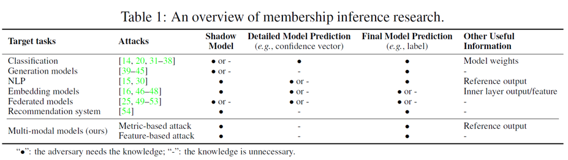

> **M4I: Multi-modal Models Membership Inference** ([arXiv](https://arxiv.org/abs/2209.06997))  
> Year : 2022  
> Authors : Pingyi Hu et al.  
> Conference : NeurIPS
{: .paper-info-box }

---

## Introduction

### Motivation

_MIA research._

멀티모달 모델들은 일반적으로 출력값이 텍스트이기 때문에 기존의 membership inference attack (MIA) 방식인 confidence score 기반 접근법을 적용하기 어렵다. 
기존 MIA는 모델의 confidence vector 또는 예측 score 등의 정량적 정보에 의존해 학습 데이터의 포함 여부를 판단하기 때문이다. 
이에 본 논문은 멀티모달 모델에 대한 최초의 MIA 기법을 제안하며, metric-based와 feature-based 두 가지 공격 방법론을 제시한다.

### Threat Model

공격자는 target model이 학습할 때 사용한 데이터 중 특정 샘플이 포함되었는지(member) 아닌지(non-member)를 구분하는 것이 목적이다. 
본 논문은 image captioning 모델을 대상으로 하며, 출력은 confidence score 없이 단순한 텍스트다.

공격자는 아래 세 가지 시나리오로 구분된다:

1. **Unrestricted Scenario**: training data 분포와 모델 구조 모두 알고 있는 상황 (gray-box).
2. **Data-only Scenario**: 데이터 분포만 알고 있는 상황.
3. **Constrained Scenario**: 어떤 정보도 없는 상황 (black-box).
## Methods

_overview of the proposed methods._

해당 이미지는 제안하는 metric based attack과 feature based attack의 overview이다.
기본적으로 두 method 다 shadow-based model이라고 보면 된다.

### Metric based attack

첫번째로 metric based attack에 대해 소개한다.

해당 방법은 멀티모달 모델이 ROUGE, BLEU를 ground truth와의 similarity를 비교할 때 지표로 사용하는 것을 활용한다.
ROUGE는 Recall-Oriented understudy for Gisting Evaluation score를 의미하며 Recall과 Precision을 사용한다.
ROUGE-L은 reference summary와 generated summary 간 최장 공통 부분 문자열(LCS) 기반 recall, precision을 이용한 평가 지표이다.
BLEU는 n-gram 기반 매칭으로, 출력 문장에서 reference와 일치하는 word sequence 개수를 기반으로 한다.

해당 두 metric을 활용하여 공격을 진행한다.

공격자는 shadow model을 통해 member/non-member 데이터를 수집하고 metric score의 분포 차이를 학습한다. 
이후 target model의 출력에 대해 계산된 metric score가 임계값 이상이면 member로 판단한다.

해당 예시로 한계점을 본다면

_metric based example._

해당 고양이 사진이 모델 학습 시 사용되지 않은 non-member 라고 한다.
이때, 해당 사진의 ground truth가 "This is a cat sitting on the road" 라고할 때 해당 모델에 입력 시 출력이 "This is a dog sitting on the road" 라고 나왔다고 가정한다.

이때 사람이 이를 봤을때는 하나의 단어가 달라짐으로 인해 완전히 다른 문장이 된다는 것을 식별할 수 있다.

그러나 현재 사용하고 있는 metric인 BLEU나 ROUGE 값은 간단한 1-gram BLEU 와 ROUGE-L 기준 0.875 로 매우 높은 similarity를 보여준다.
그로 인해 해당 query 결과가 해당 데이터가 member 라고 판단해버리게 될 수도 있다.

이러한 한계점을 극복하기 위해 제안된 방법론이 feature based attack이다.

### Feature based attack

_feature based attack._

이 방식은 이미지와 생성된 텍스트를 각각 image encoder와 text encoder에 통과시켜 feature를 추출하고, 두 feature 간의 차이 벡터를 기반으로 membership을 판별한다. 

$$
F_i = f_i(i_i),\quad F_t = f_t(t_i),\quad z_i = F_i - F_t
$$

이때 $z_i$를 입력으로 받아 binary classification을 수행하는 attack model $M_{\text{attack}}$을 학습한다.

$$
y_i = M_{\text{attack}}(z_i)
$$

해당 방식은 reference text 없이도 작동하며, 모델이 의미적으로 학습한 feature 차이를 이용해 member 여부를 판단할 수 있어 기존 metric-based attack의 한계를 보완한다.

## Experiments

### Setup

- Target model: ResNet-152 또는 VGG-16 encoder + LSTM decoder
- Dataset: MSCOCO, Flickr8k, IAPR TC-12
- Member/non-member: 각 3000쌍
- Shadow model: 특정 시나리오에 따라 동일 또는 다른 분포의 데이터셋에서 구성

이때 specific scenario라는 것은 앞서 실험할 때 세 가지 시나리오를 사용한다고 했다.
세가지 시나리오 중 constrained scenario는 데이터의 분포를 알 수 없는 black-box 시나리오를 가정하였다. 
그래서 만약 target model 학습 시 MSCOCO를 사용하였다면 Shadow model을 학습할 때는 MSCOCO 데이터셋이 아닌 FLICKR8k 데이터셋이나 IAPR TC-12 데이터셋을 사용하여 학습을 진행하였다.

### Result

_metric based attack result._

- Unrestricted scenario: 최고 성능은 IAPR dataset 사용 시 81%까지 도달함.
- Data-only scenario: 소폭 감소하나 여전히 65~75% 수준.
- Constrained scenario: 성능 저하 두드러짐. 대부분 51~66% 수준.

이러한 성능 저하는 metric이 텍스트의 구문적 유사성만 평가하며, 의미나 문맥적 변화는 반영하지 못하기 때문임을 알 수 있다.

_feature based attack result._

- Unrestricted scenario: 전반적으로 metric-based보다 우수하며 94.83%까지 성능 도달.
- Data-only scenario: 약간의 성능 저하 있음 (~75~90% 수준).
- Constrained scenario: 성능이 다소 낮아짐 (최소 50%, 최대 68%)이나 metric-based보다 우수.

해당 방식은 모델 구조나 데이터 분포의 영향을 받긴 하지만, encoder 간 feature 차이를 정교하게 반영할 수 있어 강력한 공격력을 보인다.
ROC 분석 결과에서도 feature-based attack이 false positive rate을 낮추며 더 안정적인 성능을 보였다.

_medical domain result._

의료 도메인인 R2GenCMN 모델을 대상으로 공격 실험을 수행한 결과, feature-based attack은 82%의 성공률을 기록하며, 실세계 민감 정보에 대해서도 위협이 됨을 입증했다.

## Conclusion

본 논문은 멀티모달 모델을 타겟으로 한 최초의 membership inference attack을 제안하였다. 
Metric-based attack은 기존의 text similarity metric을 활용하였고, feature-based attack은 멀티모달 feature alignment 기반 공격으로 더 정교하고 높은 성능을 보였다.

- metric-based attack: 간단하지만 reference text에 의존하고 semantic shift를 반영하지 못함.
- feature-based attack: reference 없이도 가능하며, 학습된 feature 간 차이를 활용해 더 강력한 공격 가능.

실험을 통해 의료 도메인 등 실제 상황에서도 privacy leakage 가능성이 있음을 확인하였으며, differential privacy, L2 regularization 등의 방어기법이 부분적인 효과를 보였다.

