> **FUSION: Fully Integration of Vision-Language Representations for Deep Cross-Modal Understanding** ([arXiv](https://arxiv.org/abs/2504.09925))  
> Year : 2025  
> Authors : Zheng Liu et al.  
> arXiv
{: .paper-info-box }

## Introduction

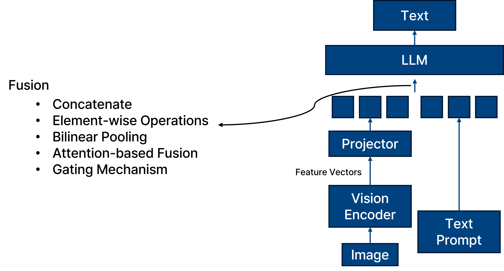_Multi-modal fusion._

멀티모달 모델인 Vision Language Model은 이미지와 텍스트 등 서로 다른 모달리티의 특성을 결합하기 위해 다양한 fusion 방식을 사용합니다.

기존에 주로 사용되는 fusion 기법으로는 concatenate, element-wise operation, bilinear pooling, attention 기반 fusion, gating mechanism 등이 있다.

이 중에서도 가장 널리 사용되는 방식은 concatenate와 attention-based fusion이다.

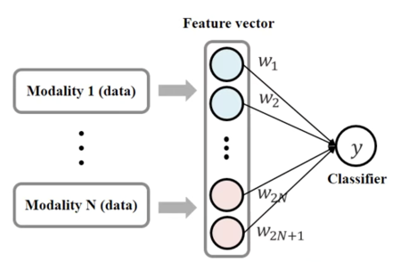_concatenate._

Concatenate는 서로 다른 modality의 feature들을 feature dimension을 따라 단순 연결하여 하나의 joint representation으로 만드는 방식이다.

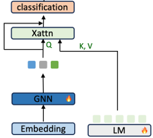_concatenate._

Attention-based fusion은 한 modality의 내용을 기반으로 다른 modality의 feature에 attention을 주어 중요한 정보를 더 강조하는 방식이다.
그래서 일반적으로 attention-based fusion 기법이 일반적인 concatenate 보다 문맥에 민감하며 유연하다는 장점이 있다.

## Key Idea

그러나 본 논문은 기존에 사용하던 fusion 기법들은 인간의 인식 방식과 조금 다른다고 주장하며, 인간의 인식 방식과 유사한 멀티모달 시스템을 만들기 위해 새로운 early fusion 기반의 기법을 제안한다.

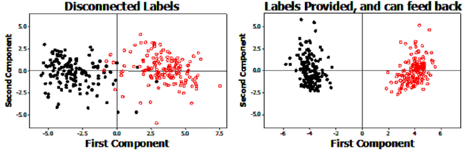_Lupyan Gary. Linguistically modulated perception and cognition: The label-feedback hypothesis. Frontiers in Psychology, 2012.
._

Lupyan (2012)의 연구에 따르면, 이미지와 텍스트를 단순히 나중에 결합하는 것보다 초기부터 함께 처리하는 것이 인지 능력에 효과적임을 보여준다.

따라서 본 논문에서는 vision과 text 정보를 나중에 fusion하지 않고, 초기 단계에서 통합적으로 처리하는 early fusion 방식을 도입한다. 

제안하는 방법과 기존 방식의 차이는 다음과 같다.

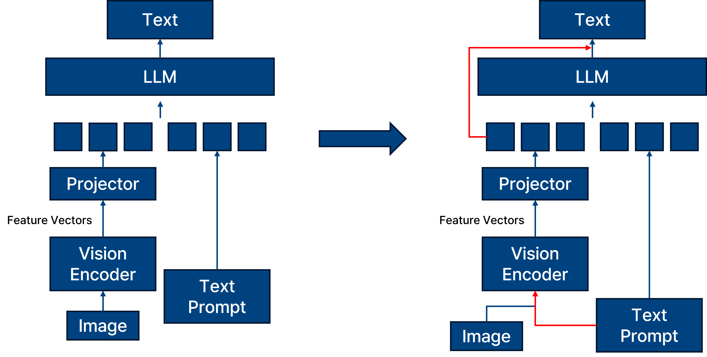_proposed method._

일반적인 fusion 기법을 사용하는 왼쪽 모델과 비교해 보았을 때, 오른쪽에 제안하는 프레임워크는 vision encoder에 이미지 정보와 텍스트 정보를 동시에 넣고 decoding 시에도 이미지 정보를 계속해서 반영하는 모습일 보인다.

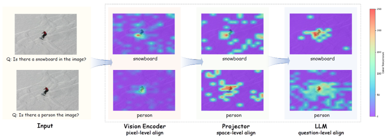_proposed method visualization._

우선 제안하는 fusion 기법을 사용했을 때의 결과를 attention map을 활용하여 확인해 볼 수 있다.

- Pixel-level: Vision encoder 내부에서 이미지 패치와 질문 내 핵심 단어 간의 attention을 시각화한 결과이다.

- Space-level: LLM embedding 공간 내에서 시각 토큰과 텍스트 토큰 간 cosine similarity를 시각화한 결과이다.

- Question-level: 디코딩 시점에서 텍스트 토큰이 시각 토큰에 주는 attention의 시각화 결과이다.

위 세 수준의 attention이 모두 일관된 위치를 주목하고 있음을 확인할 수 있으며, 이는 모델의 해석 가능성이 높다는 것을 의미한다.

다른 모델과 비교했을 떄의 결과를 보면 다음과 같다.

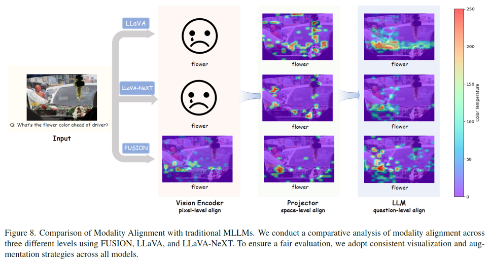_proposed method vs LLaVA visualization._

우선 LLaVA와 같이 일반적인 멀티모달 모델들은 fusion을 LLM의 입력 전 단계에서 진행하는 later fusion을 진행하기 때문에 vision encdoer에 대한 visualization 즉 pixel-level align 단계의 visualization이 불가능하다. 
이는 text 정보가 vision encoder에 입력되지 않기 때문이다. 

또한 LLaVA와 LLaVA-NeXT 의 attention map을 확인해 보았을 때 본 논문에서 제안하는 기법의 attention map 보다 일관되지 않은 결과를 보여주고 있다. 
이는 모델의 explainability가 떨어진다고 할 수 있다.

## Methods

해당 논문에서는 크게 세 가지 기법을 제안한다.

- Text-Guided Unified Vision Encoding (TUNE)

- Context-Aware Recursive Alignment Decoding (CARD)

- Dual-Supervised Sementic Mapping Loss (DSM)

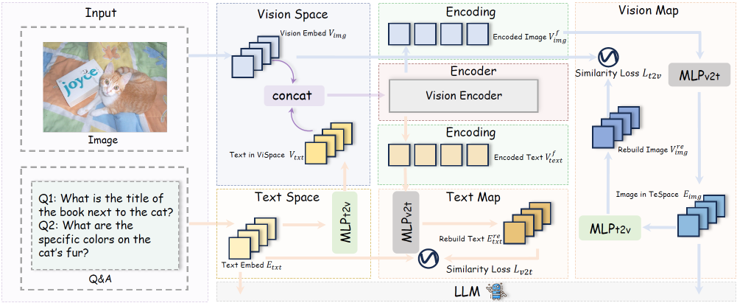_TUNE._

텍스트 정보를 vision encoder에 조기 투입하는 Text-Guided Unified Vision Encoding (TUNE) 기법이다. 
텍스트 임베딩은 MLP를 통해 vision feature 공간으로 투영되며, 이미지 패치 임베딩과 함께 concatenate되어 vision encoder의 입력으로 사용된다. 
이때 초반 layer에서는 텍스트의 영향력을 제한해 저수준 시각 정보를 유지하고, 후반 layer에서는 텍스트 정보가 점차적으로 더 강하게 작용하여 의미론적 지도를 제공한다. 
이러한 설계는 시각 표현이 텍스트의 의미를 반영하도록 유도한다.

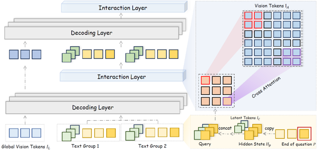_CARD._

이후 LLM의 decoding 과정에서 Context-Aware Recursive Alignment Decoding (CARD)이 작동한다. 
디코딩 중 각 질문 토큰의 hidden state는 context-aware query를 생성하며, 이는 vision token들과 windowed self-attention을 통해 상호작용한다. 
여기서 windowed self-attention은 전체 이미지 feature에 대해 attention을 계산하는 대신, 각 vision token이 지정된 국소 윈도우 내의 토큰들만 참고하도록 제한한다. 
이 방식은 연산량을 줄이고, 지역적인 정보를 더 정확하게 반영할 수 있다. 
예를 들어 특정 위치의 vision token의 경우, attention은 전체 토큰이 아니라, 윈도우 내 토큰에 대해서만 계산된다. 
또한 전체 이미지에 대한 전반적인 요약 정보를 유지하기 위해 global vision token도 추가적으로 decoding layer에 주입된다. 
이 구조는 디코딩의 각 단계마다 관련된 vision 정보를 반복적으로 정렬하며 reasoning을 보조한다.

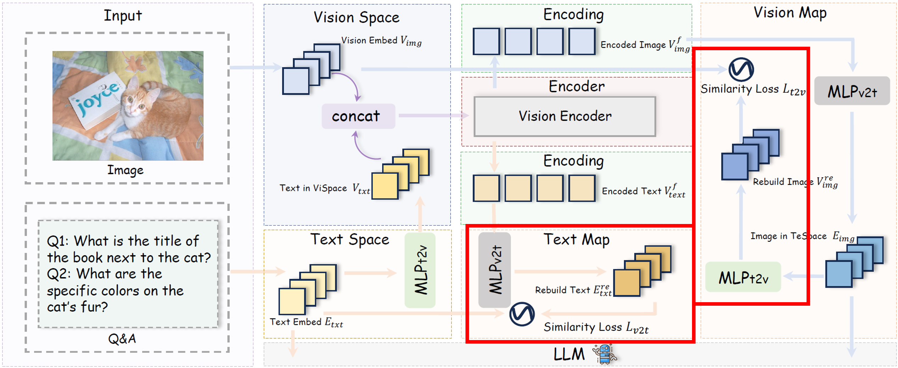_DSM._

마지막으로 Dual-Supervised Semantic Mapping Loss (DSM)는 vision-text 간 의미 정렬을 강화하기 위해 도입된다. 
두 개의 MLP mapping 함수들을 통해 시각 임베딩과 텍스트 임베딩을 서로의 공간으로 투영하고, 다음과 같은 cosine similarity 기반의 복원 손실을 계산한다.
cosine similarity loss는 이미지와 텍스트가 동일한 의미 표현을 공유하도록 유도하고 modality 간의 표현 정렬 품질을 높인다.

이러한 세 가지 기법은 각각 pixel-level 결합, decoding-level reasoning 보조, modality-level 정렬 손실을 담당하며, 전반적으로 멀티모달 모델의 해석 가능성과 정렬 정밀도를 향상시킨다.

## Dataset

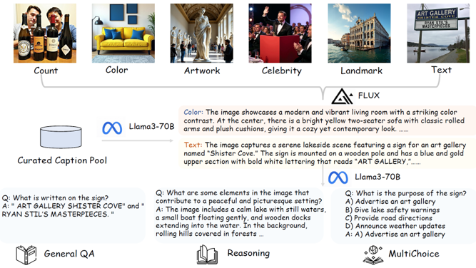_Dataset._

기존 방식은 image → caption → QA 순서로 구성되지만,

본 논문은 text의 중요성을 강조하여 caption → image → QA 순서로 데이터를 구성한다:

1. LLM을 활용하여 풍부하고 다양한 caption 생성

2. diffusion model을 통해 caption을 반영하는 이미지 생성

3. 생성된 이미지와 caption을 바탕으로 다양한 유형의 QA (객관식, reasoning 등) 생성

이 방식은 텍스트 중심의 고품질 QA 데이터셋 생성이 가능하다는 장점이 있다.

## Experiment

다음과 같이 실험을 세팅하여 진행하였다.

- LLM: Phi-3.5-mini-instruct, LLaMA3.1-8B-instruct

- Vision Encoder: SigLIP-SO400M-Patch14-384, SigLIP2-Giant-OPT-Patch16-384

- QA Dataset: PixelProse, LLaVA558k, SHareGPT4V

실험 결과로는 

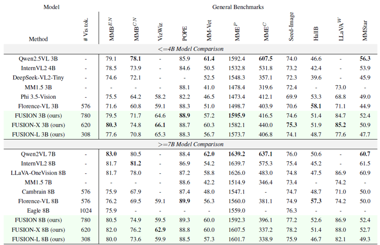_Result 1._

Table 1의 (a) 결과에 따르면, 제안하는 FUSION 모델이 최고의 성능을 보이진 않지만 전반적으로 나쁘지 않은 경쟁력 있는 성능을 보여준다.

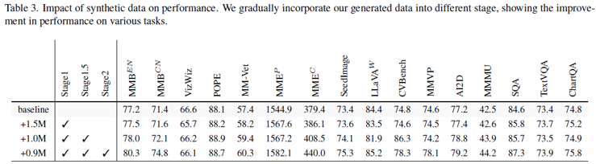_Result 2._

앞선 실험을 통해 해당 모델이 최고의 성능을 보여주지는 않는다는 것을 알 수 있다.

그러나 table 3의 결과를 보자면 제안하는 FUSION 모델의 장점을 확인해 볼 수 있다.

해당 모델을 총 세 가지 단계를 통해 제안하는 FUSION 모델의 범용성을 확인할 수 있다.

- Stage 1 – Foundational Semantic Alignment: image-caption 데이터로 사전학습하여 vision encoder의 의미 정렬 학습

- Stage 1.5 – Contextual Multimodal Fusion: QA 데이터와 image-caption 데이터를 함께 사용하여 문맥 기반 정렬 능력 강화

- Stage 2 – Visual Instruction Tuning: 실제 downstream task에 대응하도록 시각 instruction 학습 수행

이렇게 세 가지 단계로 구성되며 해당 학습 방법에 따른 성능 지표 향상을 확인해 볼 수 있다.

이는 해당 모델이 다양한 기법에 적용되며 좋은 성능을 유지하는 것을 알 수 있다.

이 결과는 앞서서 확인했던 attention map으로 확인했었던 일관된 결과를 수치적으로 보여줬다고 할 수 있다.

## Result

본 논문은 early fusion 방식의 멀티모달 모델인 FUSION을 제안하였다. 
이 모델은 텍스트의 중요성을 고려하여 vision encoder에 텍스트 정보를 함께 입력하며, decoding 시에도 시각 정보를 반복적으로 제공함으로써 정보의 일관성과 정렬 품질을 극대화한다.

실험 결과는 제안한 모델이 최고의 성능은 아니지만, 일관된 attention map과 정렬 손실, 그리고 다단계 학습 전략을 통한 성능 유지 및 향상을 통해 설명 가능성과 범용성이 뛰어난 모델임을 보여준다.
