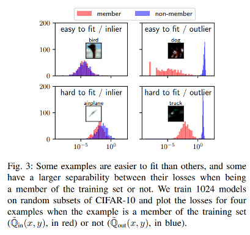
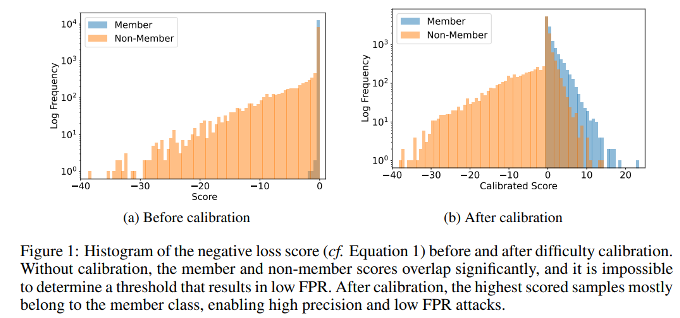
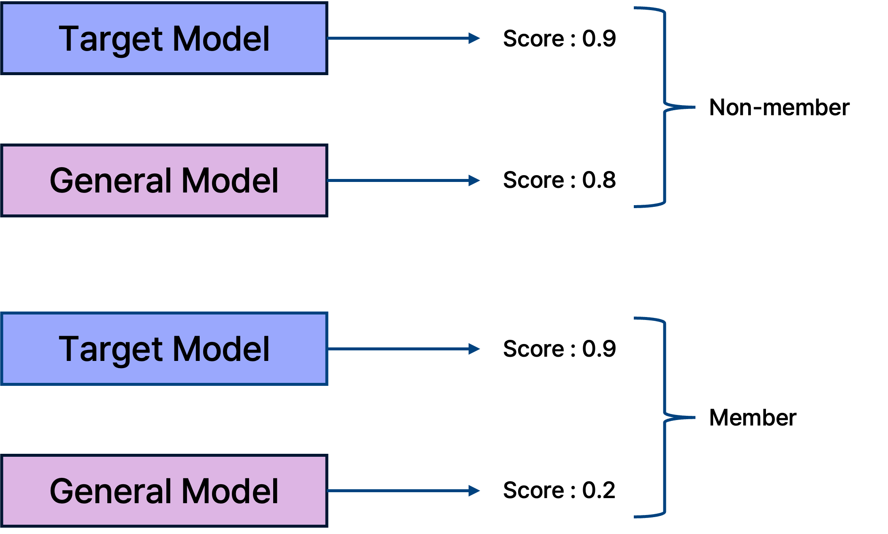
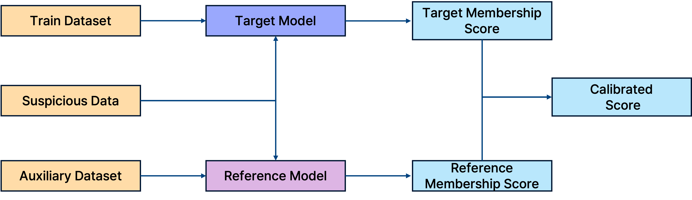
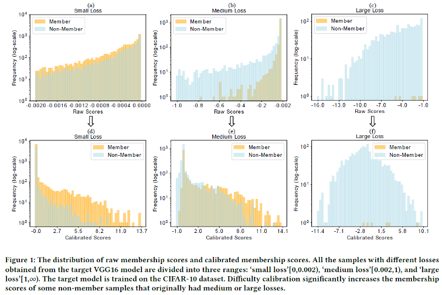
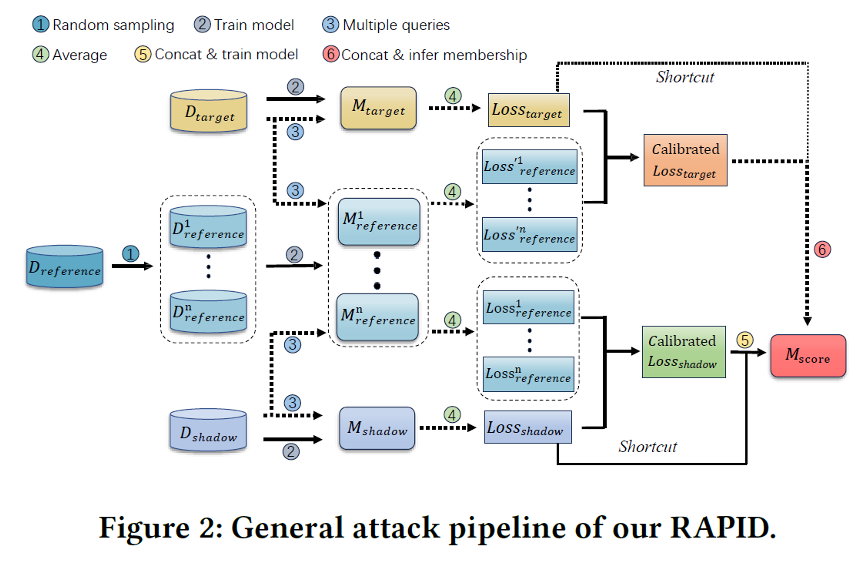
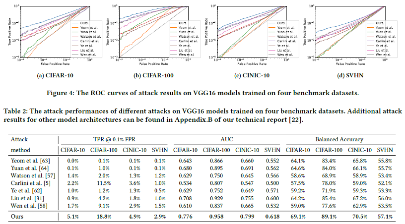
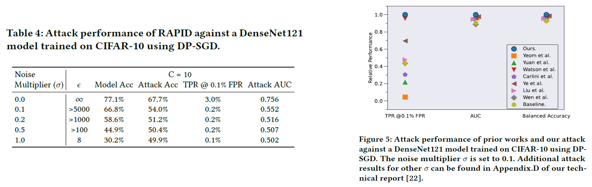
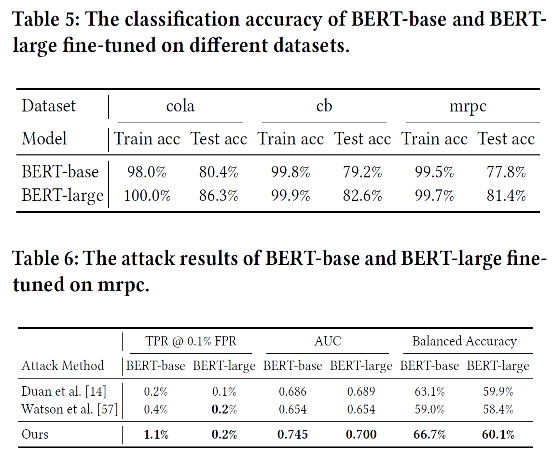

> **Is Difficulty Calibration All We Need? Towards More Practical Membership Inference Attacks** ([arXiv](https://arxiv.org/abs/2409.00426))  
> Year : 2024  
> Authors : Yu Hu et al.  
> ACM CCS
{: .paper-info-box }

## 1. Introduction

최근 머신러닝 모델의 프라이버시 침해 위협, 특히 멤버십 추론 공격(Membership Inference Attack, MIA)에 대한 연구가 활발히 진행되고 있다. 
초기 MIA 연구들은 모델의 과적합(Overfitting) 현상을 이용하여 학습 데이터(Member)와 비학습 데이터(Non-member)의 손실(Loss)이나 신뢰도(Confidence) 차이를 분석했다. 
하지만 이러한 기존의 공격(Metric-based, Attack model-based)들은 평균적인 정확도(Balanced Accuracy)나 AUC 지표에서는 높은 성능을 보였으나, 실제로는 쉬운 Non-member를 잘 식별했을 뿐 실제 Member를 찾아내는 능력(TPR at low FPR)은 부족하다는 비판을 받아왔다.

_Carlini, Nicholas, et al. "Membership inference attacks from first principles." 2022 IEEE symposium on security and privacy (SP). IEEE, 2022._

위 그림에서 볼 수 있듯이, 모델은 학습 데이터에 없더라도(Non-member) 데이터 자체가 분류하기 쉬운 경우 매우 낮은 손실 값을 가질 수 있다. 
반대로 학습 데이터에 포함되었더라도(Member) 학습이 어려운 샘플은 높은 손실을 보일 수 있다. 
즉, 단순한 모델 출력값만으로는 샘플의 내재적 난이도(Intrinsic Difficulty)를 고려하지 못한다는 한계가 존재한다.

이러한 문제를 해결하기 위해 등장한 것이 바로 Difficulty Calibration(난이도 보정) 기법이다. 

본 논문은 이 Difficulty Calibration이 만능인지 의문을 제기하며, 기존 방식의 한계를 극복하기 위해 원본 점수(Original Score)를 다시 활용하는 RAPID라는 기법을 제안한다.

## 2. Background

### Difficulty Calibration

기존의 단순 Loss 기반 공격은 샘플 자체의 난이도를 무시하기 때문에, Loss가 낮으면 Member일 것이라고 잘못 추론하는 경우가 많았다.

_Watson, Lauren, et al. "On the importance of difficulty calibration in membership inference attacks." arXiv preprint arXiv:2111.08440 (2021)._

Difficulty Calibration은 타겟 모델의 출력뿐만 아니라, 유사한 분포로 학습된 참조 모델(Reference Model)의 출력을 함께 고려한다.

* Target Model Score: 높음 (Loss 낮음) / Reference Model Score: 높음 (Loss 낮음) -> 이 데이터는 원래 쉬운 데이터이므로 Non-member일 확률이 높다.
* Target Model Score: 높음 (Loss 낮음) / Reference Model Score: 낮음 (Loss 높음) -> 일반적인 모델에서는 어렵지만 타겟 모델만 잘 맞춘다면, 타겟 모델이 이 데이터를 학습했다는 증거이므로 Member일 확률이 높다.

즉, 참조 모델의 점수를 기준(Baseline)으로 삼아 타겟 모델의 점수를 보정(Calibration)함으로써, 데이터의 내재적 난이도 영향을 제거하는 것이 목표이다.

### Conventional MIA Pipeline

_General Reference-based Membership Inference Attack Pipeline._

일반적인 Reference-based MIA는 Shadow Model(Target Model을 모사)과 Reference Model을 활용하여 Reference Membership Score를 구하고, 이를 Target Membership Score와 비교하여 최종적으로 Calibrated Score를 계산한다. 기존 연구들(LiRA, Canary 등)은 이 Calibrated Score의 정밀도를 높이는 데 집중해 왔다.

## 3. Rethinking Difficulty Calibration

본 논문의 저자들은 Difficulty Calibration을 적용했음에도 불구하고 여전히 해결되지 않는 문제점에 주목했다.

_Distribution of scores before and after calibration._

위 그림은 Loss 크기(Small, Medium, Large)에 따른 보정 전후의 점수 분포이다.
* (a) -> (d): Loss가 작은 샘플들은 보정 후 Member와 Non-member가 잘 분리된다.
* (b) -> (e), (c) -> (f): 그러나 Loss가 큰(어려운) 샘플들의 경우, 보정 후에도 여전히 분포가 겹치거나(overlap), 심지어 Non-member의 점수가 비정상적으로 높아져 Member로 오분류되는 현상이 발생한다.

저자들은 이러한 오분류가 발생하는 원인을 두 가지로 분석했다.

### 1) Imperfect Sampling (불완전한 샘플링)
Reference Model을 학습시킬 때 전체 데이터 분포를 완벽하게 반영할 수 없다. 공격자는 보통 전체 분포의 부분 집합만으로 Reference Model을 학습시키기 때문에, 이 모델이 계산한 난이도가 실제 데이터의 난이도를 완벽하게 대변하지 못한다.

### 2) Model Parameter Dependence (파라미터 의존성)
멤버십 점수는 데이터뿐만 아니라 모델의 초기 가중치나 학습 과정의 무작위성(파라미터)에도 크게 의존한다. 이를 수식으로 모델링하면 다음과 같다.

일반적으로 멤버십 점수 $S$는 가우시안 분포를 따른다고 가정한다.
$$\mathcal{S}(x,y) \sim \mathcal{N}(\mu, \sigma^2)$$

Target Model과 Reference Model의 점수 분포를 각각 정의하면 다음과 같다.
$$\mathcal{S}_{tar}(x,y) \sim \mathcal{N}(\mu_{tar}, \sigma_{tar}^2), \quad \mathcal{S}_{ref}(x,y) \sim \mathcal{N}(\mu_{ref}, \sigma_{ref}^2)$$

이때 보정된 점수(Calibrated Score) $\mathcal{S}_{cal}$은 두 분포의 차이로 나타낼 수 있다.

$$\mathcal{S}_{cal} = \mathcal{S}_{tar} - \mathcal{S}_{ref}$$

$$\mathcal{S}_{cal}(x,y) \sim \mathcal{N}(\mu_{tar} - \mu_{ref}, \sigma_{tar}^2 + \sigma_{ref}^2)$$

핵심 문제: Non-member의 경우 이상적으로는 $\mu_{tar} \approx \mu_{ref}$가 되어 평균이 0에 가까워야 한다. 하지만 분산(Variance)인 $\sigma_{tar}^2 + \sigma_{ref}^2$가 합해져서 커지게 된다. 이로 인해 Non-member임에도 불구하고 우연히 매우 높은 보정 점수를 받을 확률이 증가하여, 결과적으로 False Positive(오탐)가 발생하게 된다.

## 4. Proposed Method: RAPID

위 분석을 바탕으로, 저자들은 Difficulty Calibration만으로는 불충분하다고 결론지었다. 그리고 원본 점수(Original Score)를 다시 활용(Re-leverage)하는 새로운 공격 기법 RAPID를 제안한다.

### Design Intuition
Difficulty Calibration이 쉬운 Non-member를 걸러내는 데 효과적이라면, Original Score(높은 Loss)는 어려운 Non-member를 식별하는 데 강력한 증거가 된다. 따라서 이 두 가지 정보를 모두 활용하면 상호 보완적인 효과를 얻을 수 있다.

_Overview of RAPID._

### Attack Pipeline

RAPID는 크게 세 단계로 구성된다.

1. Shadow & Reference Model Training:
    * Shadow Model: 타겟 모델과 유사한 환경에서 학습하여, 공격 모델(Scoring Model)을 학습시키기 위한 데이터(Label=1/0)를 생성한다.
    * Reference Model: 데이터의 난이도를 계산하여 Calibrated Score를 생성하는 데 사용된다.

2. Scoring Model Training:
    * 이 단계가 RAPID의 핵심이다. 단순히 값을 빼는 선형적인 보정 대신, MLP(Multi-Layer Perceptron) 기반의 Scoring Model을 학습시킨다.
    * Input: (Original Score $\mathcal{S}$, Calibrated Score $\mathcal{S}'$)
    * Output: Final Membership Probability
    * 모델은 Calibrated Score가 높더라도 Original Loss가 매우 크다면 Non-member일 확률이 높다는 비선형적인 패턴을 학습하게 된다.
    
    $$\mathcal{M}_{score} = \text{sigmoid}(\text{MLP}(\mathcal{S} \oplus \mathcal{S}'))$$

3. Enhancement Techniques:
    공격 성능을 높이기 위해 두 가지 추가 기법을 적용한다.
    * Random Sampling: 여러 Reference Model을 서로 다른 부분 집합 데이터로 학습시켜 평균을 냄으로써 샘플링 편향을 줄인다.
    * Multiple Queries: 타겟 모델에 Data Augmentation을 적용한 여러 버전을 쿼리하고 그 결과를 평균 내어, 모델 파라미터에 의한 분산을 감소시킨다.

## 5. Experimental Results

### Setup
* Datasets: CIFAR-10, CIFAR-100, CINIC-10, SVHN, Location, Texas
* Models: VGG16, ResNet50, DenseNet121, MobileNetV2
* Baselines: LiRA(offline), Canary(offline), Watson et al., Yeom et al. 등 SOTA 공격들과 비교

### Main Results

1. General Performance

RAPID는 기존 SOTA인 LiRA나 Canary(offline)보다 뛰어난 성능을 보였다. 특히 Low FPR(0.1%) 영역에서 높은 TPR을 달성하여, 실질적인 프라이버시 위협이 큼을 입증했다.
예: CIFAR-100에서 TPR @0.1% FPR이 기존 최고 11.5%에서 18.8%로 향상되었다.

2. Attack Cost Analysis
RAPID의 가장 큰 장점 중 하나는 효율성이다. LiRA와 같은 공격은 수백 개의 Reference Model을 학습시켜야 하지만, RAPID는 단 4개의 Reference Model과 소수의 쿼리(8회)만으로도 우수한 성능을 냈다. 계산 비용은 LiRA 대비 약 1/25 수준이다.

3. Robustness against DP-SGD
Differential Privacy(DP-SGD)가 적용된 모델에 대해서도 실험을 진행했다. DP는 강력한 방어 기법이지만, RAPID는 여전히 다른 공격 기법들보다 높은 성공률을 유지했다.

_Performance against DP-SGD models._

4. Extension to LLMs

Vision Task뿐만 아니라 BERT와 같은 대형 언어 모델(LLM)의 Fine-tuning 단계에서도 RAPID의 유효성을 검증했다. LLM 환경에서도 기존 Difficulty Calibration 공격 대비 약 3배 높은 TPR을 달성했다.

## 6. Conclusion

본 논문은 Difficulty Calibration이 만능인가?라는 질문을 던지며, 기존 방식이 간과했던 Original Score의 중요성을 다시 증명했다.

* 문제 제기: Difficulty Calibration은 어려운 Non-member 샘플을 Member로 오분류하는 경향이 있다.
* 해결책 (RAPID): Original Score와 Calibrated Score를 함께 입력으로 받는 Scoring Model을 도입하여 오분류를 교정한다.
* 성과: 적은 비용(Low Computation)으로 기존 SOTA 공격(LiRA, Canary)을 상회하는 정확도와 실용성을 입증했다.

이 연구는 앞으로의 Membership Inference Attack 연구가 단순히 복잡한 통계적 모델링을 넘어, 데이터의 내재적 특성과 모델의 출력값 사이의 관계를 더 효율적으로 활용하는 방향으로 나아가야 함을 시사한다.