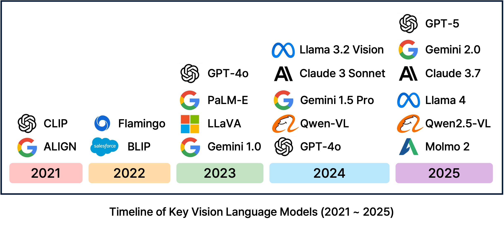
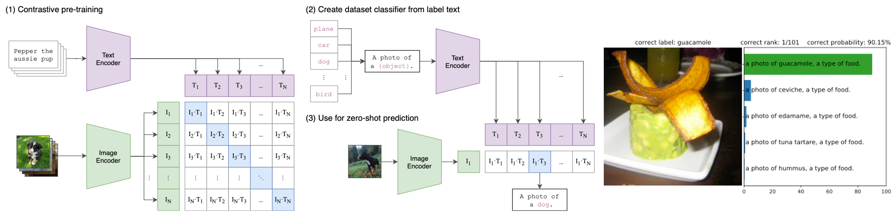
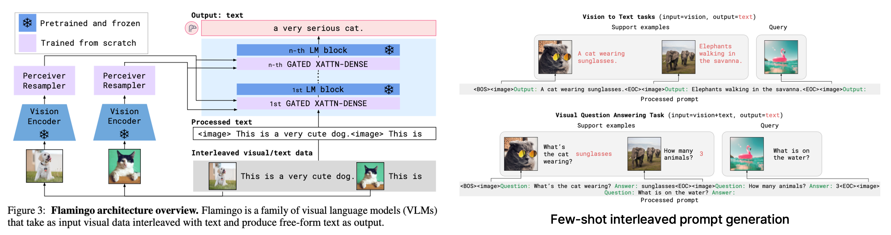
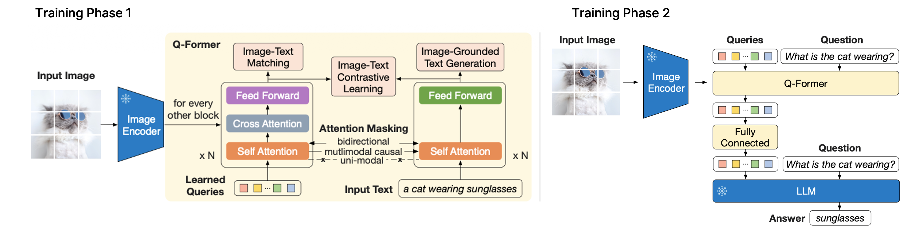
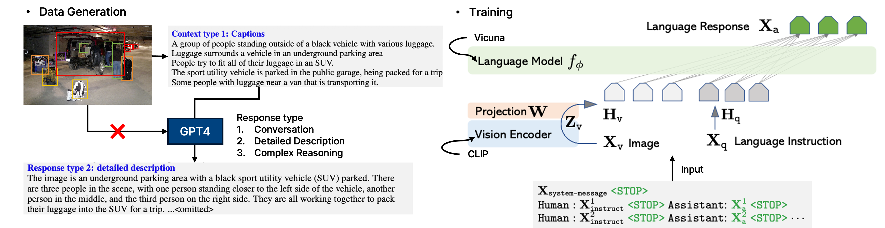
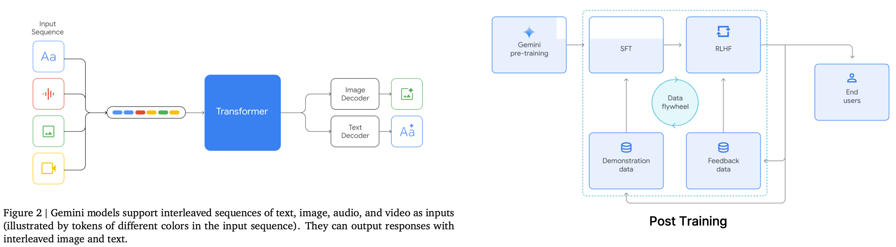
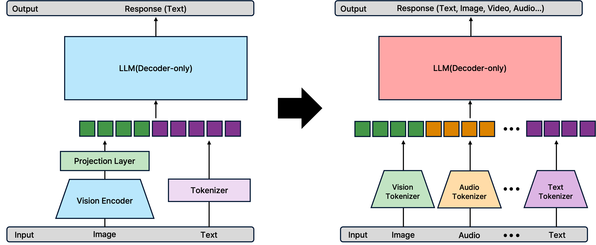
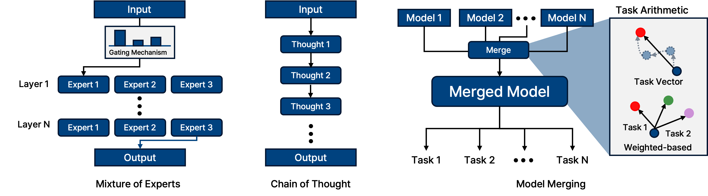
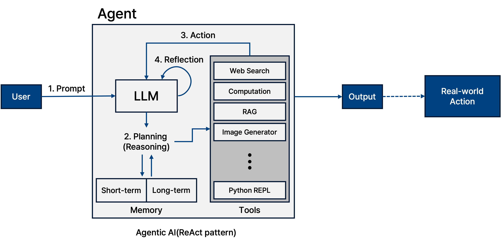

## 1. Introduction

현재 LLM(Large Language Model)의 비약적인 발전과 함께 Vision Language Model(VLM) 또한 급속도로 진화하고 있다. 
**VLM**이란 이미지 정보(Visual modality)와 텍스트 정보(Text modality)를 동시에 이해하고 생성할 수 있는 멀티모달 모델을 의미한다.

대표적인 VLM 모델들을 살펴보면, 2021년 **CLIP**을 기점으로 이미지와 텍스트의 정렬(Alignment)을 시도했으며, 이후 다양한 기업과 연구소에서 이를 활용한 모델들을 개발해왔다. 
특히 2025년 현재, GPT-4o나 Gemini 1.5 Pro와 같은 최신 모델들은 텍스트 모델에 이미지를 덧붙이는 형태가 아닌, **Native Multimodal Model** (설계 단계부터 멀티모달을 고려한 구조)로 패러다임이 변화하고 있다.

본 포스트에서는 VLM 발전 과정에 중요한 기여를 했다고 평가받는 주요 논문들(**CLIP, Flamingo, BLIP-2, LLaVA, Gemini**)을 중심으로, 각 모델이 제안한 핵심 방법론과 아키텍처의 흐름을 리뷰한다. (단순 성능 비교보다는 모델 구조와 학습 방법론의 변화에 초점을 맞춘다.)

## 2. Model

### 1. CLIP (Contrastive Language-Image Pre-Training)

CLIP은 VLM 연구의 초기 대표적 모델로, 가장 중요한 기여는 방대한 인터넷 데이터셋(4억 쌍)을 활용하여 이미지와 텍스트의 **Alignment(정렬)** 를 성공적으로 수행했다는 점이다.

기존 모델들은 고정된 클래스 집합(fixed set of labels)을 예측하는 방식이었기 때문에, 학습하지 않은 새로운 카테고리에 대해서는 분류가 불가능했다. 
하지만 CLIP은 자연어를 통한 학습 덕분에 강력한 **Zero-shot** 성능을 보여주었다.

_Radford, Alec, et al. "Learning transferable visual models from natural language supervision." International conference on machine learning. PMLR, 2021._

#### Method: Contrastive Learning
CLIP은 **Contrastive Learning** 을 통해 텍스트 인코더와 이미지 인코더를 공동 학습시킨다. 
핵심 아이디어는 $N$개의 $(Image, Text)$ 쌍이 배칠(batch)로 들어왔을 때, 실제 짝인 $N$개의 대각선 요소(positive pairs)의 코사인 유사도는 최대화하고, 나머지 $N^2 - N$개의 짝이 아닌 요소(negative pairs)의 유사도는 최소화하는 것이다.

이를 수식으로 표현하면 **InfoNCE Loss** (혹은 NT-Xent Loss)를 기반으로 하며, 이미지($I$)와 텍스트($T$) 각각에 대해 다음과 같이 정의된다.

$$
\mathcal{L}_i^{(v \rightarrow t)} = -\log \frac{\exp(\langle I_i, T_i \rangle / \tau)}{\sum_{j=1}^N \exp(\langle I_i, T_j \rangle / \tau)}
$$

$$
\mathcal{L}_i^{(t \rightarrow v)} = -\log \frac{\exp(\langle T_i, I_i \rangle / \tau)}{\sum_{j=1}^N \exp(\langle T_i, I_j \rangle / \tau)}
$$

여기서 $\langle \cdot, \cdot \rangle$은 코사인 유사도(Cosine Similarity)를 의미하며, $\tau$는 temperature parameter로, softmax 분포의 스케일을 조절하는 역할을 한다. 최종 Loss는 이 두 Loss의 평균으로 계산된다.

$$
\mathcal{L} = \frac{1}{2} \sum_{i=1}^N (\mathcal{L}_i^{(v \rightarrow t)} + \mathcal{L}_i^{(t \rightarrow v)})
$$

이 학습을 통해 CLIP은 텍스트와 이미지를 동일한 임베딩 공간(Embedding Space)에 매핑하게 된다. 
학습이 완료된 후 추론 시에는, 데이터셋의 클래스 이름들을 텍스트 인코더에 통과시켜 임베딩을 생성하고, 입력 이미지와의 유사도가 가장 높은 텍스트를 정답으로 선정한다.
이때 중요한 점은 단순한 라벨 단어(예: "dog")만 사용하는 것보다, "A photo of a {label}."과 같은 프롬프트 템플릿(Prompt Template)을 사용할 때 정확도가 크게 향상된다는 것이다. 
이러한 프롬프트 엔지니어링은 텍스트가 이미지를 설명한다는 문맥을 제공하여 모델이 다의어 문제를 해결하거나 분포 차이를 좁히는 데 도움을 준다.
결과적으로 CLIP은 ImageNet과 같은 데이터셋을 직접 학습하지 않고도(zero-shot), 기존 ResNet-50과 동등한 수준의 정확도를 달성하는 등 뛰어난 일반화 능력을 보여주었다. 
또한, 자연스러운 분포 변화(Natural Distribution Shift)에 대해서도 기존 모델보다 훨씬 더 강건(Robust)한 모습을 보인다.

**한계점:**
* 생성 능력(Generative capability)이 없다. (분류 및 매칭만 가능)
* 복잡한 시각적 추론이나 미세 분류(Fine-grained classification)에는 여전히 한계를 보인다.

### 2. Flamingo

Flamingo는 DeepMind에서 제안한 모델로, **Visual In-context Learning**을 VLM에 도입했다는 점에서 큰 의의가 있다. 
LLM의 강력한 few-shot 능력을 비전 도메인으로 확장하여, 별도의 파인튜닝 없이 예시 이미지와 텍스트를 프롬프트로 제공하는 것만으로 새로운 태스크를 수행할 수 있게 했다.

_Alayrac, Jean-Baptiste, et al. "Flamingo: a visual language model for few-shot learning." Advances in neural information processing systems 35 (2022): 23716-23736._

#### Key Components
Flamingo는 사전 학습된 Vision Encoder와 LLM(Chinchilla)을 **Freeze** 한 상태로 유지하고, 이 둘을 연결하는 가벼운 모듈만을 학습시킨다.

1.  **Perceiver Resampler**:
    가변적인 개수의 Visual feature(이미지나 비디오 프레임)를 고정된 개수(예: 64개)의 Visual token으로 변환한다. 
    이는 Transformer의 Cross-attention 연산량을 줄이고 비디오와 같은 긴 시퀀스를 처리하는 데 핵심적인 역할을 한다.
2.  **Gated Cross-Attention (Gated Xattn-dense)**:
    LLM의 각 레이어 사이에 삽입되어 시각 정보를 주입한다. 여기서 중요한 점은 **Tanh Gating** 메커니즘이다.
    
    $$y = \tanh(\alpha) \cdot \text{Attention}(x) + x$$
    
    학습 초기에는 $\alpha$를 0으로 초기화하여, 초기 단계에서는 시각 정보를 무시하고 오로지 언어 모델 본연의 성능을 유지하도록 한다. 학습이 진행됨에 따라 점진적으로 시각 정보를 받아들이도록 설계되었다.
3.  **Multi-visual Input Support**:
    Flamingo는 여러개의 이미지와 텍스트가 번갈아 나오는 데이터를 처리하기 위해 특별 마스킹 방식을 사용한다.
    텍스트 토큰을 생성할 때 해당 텍스트 이전에 등장한 가장 마지막 이미지의 정보에만 cross attention을 수행하도록 마스킹한다.
4.  **Interleaved Data Learning**:
    이미지와 텍스트가 번갈아 나오는(Interleaved) 웹 데이터를 대규모로 학습하여, "이미지-텍스트-이미지-텍스트"와 같은 긴 시퀀스의 문맥을 이해할 수 있다.
    해당 데이터에서는 세 가지 유형의 데이터를 학습한다.
    - Interleaved Image-Text: 웹페이저처럼 이미지와 텍스트가 자유럽게 섞이 데이터
    - Video-Text Pairs: 비디오 이해 능력을 위한 데이터
    - Image-Text Pairs: 고품질의 이미지 설명 데이터

**한계점:**
* 모델의 크기가 매우 크고, 추론 시 계산 비용이 높다.
* Open-ended 생성형 측면에서는 강하지만 ImageNet 과 같은 분류 태스크에서는 이전의 모델들보다 안좋은 모습을 보였다.

### 3. BLIP-2

Flamingo가 LLM을 Freeze하여 성능을 확보했지만 모델이 너무 거대했다면, Salesforce Research의 BLIP-2는 효율성에 초점을 맞췄다. 
**Q-Former**라는 경량화된 모듈을 제안하여, 거대 LLM과 Vision Encoder를 모두 Freeze한 상태에서도 뛰어난 성능을 달성했다.

_Li, Junnan, et al. "Blip-2: Bootstrapping language-image pre-training with frozen image encoders and large language models." International conference on machine learning. PMLR, 2023._

#### The Core: Q-Former & Learnable Query
Q-Former(Querying Transformer)는 BERT 기반의 구조로, 이미지 인코더와 LLM 사이의 **Information Bottleneck** 역할을 한다.
Q-Former는 내부적으로 Image Transformer와 Text Transformer 두 개의 모듈로 나뉘어 있으며, Self-attention 레이어는 공유한다.
Q-Former의 가장 큰 특징은 **Learnable Query (Query Embeddings)** 를 사용한다는 점이다. 
이 Query들은 트랜스포머의 입력으로 들어가, Cross-Attention을 통해 Frozen Image Encoder의 출력에서 현재 텍스트와 가장 관련 있는 시각적 정보만을 추출한다. 
즉, 이미지의 모든 정보를 LLM에 넘기는 것이 아니라, **질의(Query)에 필요한 정보만 압축**하여 넘기는 것이다.

#### Training Strategy
학습은 두 단계(Two-stage)로 진행된다.

**Phase 1: Vision-Language Representation Learning (with Frozen Image Encoder)**
Q-Former를 이미지 인코더에 연결하여 학습한다. 
이때 3가지 목적 함수를 동시에 사용하여 쿼리가 시각적 특징을 잘 추출하도록 한다.
각 목적 함수는 서로 다른 attention masking strategy를 사용한다.
1.  **ITC (Image-Text Contrastive Learning):** 이미지와 텍스트의 전반적인 정렬 (Unimodal Attention 사용).
2.  **ITG (Image-grounded Text Generation):** 이미지를 보고 텍스트를 생성하도록 학습 (Multimodal Causal Attention 사용).
3.  **ITM (Image-Text Matching):** 이미지와 텍스트가 쌍이 맞는지 0/1로 분류 (Bidirectional Attention 사용, Hard Negative Mining 적용).

**Phase 2: Vision-to-Language Generative Learning (with Frozen LLM)**
Phase 1에서 학습된 Q-Former의 출력(Query output)을 Linear Layer(Projection)를 통해 LLM의 입력 차원에 맞춘 뒤, LLM에 입력하여 텍스트를 생성하게 한다. 
이 단계에서 Q-Former는 시각 정보를 언어 모델이 이해할 수 있는 "Soft Prompt"로 변환하는 역할을 수행한다.

**장점 및 한계:**
* 모듈성(Modularity)이 뛰어나 Vision Encoder나 LLM을 더 좋은 모델로 쉽게 교체할 수 있다.
* 하지만 In-context learning 능력이 Flamingo에 비해 부족하며, LLM이 가진 환각(Hallucination) 등의 단점을 그대로 상속받는다.

### 4. LLaVA (Large Language and Vision Assistant)

LLaVA는 모델 구조의 혁신보다는 **Data-centric** 관점과 **Instruction Tuning**의 중요성을 강조한 모델이다. 
단순한 캡셔닝을 넘어, 사용자의 복잡한 지시(Instruction)를 따르고 추론(Reasoning)하는 능력을 갖추는 것을 목표로 했다.

_Liu, Haotian, et al. "Visual instruction tuning." Advances in neural information processing systems 36 (2023): 34892-34916._

#### Visual Instruction Tuning
LLaVA는 GPT-4(text-only)를 활용하여 양질의 멀티모달 인스트럭션 데이터를 생성했다. 
GPT-4는 이미지를 직접 볼 수 없기 때문에, 이미지를 Captions(캡션)와 Bounding Boxes(바운딩 박스)라는 심볼릭 표현(Symbolic Representations)으로 변환하여 GPT-4에 입력하고, 이를 바탕으로 세 가지 유형의 데이터를 생성했다.
1.  **Conversation:** 사진에 대한 일상적인 대화
2.  **Detailed Description:** 사진에 대한 상세하고 풍부한 묘사
3.  **Complex Reasoning:** 사진 내용을 바탕으로 한 심층적인 추론 문제

#### Model Architecture & Training
LLaVA의 구조는 매우 단순하다. CLIP ViT-L/14의 시각적 특징을 **Linear Projection Layer** (단순 $W \cdot x + b$) 하나만 통과시켜 LLM(Vicuna)의 입력 임베딩 공간으로 투영한다. Q-Former나 Resampler 같은 복잡한 모듈을 제거했다.
이떄, 마지막 레이어의 출력이 아닌 마지막 레어이 직전의 Grid Feauture를 사용한다. 
이는 마지막 레이어가 지나치게 정보를 추상화시켜 세부 정보를 잃는 것을 방지하기 위함이다.

* **Stage 1: Pre-training for Feature Alignment**
    * Vision Encoder와 LLM을 Freeze하고, **Projection Matrix**만 학습.
    * 이미지 특징을 LLM의 단어 임베딩 공간에 정렬시키는 과정.
* **Stage 2: Fine-tuning End-to-End**
    * Vision Encoder는 유지(또는 일부 해제)하고, **Projection Layer와 LLM**을 GPT-4로 생성한 Instruction 데이터셋으로 파인튜닝.
    * 이 과정을 통해 모델은 "이미지를 보고 사용자의 질문 의도를 파악하여 답변하는 능력"을 갖게 된다.

**한계점:**
* 이미지를 고정된 해상도와 패치로 처리하므로, 아주 작은 글씨나 세밀한 디테일을 놓치는 경우가 있다 (Hallucination 존재).
* 학습 데이터에 없는 도메인에 대해서는 약한 모습을 보일 수 있다.

### 5. Gemini

Gemini는 기존 모델들이 텍스트 전용 LLM에 비전 인코더를 붙이는 방식을 사용한 것과 달리, 처음부터 다양한 모달리티를 동시에 학습한 **Native Multimodal Model**이다. 

_Gemini Team, Google. "Gemini: a family of highly capable multimodal models." arXiv preprint arXiv:2312.11805 (2023)._

#### Native Multimodal Architecture
기존 방식(BLIP-2, LLaVA 등)은 Vision Encoder와 LLM이 분리되어 있어, 시각 정보가 언어 모델로 넘어갈 때 정보 손실이 발생하거나, 오디오/비디오 처리를 위해 별도의 모듈이 필요했다.
반면 Gemini는 텍스트, 이미지, 오디오, 비디오 데이터를 하나의 시퀀스로 취급하여 Transformer Decoder에 입력한다. 이를 통해 모달리티 간의 경계를 허물고 더 깊은 수준의 이해와 추론이 가능하다.

#### Discrete Image Tokens & Generation
Gemini는 텍스트뿐만 아니라 이미지도 출력할 수 있는데, 이는 이미지를 픽셀 값이 아닌 **Discrete Image Token**으로 변환하여 처리하기 때문이다. 즉, 언어 모델이 단어를 생성하듯 이미지 토큰을 순차적으로 생성(Auto-regressive generation)하여 이미지를 만들어낸다.

#### Post-training
Gemini 역시 Pre-training 이후 정교한 후처리 과정을 거친다.
* **SFT (Supervised Fine-Tuning):** 양질의 멀티모달 데이터를 통해 지시 따르기(Instruction following) 능력 향상.
* **RLHF (Reinforcement Learning from Human Feedback):** 답변의 유해성을 줄이고, 선호되는 답변을 생성하도록 강화학습 적용.

Gemini는 이러한 구조 덕분에 복잡한 비디오 이해, 이미지 내 텍스트 인식(OCR), 다중 모달리티 추론 등에서 SOTA 성능을 기록했다.

## Summary & Trends

VLM의 발전사는 **"어떻게 시각 정보를 언어 모델에 효과적으로 전달할 것인가?"** 에 대한 해답을 찾아가는 과정이었다.

1.  **Alignment (CLIP):** 이미지-텍스트 임베딩 공간의 일치.
2.  **Adapter/Connector (Flamingo, BLIP-2):** Frozen LLM을 활용하기 위한 연결 모듈(Resampler, Q-Former)의 발전.
3.  **Instruction Tuning (LLaVA):** 사용자의 의도를 따르는 대화형 모델로의 진화.
4.  **Native Multimodal (Gemini, GPT-4o):** 아키텍처 통합 및 Any-to-Any(입출력의 자유로움) 구현.

최근에는 단순히 모델 구조를 바꾸는 것을 넘어, LLM의 성능을 극대화하기 위한 다양한 테크닉들이 VLM에도 적용되고 있다.
* **Mixture of Experts (MoE):** 입력 토큰에 따라 필요한 전문가(Expert) 네트워크만 활성화하여 파라미터 수 대비 연산 효율을 극대화.
* **Long Context Window (Ring Attention):** 수십만~수백만 토큰의 긴 비디오나 문서를 처리하기 위해 Attention 연산을 분산 처리.
* **Chain of Thought (CoT):** "Step-by-step" 추론을 유도하여 복잡한 시각적 추론 문제 해결.
* **Model Merging:** 서로 다른 장점을 가진 모델들의 가중치를 병합하여 성능 향상.

마지막으로, 모델이 단순히 보고 답하는 것을 넘어, **Agentic AI** 로 진화하고 있다. 
시각 정보를 바탕으로 계획(Planning)을 세우고, 도구(Tool)를 사용하며, 행동(Action)하고, 그 결과를 반성(Reflection)하여 다시 계획을 수정하는 **ReAct** 패턴 등이 적용되고 있다. 
이는 VLM이 단순한 '인식 모델'에서 실세계와 상호작용하는 '행동하는 모델'로 나아가고 있음을 시사한다.

## Conclusion

지금까지 CLIP부터 Gemini까지 VLM의 숨 가쁜 발전 과정을 살펴보았다. 모델의 아키텍처는 점점 통합되고(Native), 학습 방법은 정교해지고 있다(Instruction Tuning, RLHF).

어쩌면 모델 성능 경쟁은 포화 상태에 이를지도 모른다. 이제는 단순히 벤치마크 점수를 높이는 것보다, **Adversarial Attack**에 강건하고, 개인정보(Privacy)를 보호하며, 환각(Hallucination) 없이 신뢰할 수 있는 **Secure & Trustworthy VLM**을 만드는 연구가 더욱 중요해질 시점이다.