최근 Large Language Model(LLM)이 다양한 분야에 활용됨에 따라, 모델이 학습 데이터에 포함된 민감 정보를 노출할 수 있다는  Privacy 취약점 에 대한 우려가 커지고 있다. 
그중에서도 가장 활발히 연구되는 분야가 바로  Membership Inference Attack (MIA) 이다.

본 포스팅에서는 LLM을 대상으로 한 MIA 기법들이 초기의 단순한 확률 기반 접근에서 어떻게 발전해 왔는지, 그리고 Pre-training과 Fine-tuning 단계에서 각각 어떤 특성을 보이는지 핵심 논문들을 통해 살펴보고자 한다.

## 1. Introduction

### Security vs. Privacy in LLM
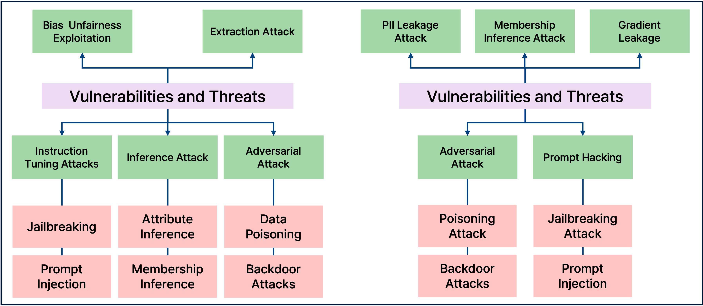
_Das, Badhan Chandra, M. Hadi Amini, and Yanzhao Wu. "Security and privacy challenges of large language models: A survey." ACM Computing Surveys 57.6 (2025): 1-39._

LLM의 보안(Security)과 프라이버시(Privacy) 이슈는 위 그림과 같이 분류될 수 있다. 
과거 Vision 도메인에서는 이 둘의 경계가 명확했으나,  Generative Model 인 LLM에서는 그 경계가 모호해지고 있다.
예를 들어, Jailbreaking(Security 취약점)을 통해 모델이 학습한 PII(개인식별정보)를 내뱉게 만든다면 이는 곧 Privacy 침해로 이어지기 때문이다.

### Membership Inference Attack (MIA)란?
Privacy 공격은 크게 두 가지로 나뉜다.
*  Attribute Inference:  학습 데이터에 포함된 특정인의 속성(예: 성별, 거주지 등)을 추론하는 공격.
*  Membership Inference Attack (MIA):  특정 데이터 샘플(Suspicious Data)이 타겟 모델의 학습 데이터셋에 포함되었는지 여부(Member vs. Non-member)를 판별하는 공격.

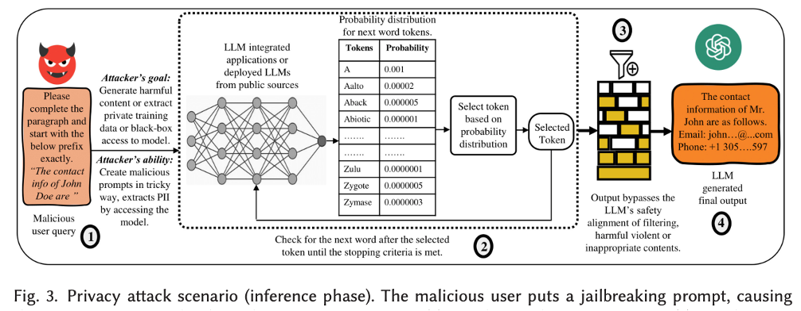
_Das, Badhan Chandra, M. Hadi Amini, and Yanzhao Wu. "Security and privacy challenges of large language models: A survey." ACM Computing Surveys 57.6 (2025): 1-39._

기본적으로 MIA는 타겟 모델에 쿼리를 날리고, 반환된 출력값(Loss, Probability, Perplexity 등)을 분석하여 학습 여부를 판단한다. 
LLM 대상 MIA 연구는 크게  Pre-trained Model 을 대상으로 하는 연구와  Fine-tuned Model 을 대상으로 하는 연구로 나눌 수 있다.

---

## 2. Papers Review: Pre-training Phase

Pre-training 단계의 모델을 대상으로 한 공격 기법들은 초기의 Shadow Model 기반 접근에서, Reference Model 활용, 그리고 최근에는 외부 데이터 없이 모델 자체의 통계적 특성만을 활용하는 방향으로 발전하고 있다.

### 1) 2019/SIGKDD: Rank 기반의 초기 접근
 Title:  Auditing Data Provenance in Text-Generation Models

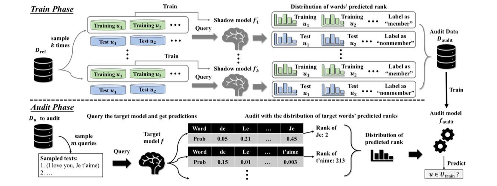
_Song et al. "Auditing data provenance in text-generation models."_

이 논문은 텍스트 생성 모델(LSTM, Seq2Seq 등)을 대상으로 한 초기 MIA 연구이다. 
저자들은  Overfitting  특성, 특히 "희소 단어(Rare Word)"에 대한 모델의 암기 경향에 주목했다.

*  Motivation:  단순한 확률(Probability) 값은 문맥에 따라 변동이 크다. 하지만 학습된 데이터라면 해당 단어가 등장해야 할 위치에서  순위(Rank) 가 비약적으로 높을 것이다.
*  Method: 
    *  Rank Metric:  모델이 예측한 단어 리스트에서 정답 단어가 몇 번째 순위에 있는지를 Feature로 사용한다.
    * 학습 데이터에 포함된 희소 단어는 예측 확률 분포에서 상위권(높은 Rank)에 위치하지만, 학습되지 않은 희소 단어는 하위권에 머무는 격차를 이용한다.

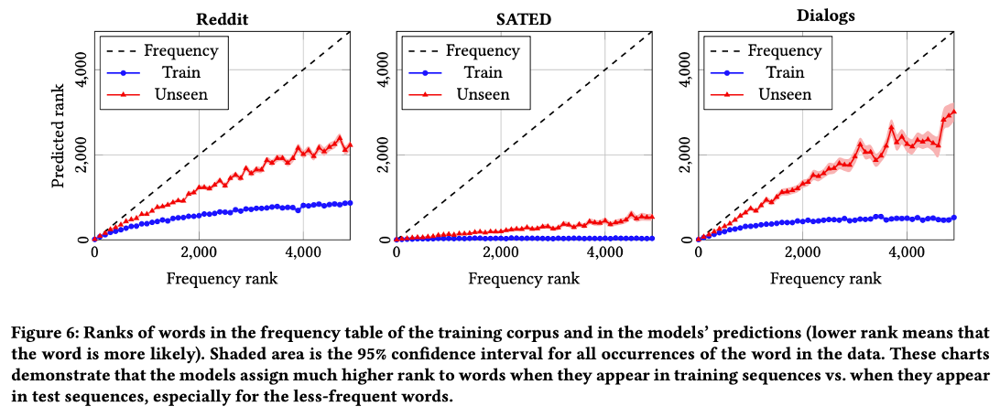

 Key Insight:  위 표에서 볼 수 있듯, 단어가 희소할수록(Frequency가 낮을수록) Train 데이터와 Test 데이터 간의 Rank 차이가 벌어진다. 즉, 모델은 일반적인 문법은 학습하지만, 희소한 정보는  암기(Memorization) 하는 경향이 있음을 입증했다.

### 2) 2021/USENIX: 실제 LLM 데이터 추출 (The Carlini Attack)
 Title:  Extracting training data from large language models

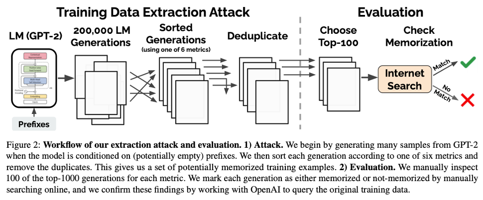
_Carlini, Nicholas, et al. "Extracting training data from large language models."_

이 논문은 학술적인 검증을 넘어, 실제 GPT-2와 같은 LLM에서 학습 데이터를 원문 그대로  추출(Extraction) 할 수 있음을 보인 기념비적인 연구다.

*  Metric의 고도화:  단순히 Perplexity(PPL)가 낮다고 Member로 판단하면, "The weather is good" 처럼 흔한 문장도 Member로 오탐지하게 된다. 이를 보정하기 위해 다양한 비교 지표를 제안했다.
    1.   Comparision with Small Models:  타겟 모델(Large)의 PPL과 소형 모델(Small)의 PPL 비율을 본다. 소형 모델은 암기 용량이 적으므로, 소형 모델은 모르는데 대형 모델만 확신을 갖는다면 암기된 데이터일 확률이 높다.
    2.   Zlib Entropy:  텍스트 압축 알고리즘(Zlib)의 압축률과 모델의 PPL을 비교한다. Zlib은 반복 패턴을 잘 압축하는데, Zlib이 압축하기 어려워하는(복잡한) 문장을 모델이 쉽게 예측(낮은 PPL)한다면 이는 학습된 것이다.
    3.   Lowercase:  원본과 소문자 변환 문장의 PPL을 비교하여 대소문자 패턴까지 암기했는지 확인한다.

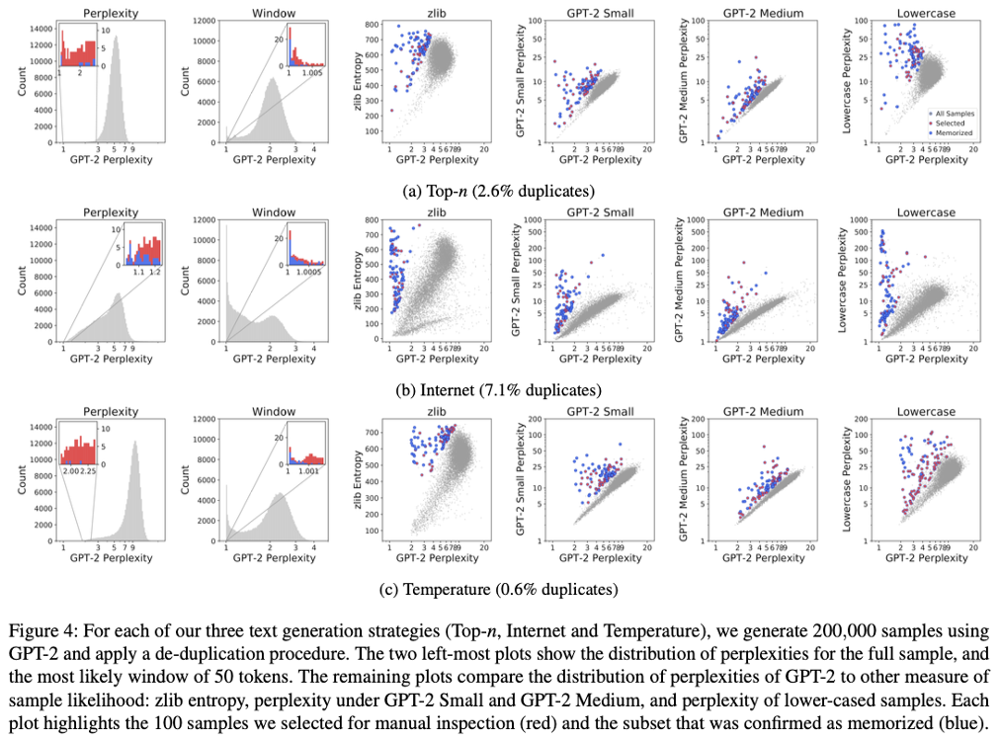

 Key Insight:   k-eidetic memorization 이라는 개념을 도입하여, 학습 데이터에 $k$번 이하로 등장한 데이터도 모델이 암기할 수 있음을 보였다. 위 그림은 실제로 WebText에서 추출된 개인정보와 문장들을 보여준다.

### 3) 2023/ACL: 외부 데이터가 필요 없는 Neighborhood Attack
 Title:  Membership Inference Attacks against language models via neighbourhood comparison

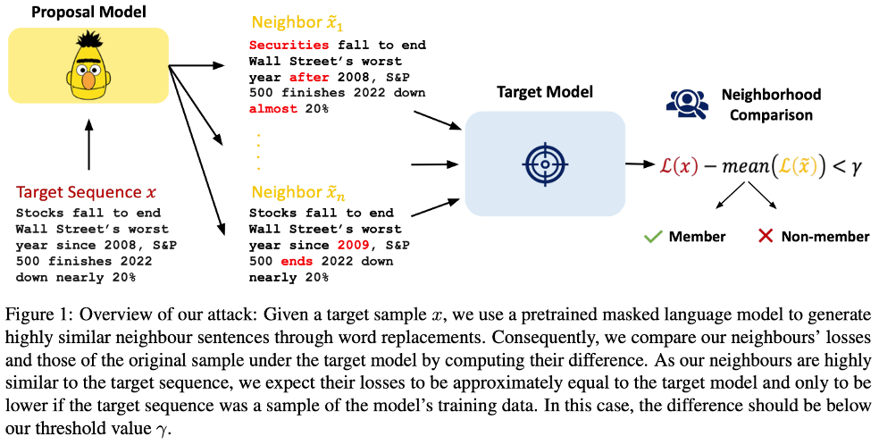
_Mattern, Justus, et al. "Membership inference attacks against language models via neighbourhood comparison."_

이전 연구들(Carlini et al.)은 Reference Model을 학습시키기 위해 유사한 데이터셋이 필요하다는 한계가 있었다. 이 논문은  외부 데이터 없이  타겟 모델만으로 공격하는 기법을 제안한다.

*  Method (Neighborhood Comparison): 
    * 타겟 문장 $x$의 단어 일부를 교체하여 의미가 유사한 이웃 문장들 $x'_1, x'_2, \dots$ (Neighbors)을 생성한다.
    *  가설:  모델이 $x$를 학습했다면 $x$에 대한 PPL은 매우 낮지만, 학습하지 않은 이웃 $x'$에 대해서는 PPL이 상대적으로 높을 것이다. 반면, 일반적인 문장이라면 $x$와 $x'$ 모두 비슷한 PPL을 가질 것이다.
    * $\text{Score}(x) = \frac{\text{Loss}(x)}{\frac{1}{n}\sum \text{Loss}(x'_i)}$ 와 같은 형태로 이웃과의 점수 차이를 계산한다.

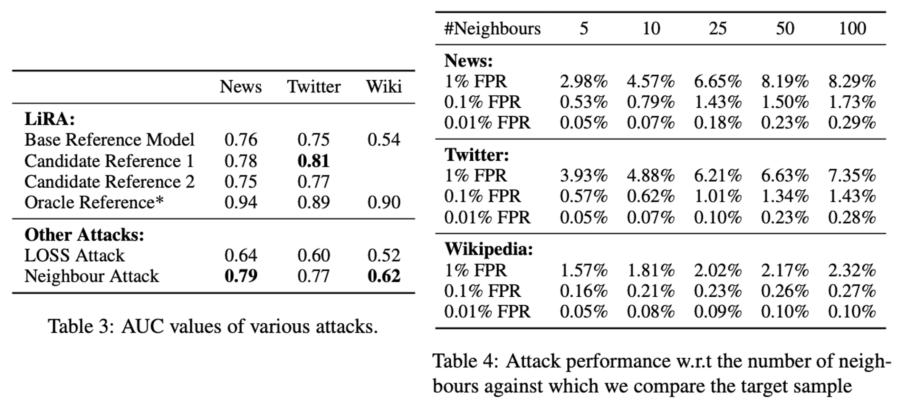

 Key Insight:  Reference Model 없이도 기존 SOTA 기법들과 대등하거나 더 뛰어난 성능을 보임을 입증했다(Table 3, 4). 이는 공격자가 데이터 분포를 몰라도 공격이 가능함을 시사한다.

### 4) 2024/ICLR: 효율적인 탐지, Min-K% Prob
 Title:  Detecting pretraining data from large language models

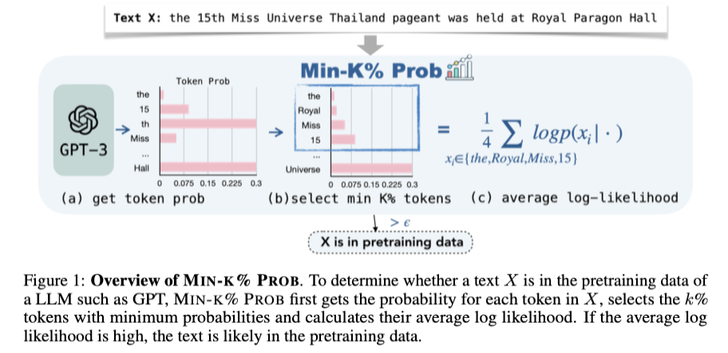
_Shi, Weijia, et al. "Detecting pretraining data from large language models."_

Neighbor Attack은 이웃 문장을 생성하고 평가하는 데 계산 비용이 많이 든다. 이 논문은 모델의 확률 분포에서  "어려운 단어" 에 집중하는  Min-K%  기법을 제안한다.

*  Motivation:  문장 전체의 평균 PPL을 사용하면, 'the', 'is'와 같이 맞추기 쉬운 단어들이 점수를 희석시킨다. 학습 여부를 결정짓는 것은 모델이 맞추기 힘든  Outlier Token 들이다.
*  Method (Min-K% Prob): 
    1.  입력 텍스트의 각 토큰에 대한 Log-Likelihood를 계산한다.
    2.  확률이 가장 낮은(맞추기 어려운) 상위 $k\%$의 토큰만 선택한다.
    3.  이 토큰들의 평균 확률을 계산하여 Score로 사용한다. (점수가 높으면 Member)

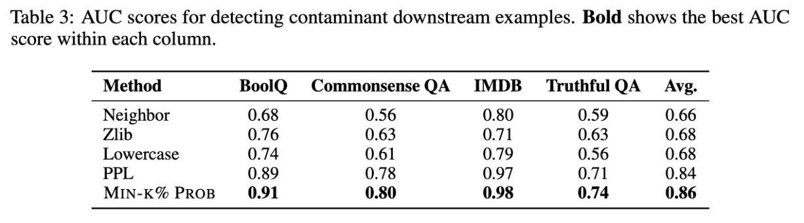

 Key Insight:  학습된 데이터라면 모델은 그 안의 '이상치 단어'조차도 높은 확률로 예측할 것이다. WIKIMIA 벤치마크에서 LLaMA, GPT-Neo 등을 대상으로 높은 성능을 보였다.

---

## 3. Papers Review: Fine-tuning Phase

Fine-tuning 단계는 Pre-training보다 데이터셋의 크기가 작고, 더 민감한 도메인 특화 데이터(Medical, Financial 등)를 사용하는 경우가 많아 프라이버시 리스크가 더 크다.

### 1) 2022/EMNLP: Fine-tuning 방식에 따른 취약점 분석
 Title:  An empirical analysis of memorization in fine-tuned autoregressive language models

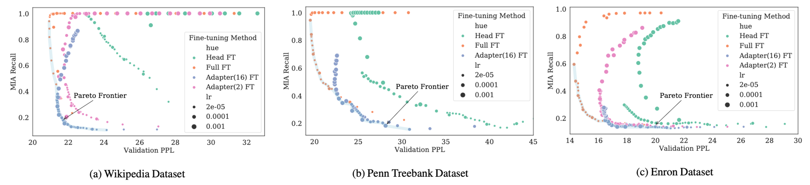
_Mireshghallah, Fatemehsadat, et al. "An empirical analysis of memorization in fine-tuned autoregressive language models."_

Fine-tuning 기법(Full FT, Head FT, Adapter 등)에 따라 정보 유출 정도가 어떻게 다른지 분석한 연구이다.

*  Comparison: 
    *  Full Fine-Tuning:  모든 파라미터 업데이트.
    *  Head Fine-Tuning:  마지막 Classification Layer만 업데이트.
    *  Adapters:  중간에 작은 모듈 삽입.
*  Result:  놀랍게도 파라미터를 가장 적게 건드리는  Head Fine-Tuning이 가장 취약 했다.
    *  이유:  Pre-trained Feature가 고정된 상태에서, 적은 수의 파라미터(Head)만으로 새로운 데이터에 맞추려다 보니, 해당 파라미터들이 학습 데이터를 과도하게 암기(Overfitting)하게 되기 때문이다.

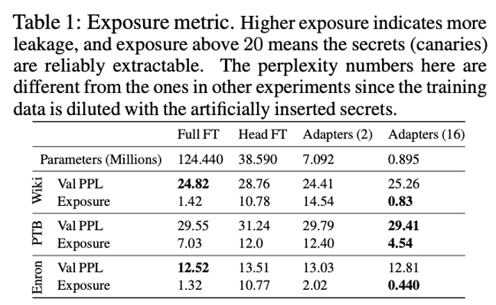

 Key Insight:   Exposure 라는 Metric을 도입하여 분석하였으며, 리소스가 적게 드는 효율적인 튜닝 방식이 보안적으로는 더 위험할 수 있음을 시사한다.

### 2) 2024/NeurIPS: Self-Prompt를 통한 정교한 공격
 Title:  Membership Inference Attacks against Fine-tuned Large language Models via Self-prompt Calibration

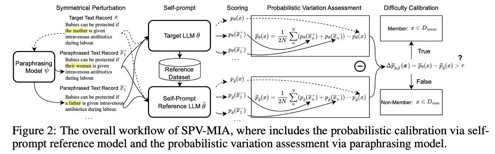
_Fu, Wenjie, et al. "Membership inference attacks against fine-tuned large language models via self-prompt calibration."_

Fine-tuning 데이터는 구하기 어렵기 때문에 Reference Model을 만들기 어렵다. 이 논문은 타겟 모델  스스로 Reference 데이터를 생성 하게 하는  SPV-MIA  기법을 제안했다.

*  Method: 
    1.   Self-Prompt Reference Calibration:  타겟 LLM에게 프롬프트를 주어 텍스트를 생성하게 한다. Fine-tuned 모델은 학습 데이터 분포를 반영하여 텍스트를 생성하므로, 이를 모아 Reference Model(Proxy)을 학습시킨다.
    2.   Probabilistic Variation (2계 도함수 활용): 
        * 단순히 확률값만 보는 것이 아니라, 해당 데이터가 확률 분포상  Local Maxima 에 위치하는지를 확인한다.
        * 이를 위해 입력 문장 $x$ 주위에 대칭적인 변형(Symmetrical Paraphrasing)을 가해 $x+h$, $x-h$를 만들고, $x$에서의 확률이 주변보다 급격히 떨어지는지(Curvature가 큰지)를 수학적으로 측정한다.
        * $$\text{Var}(x) \approx \mathcal{L}(x+h) + \mathcal{L}(x-h) - 2\mathcal{L}(x)$$ (2계 도함수의 중심 차분 근사)

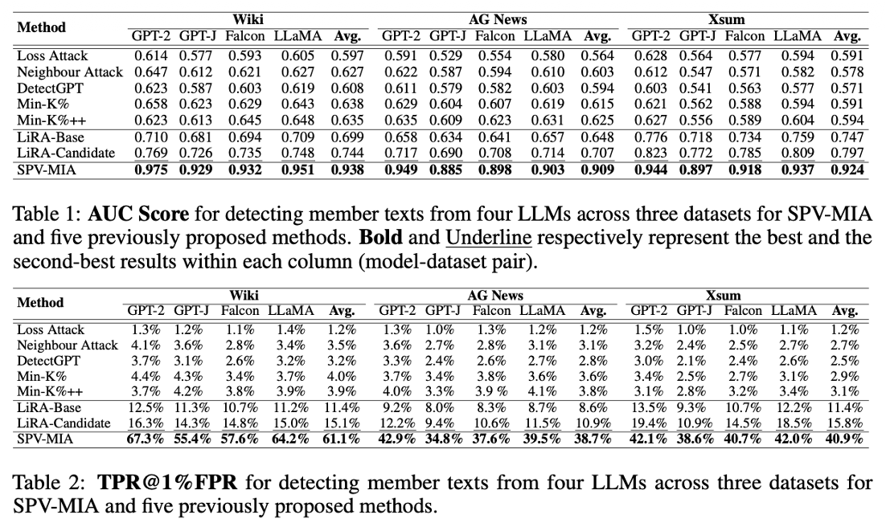

 Key Insight:  Neighbor Attack이 단순 휴리스틱이었다면, 이 논문은 이를 수학적(2계 도함수)으로 정당화하고, 데이터 부재 문제를 Self-Prompting으로 해결했다.

---

## 4. Summary & Discussion

지금까지 살펴본 LLM 대상 Membership Inference Attack의 흐름을 정리하면 다음과 같다.

### Summary Table

| Year | Conf. | Context | Motivation | Method | Key Idea |
|:---:|:---:|:---:|:---:|:---:|:---:|
| 2019 | SIGKDD | Pretrain | 텍스트 생성 모델 대상 기법 부재 |  Rank Metric  | 희소 단어의 순위 격차 활용 |
| 2021 | USENIX | Pretrain | 단순 Loss 기반의 높은 오탐률 |  Comparison Metrics  | Zlib, Small Model 등 다양한 참조 지표 활용 |
| 2023 | ACL | Pretrain | Reference Model 학습용 외부 데이터 부재 |  Neighbor Attack  | 이웃 문장 생성 및 비교 (Loss Gap) |
| 2024 | ICLR | Pretrain | 이웃 생성의 높은 계산 비용 |  Min-K% Prob  | 확률이 낮은 상위 k% 토큰(Outlier)만 평가 |
| 2022 | EMNLP | Finetune | Finetuning 기법별 위험도 분석 부재 |  Empirical Analysis  | Head FT가 Full FT보다 더 위험함 (Overfitting) |
| 2024 | NeurIPS | Finetune | Finetuning 데이터 확보의 어려움 |  SPV-MIA  | Self-prompt로 Ref 데이터 생성 + 2계 도함수 활용 |

### Discussion

LLM Privacy Attack의 연구 흐름은  "정교함(Calibration)" 과  "자립성(Independence)" 으로 요약할 수 있다.

1.   Metric의 고도화:  초기에는 단순한 Perplexity(PPL)를 사용했으나, 이는 문장의 일반적인 유창성에 영향을 많이 받았다. 
이후  Ratio-based (Reference Model 활용), Rank-based, Zlib Entropy 등으로 발전하며 모델의 '암기'와 '지식'을 구분하려 노력했다.
2.   Realistic Scenario:  초기에는 공격자가 데이터 분포를 알고 Reference Model을 학습시킬 수 있다고 가정했다. 하지만 최근 연구들(Neighbor, Min-K%, Self-Prompt)은  외부 데이터 없이(Data-free) , 혹은  모델 자체의 정보만을 활용 하여 공격을 수행하는 방향으로 나아가고 있다. 이는 공격자가 수행하기 훨씬 더 현실적이고 위협적인 시나리오이다.
3.   Fine-tuning의 위험성:  Pre-trained 모델보다 Fine-tuned 모델이 공격에 더 취약하며, 특히 파라미터 효율적인 학습 방법이 오히려 프라이버시에는 취약할 수 있다는 점은 향후 LLM 배포 전략 수립 시 반드시 고려해야 할 요소이다.

앞으로는 멀티모달(Vision-Language) 모델에 대한 MIA나, 방어 기법(Defense)과 결합된 연구들이 더욱 활발해질 것으로 예상된다.

---

추가로 읽었으면 좋았을 논문들
- 2021 - NIPS - Membership Inference Attacks against nlp classification models
- 2022 - ACL - Quantifying privacy risks of masked language models using mia
- 2023 - ICLR - Membership leakage in pretrained language models
- 2025 - ACL - Sampling-based pseudo-likelihood for mia
- 2025 - arxiv - Exposing privacy gaps-mia on preference data for llm alignment
