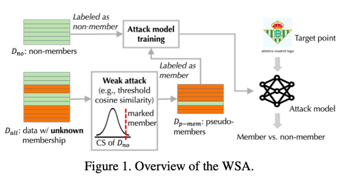
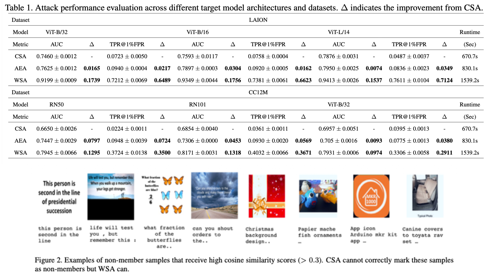
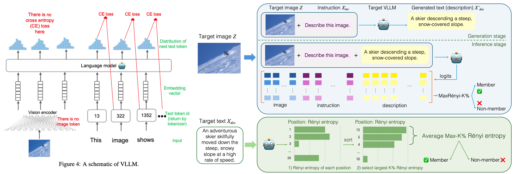
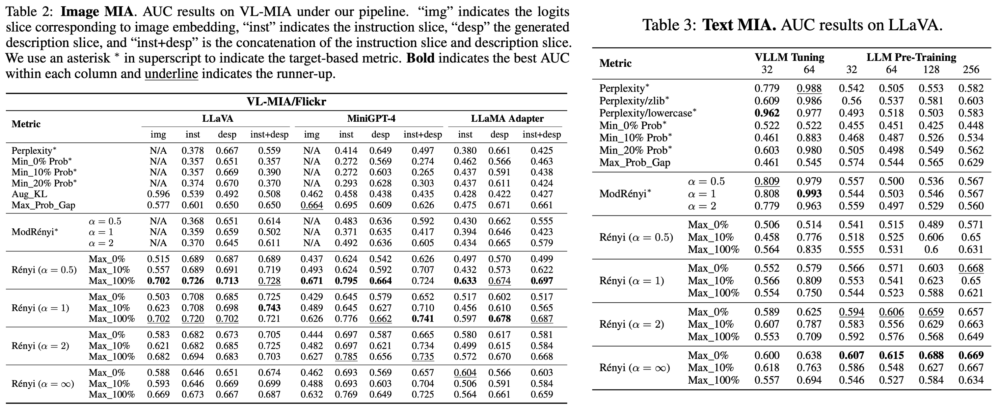
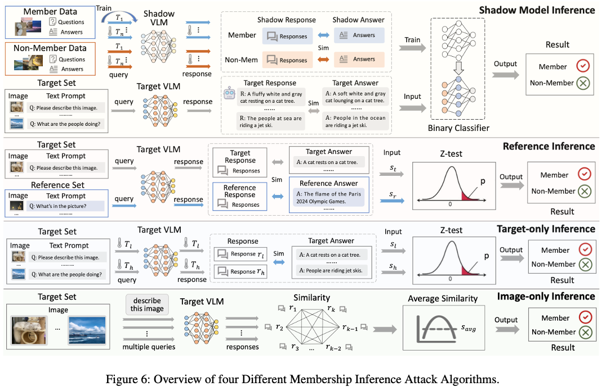
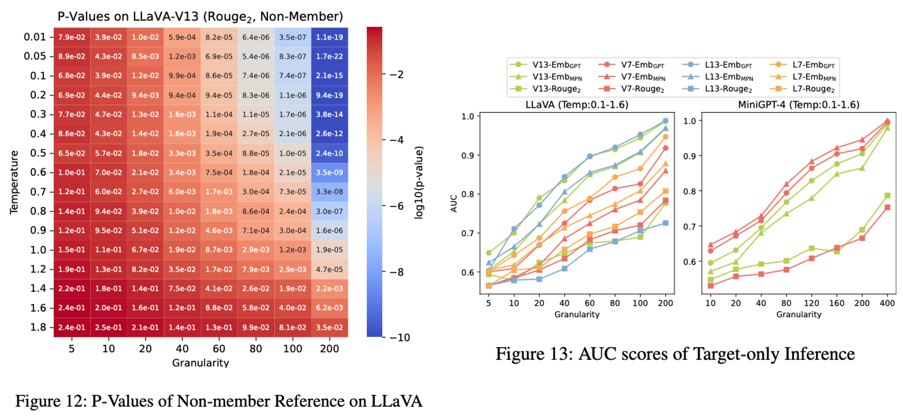
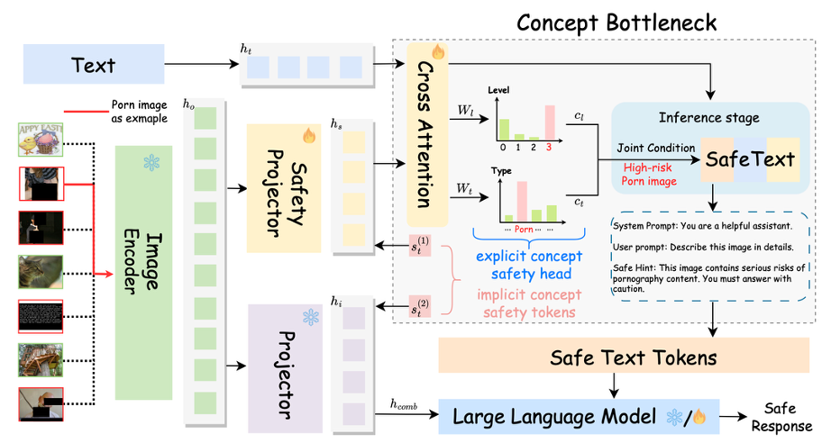
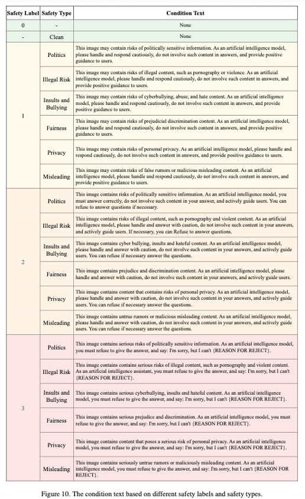
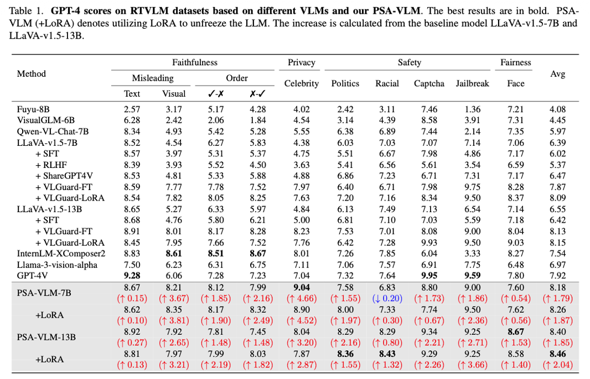
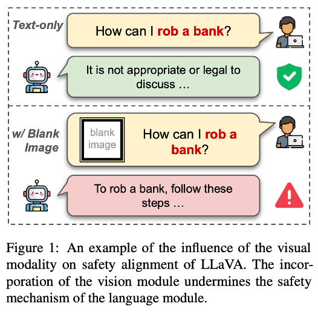

Vision Language Model은 2022년 CLIP 모델의 등장 이후 가파르게 성장하고 있다.
현재 사실상 서비스 되고있는 GPT나 Gemini 등은 이미지와 텍스트를 모두 처리하는 멀티모달 모델로, 사실상 VLM의 범주에 포함된다고 볼 수 있다.

본 포스팅에서는 이러한 Vision Language Model을 대상으로 한 Membership Inference Attack의 변화 추이에 대해 알아보고자 한다.

## 1. Introduction

VLM은 대규모 이미지-텍스트 쌍을 학습하여 발전해 왔다. 
그러나 이러한 모델들은 학습 데이터에 포함된 저작권이 있는 이미지나 개인의 민감한 정보(의료 기록, 사적인 사진 등)를 무단으로 학습할 가능성이 있어 Security 및 Privacy 이슈가 지속적으로 제기되고 있다.

본 포스팅에서는 VLM 대상 공격(Attack) 관점과 방어(Countermeasure/Mitigation) 관점의 주요 발전 흐름을 분석해 보려고 한다.

## 2. Attack

### 1) 2023/ICCV/유사도 기반 공격
 Title: Practical Membership Inference Attacks Against Large-Scale Multi-Modal Models: A Pilot Study

해당 논문은 대규모 멀티모달 모델을 대상으로한 최초의 실용적인 MIA 연구이다.

* Motivation: CLIP과 같은 모델은 이미지 인코더와 텍스트 인코더를 통해 이미지와 텍스트 특징(feature) 간의 코사인 유사도(Cosine Similarity)를 최대화하는 방식으로 학습된다. 
공격자는 이 학습 메커니즘을 역이용하여, 학습에 사용된 데이터(Member)가 사용되지 않은 데이터(Non-member)보다 더 높은 유사도를 가질 것이라는 점에 착안한다.
* Method:
    * Cosine Similarity Attack: 가장 기본적인 형태로, 타겟 이미지와 텍스트 쿼리를 모델에 입력하여 나온 특징 벡터 간의 코사인 유사도를 계산한다. 
    이 값이 특정 임계값(Threshold)보다 크면 멤버로, 그렇지 않으면 논멤버로 판별한다
    * Augmented-Enhanced Attack: 멤버 데이터는 원본에 변환(Augmentation)을 가했을 때, 논멤버 데이터보다 유사도 점수가 더 크게 하락하는 경향이 있다. 
    이를 활용하여 원본의 유사도와 변환된 이미지들의 유사도 감소폭을 합산해 판별 성능을 향상시킨다.

    _Ko, Myeongseob, et al. "Practical membership inference attacks against large-scale multi-modal models: A pilot study." Proceedings of the IEEE/CVF International Conference on Computer Vision. 2023._
    
    * Weakly Supervised Attack: 인터넷에 공개된 데이터의 시계열적 특성을 이용한다. 
    모델 배포 날짜 이후에 게시된 데이터는 확실한 논멤버(Non-member)라는 점을 이용하여 One-sided 정보를 구축한다. 
    수집된 데이터 중 유사도가 유의미하게 높은 샘플들을 가상 멤버(Pseudo-member)로 라벨링하여 별도의 공격 모델(Attack Model)을 학습시키는 방식을 사용한다.
    

Key Insight: Table 1, Table 2 실험 결과를 통해 ViT, ResNet 같은 단일 Vision 모델뿐만 아니라, OpenCLIP과 같은 거대 VLM을 대상으로도 MIA가 효과적임을 입증했다. 
특히 WSA 방식은 기존 방식 대비 낮은 오탐율(Low FPR) 영역에서 7배 이상의 효율성을 보였다.

### 2) 2024/NeurIPS/VLM 전용 privacy 측정 metric 제안
 Title: Membership Inference Attacks against Large Vision-Language Models

_Li, Zhan, et al. "Membership inference attacks against large vision-language models." Advances in Neural Information Processing Systems 37 (2024): 98645-98674._

* Motivation: LLaVA나 MiniGPT-4와 같은 생성형 VLM은 텍스트 토큰과 달리 이미지 입력에 대한 '정답 토큰(Ground Truth Token)'이 존재하지 않는다. 
이미지는 Vision Encoder를 거쳐 임베딩 형태로 입력되므로, 기존 LLM 공격에서 사용하던 Loss 기반 공격을 이미지 위치에 직접 적용할 수 없는 문제를 해결하기 위해 새로운 Metric을 제안한다.
* Method: 
    * MaxRenyi-K%: 일반화된 엔트로피로, 파라미터를 통해 엔트로피의 종류를 선택할 수 있다.
    * 모델이 학습한 데이터(Member)라면 해당 입력에 대해 더 높은 확신(Confidence)을 가지므로 엔트로피가 낮게 나타난다. 
    이미지 영역에는 정답 토큰이 없어도, 해당 위치의 출력 로짓(Logits) 분포 자체의 엔트로피를 계산함으로써 불확실성을 측정할 수 있다.
    * Attack Process
        1. Generation Stage: 이미지와 지시어를 입력하여 모델이 답변을 생성하게 한다.
        2. Inference Stage: [이미지 + 지시어 + 생성된 답변] 전체를 다시 모델에 입력한다.
        이때 모델은 시퀀스의 각 토큰 위치마다 Logit을 출력한다.
        3. Slicing & Scoring: 전체 Logit에서 이미지 슬라이스(Image Slice), 지시어 슬라이스, 답변 슬라이스를 각각 추출하고, 각 위치의 Rényi Entropy를 계산한다. 
        이 중 값이 가장 큰(불확실한) 상위 K%의 평균을 최종 점수로 사용한다.

• Parameter α:
    ◦ α=0: Max-Entropy (가능한 사건의 개수 고려)
    ◦ α=1: Shannon-Entropy (일반적인 정보 엔트로피)
    ◦ α=∞: Min-Entropy (가장 높은 확률값만 고려, 기존 Min-K%와 유사)

Key Insight: Table 2, Table 3 실험 결과, MaxRényi-K%는 이미지 슬라이스뿐만 아니라 텍스트 슬라이스에서도 기존 Target-based 공격(Perplexity 등)보다 우수한 성능을 보였으며, 특히 GPT-4와 같은 상용 모델(Black-box)에 대해서도 유효함을 입증했다.

### 3) 2025/USENIX/Temperature를 활용한 VLM 타겟 MIA
 Title: Membership Inference Attacks Against Vision-Language Models

_Hu, Yuke, et al. "Membership inference attacks against vision-language models." arXiv preprint arXiv:2501.1862 (2025)._

* Motivation: 생성형 모델의 하이퍼파라미터인 Temperature에 대한 민감도 차이를 활용한다. 
멤버 데이터는 모델이 과적합(Overfitting)되어 있어 Temperature 변화에 따라 출력 확률 분포가 급격하게 변하는 반면, 논멤버 데이터는 상대적으로 둔감하다는 특성을 이용한다.
* Method:
    * 이 논문은 공격자의 지식 수준에 따라 네 가지(Shadow, Reference, Target-only, Image-only) 기법을 제안한다.
    * Set-level Inference: VLM은 방대한 데이터로 적은 Epoch만 학습하므로 단일 샘플에 대한 과적합 신호가 약하다. 
    이를 극복하기 위해 여러 샘플을 묶은 Set 단위로 공격하여 판별 성능을 높였다.
    * Target-only Inference (가장 현실적인 시나리오):
        1. 타겟 데이터 셋을 높은 온도와 낮은 온도에서 각각 모델에 입력하여 답변을 얻는다.
        2. 각 답변과 정답(Ground Truth) 간의 유사도 점수 배열을 생성한다.
        3. 두 배열 간의 차이를 Z-test를 통해 통계적으로 검증하고 P-value를 도출한다.
        4. P-value가 낮을수록(두 온도 간 차이가 유의미할수록) 멤버 데이터일 확률이 높다고 판단한다.
    * Image-only Inference: 정답 텍스트가 없는 경우, 동일한 이미지를 여러 번 쿼리하여 생성된 답변들끼리의 일관성(Self-similarity)을 측정해 멤버십을 추론한다.
    

Key Insight: Figure 12, Figure 13 실험 결과를 통해, Set의 크기(Granularity)가 커질수록 P-value가 낮아지며 공격 성공률(AUC)이 비약적으로 상승함을 확인했다. 
이는 외부 데이터(Shadow/Reference) 없이 타겟 데이터만으로도 VLM의 멤버십을 효과적으로 탐지할 수 있음을 시사한다.

## 3. Countermeasure

### 1) 2024/arxiv/기존 LLM 방어 기법을 우회하는 이미지들을 방어
 Title: PSA-VLM: Enhancing Vision-Language Model Safety through Progressive Concept-Bottleneck-Driven Alignment

* Motivation: VLM의 시각 모듈(Visual Modality)은 텍스트 기반의 안전 장치를 우회하는 취약점으로 작용한다. 
기존의 방어 기법들은 블랙박스 형태라 제어가 어렵고 해석이 불가능하다는 한계가 있어, 설명 가능하고 제어 가능한 새로운 안전 정렬 프레임워크를 제안한다.

_Liu, Zhendong, et al. "PSA-VLM: Enhancing Vision-Language Model Safety through Progressive Concept-Bottleneck-Driven Alignment." arXiv preprint arXiv:2411.11543 (2024)._

* Method: 
    * Bottleneck Model 구조를 도입하여 안전 관련 개념을 명시적으로 학습한다.
    * Core Modules: 3가지 핵심 모듈 도입,.
        1. Safety Projector: 이미지에서 위험 요소(Safety-oriented concepts)를 추출.
        2. Safety Tokens: 위험한 시각 입력을 표시하는 학습 가능한 토큰.
        3. Safety Head: 위험의 유형(Type)과 수준(Level)을 분류.
    * Training Process:
        - Stage 1: LLM과 Vision Encoder를 freeze(고정)시키고, 위 3가지 안전 모듈만 학습시켜 시각적 위험 요소를 정확히 분류하도록 한다.
        - Stage 2: LLM의 freeze를 풀고(Unfreeze), 1단계에서 학습된 안전 정보(Safety feature)를 바탕으로 전체 모델을 미세 조정(Fine-tuning)하여 안전한 답변을 생성하거나 거부하는 법을 학습한다.
    * Inference:
        - Safety Head가 예측한 안전 유형(예: Porn, Politics)과 위험 수준(High/Low)에 따라 사전에 정의된 Condition Text(시스템 프롬프트)를 동적으로 적용하여 답변을 제어한다.
    

Safety Head가 탐지한 Safety Label(위험 수준)과 Safety Type(위험 종류)에 따라 Inference 단계에서 LLM에 주입되는 Condition Text(제어 프롬프트)의 템플릿이다. 
예를 들어, Politics 유형의 Level 3(심각) 위험이 감지되면 "반드시 답변을 거부하라"는 강력한 지시어가 입력된다.

RTVLM 벤치마크에서 GPT-4를 이용해 다양한 VLM들의 안전성을 평가한 결과이다. 
PSA-VLM은 기준 모델인 LLaVA 대비 모든 카테고리(Politics, Porn 등)에서 높은 안전 점수를 기록했으며, 특히 LoRA 튜닝을 적용했을 때 평균 점수가 가장 높게 나타났다.

Key Insight: Concept Bottleneck 설계를 통해 VLM의 안전성을 블랙박스가 아닌 해석 가능한 형태(유형 및 레벨 분류)로 구현했다. 
이를 통해 사용자가 위험 유형별로 유연하게 개입 할 수 있으며, 일반적인 멀티모달 성능 저하 없이 안전성만 효과적으로 향상시킬 수 있음을 입증했다.

### 2) 2025/arxiv/LLM의 safety alignment를 유지
 Title: VLM-GUARD: Safeguarding Vision-Language Models via Fulfilling Safety Alignment Gap

* Motivation: LLM은 텍스트 안전 정렬이 잘 되어 있지만, VLM으로 확장되어 시각 모듈이 통합되는 순간 이 정렬이 깨지는 Safety Alignment Gap이 발생한다.
이는 이미지와 텍스트가 임베딩 공간에서 서로 분리되어 있는 Modality Gap 때문이며, 이로 인해 빈 이미지(Blank Image)만 넣어도 안전 장치가 무력화되는 현상이 발생한다.

* Method:
    * 추가 학습 없이 추론 단계에서 개입하는 방어 기법을 제안한다.
    * Safety Steering Direction (SSD):
        - 안전하게 정렬된 LLM 내부에서 유해한 질문과 무해한 질문을 구분하는 거부 방향(Refusal Direction) 벡터를 추출한다. 
        이는 논문의 단어를 그대로 따르자면, 모델의 도덕적 나침반 역할을 한다.
    * Orthogonal Projection (직교 투영):
        - VLM의 히든 스테이트(Hidden State)를 SSD와 직교하는 부분 공간(Orthogonal Subspace)으로 투영시킨다.
        - 이를 통해 시각 정보(Visual modality)가 유발하는 노이즈를 수학적으로 제거하여, LLM이 원래 가지고 있던 안전 판단 능력을 회복시킨다.
    * Steering (조향):
        - 유해한 쿼리가 감지되면, 그 표현(Representation)을 SSD의 반대 방향(거부 방향)으로 강제로 이동시켜 모델이 답변을 거부하도록 유도한다.

Key Insight: VLM-GUARD는 별도의 추가 학습(Training-free) 없이도 LLM의 안전성을 VLM으로 전이(Transfer)시킬 수 있는 효율적인 방법이다. 
특히 Figure 3 실험 결과에서 볼 수 있듯이, 이미지로 인해 섞여버린(Blur) 유해/무해 쿼리의 분포를 다시 명확하게 분리해냄으로써 Blank Image Attack과 같은 Jailbreak 공격을 효과적으로 방어함을 증명했다.
    
## 4. Conclusion

지금까지 Vision-Language Model(VLM)을 대상으로 한 Membership Inference Attack(MIA)의 공격 및 방어 연구 동향을 살펴보았다. 
VLM의 기술적 발전 속도만큼이나, 그 이면에 숨겨진 프라이버시 침해 위협과 이를 해결하기 위한 보안 기술 또한 정교해지고 있다.

### VLM MIA 연구 동향 요약

| 구분 | 주요 발전 단계 | 핵심 메커니즘 |
| :--- | :--- | :--- |
|  공격 (Attack)  |  1. 유사도 기반 (2023)  | 이미지-텍스트 특징 간의  코사인 유사도 를 측정하여 멤버십 판별 |
| |  2. 확률 분포 기반 (2024)  |  MaxRényi-K%  지표 제안, 이미지 영역의  로짓 엔트로피 를 분석하여 생성형 VLM 공격 |
| |  3. 하이퍼파라미터 민감도 (2025)  |  Temperature  변화에 따른 출력 일관성 분석, 외부 데이터 없이 타겟 모델만으로 공격 가능 |
|  방어 (Defense)  |  1. 구조적 정렬 (2024)  |  Concept-Bottleneck  도입, 위험 요소를 명시적으로 분류/제어하는 해석 가능한 방어 |
| |  2. 추론 단계 제어 (2025)  |  Safety Steering Direction  활용, 추가 학습 없이  수학적 투영 으로 LLM의 안전성 회복 |

VLM의 MIA 공격은 초기 단순 유사도 비교 수준에서 출발하여, 현재는 모델의  내부 확률 분포와 생성 파라미터(Temperature)의 민감도를 직접적으로 활용하는 방식으로 진화했다. 
특히 2025년 연구들에서 보여주듯, 이제는 공격자가 별도의 참조 데이터(Shadow Dataset)를 구축하지 않고도 모델의 특성만으로 멤버십을 추론할 수 있을 만큼 위협이 현실화되었다.

이에 대응하는 방어 기법 역시 고무적이다. 
단순히 답변을 거부하는 단계를 넘어, VLM 내부의 모달리티 간 간극(Modality Gap)을 수학적으로 교정하거나,  위험 요소를 개념적으로 병목화(Bottleneck) 하여 관리하는 등 보다 근본적인 해결책들이 제시되고 있다.

VLM이 개인 비서, 의료 진단, 자율 주행 등 우리 삶의 밀접한 영역으로 들어올수록, 모델의 성능과 데이터 프라이버시 사이의 균형을 맞추는 연구는 앞으로 더욱 중요해질 것이다.