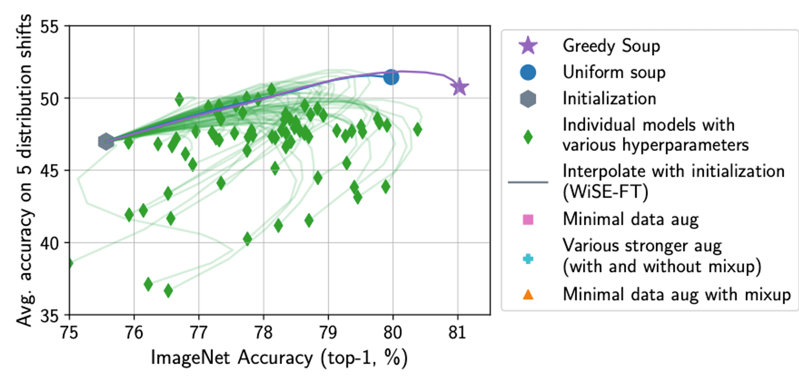
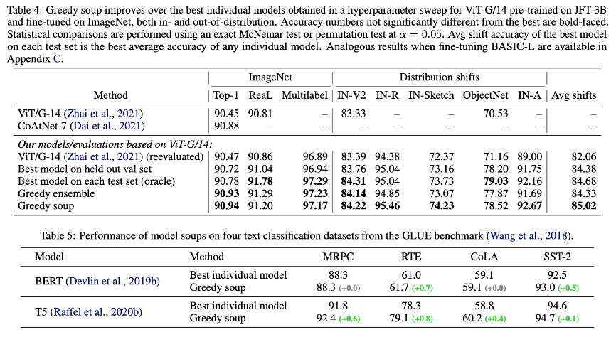
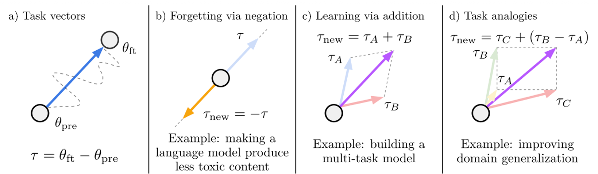
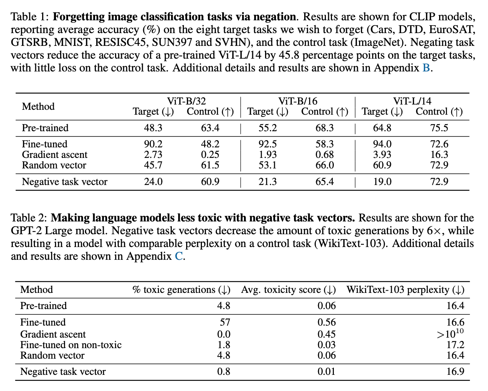
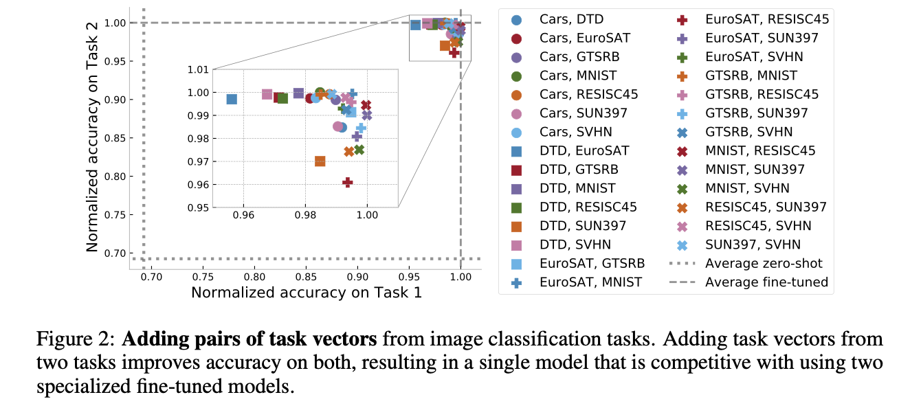
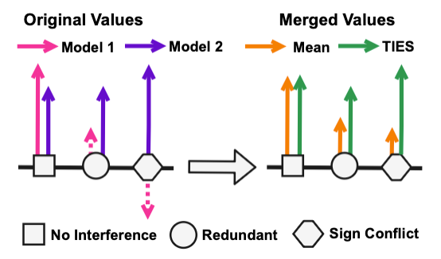
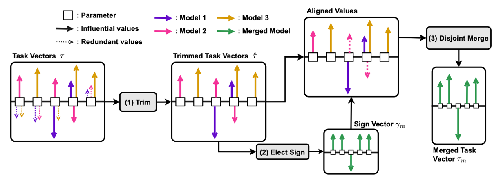
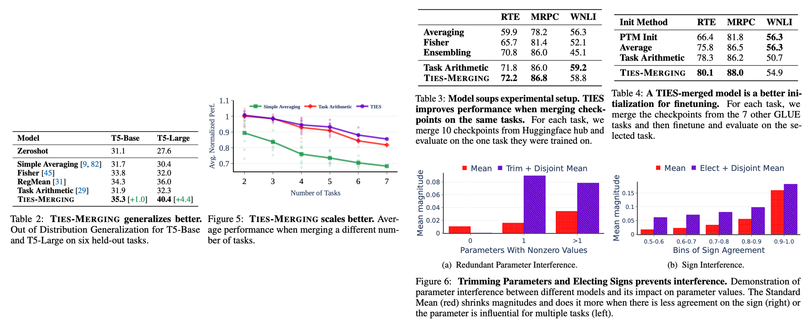
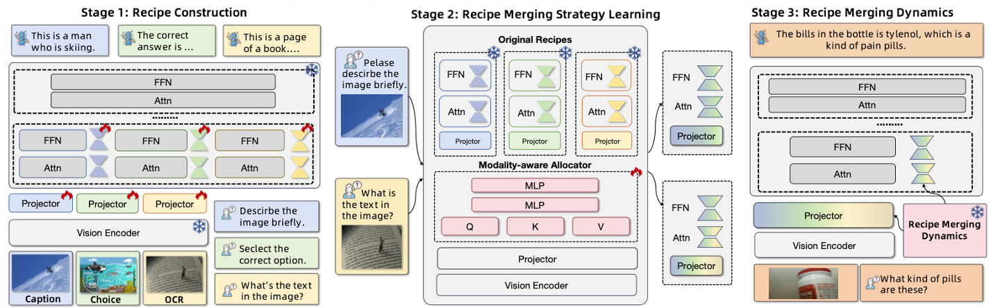
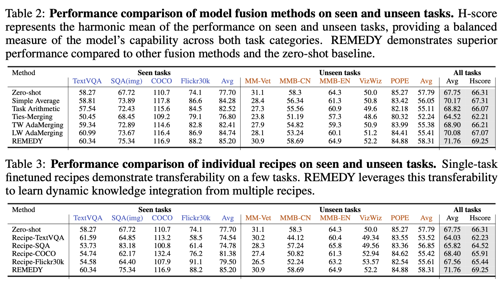

## 1. Introduction

최근 LLM(대규모 언어 모델)과 VLM(시각-언어 모델)은 수천억 개의 파라미터를 보유하며 놀라운 성능을 보여주고 있다. 그러나 이러한 거대 모델들을 매번 특정 태스크를 위해 전체 파인튜닝(Full Finetuning)하거나 모델마다 별도의 가중치를 유지하는 것은  컴퓨팅 자원과 저장 공간 측면에서 매우 비효율적 이다.

이를 해결하기 위해 등장한  Model Merging 은 별도의 추가 학습 없이, 이미 학습된 여러 모델의 가중치를 수학적으로 결합하여 새로운 능력을 갖춘 단일 모델을 만드는 기술이다. 본 포스팅에서는 단순 평균에서 시작해 최신 동적 병합 기법까지의 발전 과정과 머징이 가지는 태생적 취약점을 심층적으로 분석한다.

## 2. Model Merging Paper Review

### 1) 2022/PMLR/앙상블의 효율적 대안
> Title: Model soups: averaging weights of multiple fine-tuned models improves accuracy without increasing inference time

_Wortsman, Mitchell, et al. "Model soups: averaging weights of multiple fine-tuned models improves accuracy without increasing inference time." International conference on machine learning. PMLR, 2022._

전통적인 앙상블 기법은 $N$개의 모델 결과를 평균 내기 위해 추론 시 $N$배의 연산량을 요구한다.  
Model Soups 는 가중치 공간에서의 평균이 성능을 유지할 수 있다는 가설에서 출발했다.

*  Uniform Soup : 모든 체크포인트의 가중치를 단순 산술 평균($\frac{1}{N}\sum \theta_i$) 한다.
*  Greedy Soup : 성능 향상에 기여하는 모델만을 선택적으로 병합한다. 모델들을 성능 순으로 정렬한 뒤, 순차적으로 병합하며 검증셋 성능이 향상될 경우에만 해당 가중치를 유지하는 방식이다.
*  Key Insight : 하이퍼파라미터만 다른 동일 아키텍처 모델들은 동일한  Error Basin 에 위치한다. 따라서 가중치 평균은 개별 모델보다 더 평탄한(Flat) 최적점을 찾게 해주며, 이는 결과적으로 일반화 성능의 향상으로 이어진다.

- Table 4의 결과를 통해 greedy soup를 적용했을 때 하이퍼파라미터 튜닝으로 찾은 가장 성능 좋은 단일 모델보다 성능이 높음을 확인했다. 특히 학습 데이터와 분포가 다른 데이터에서도 성능이 크게 향상되었다.

- BERT나 T5 같은 언어 모델에도 적용해본 결과, Vision 모델과 마찬가지로 Greedy Soup이 단일 최고 모델보다 성능이 좋았다. 즉, 이 기법은 이미지뿐만 아니라 텍스트 모델(LLM)에서도 통하는 범용적인 방법임이 입증되었다.

결론적으로, Greedy Soup은 추론 비용을 늘리지 않으면서도 가장 강력하고 안정적인 단일 모델을 만들어내는 효과적인 기법임을 보였다.

### 2) 2023/ICLR/Task vector의 제안
> Title: Editing Models With Task Arithmetic

_Ilharco, Gabriel, et al. "Editing models with task arithmetic." arXiv preprint arXiv:2212.04089 (2022)._

이 논문은 모델의 학습된 상태를 하나의 '방향성 벡터'로 취급하는  Task Vector  개념을 제안했다.

*  정의 : $\tau = \theta_{ft} - \theta_{pre}$ (파인튜닝 모델 가중치에서 사전 학습 모델 가중치를 뺀 값)
*  주요 연산 :
    *  Addition : $\theta_{new} = \theta_{pre} + (\tau_1 + \tau_2)$. 서로 다른 두 가지 태스크 능력을 통합한다.
    *  Negation : $\theta_{new} = \theta_{pre} - \tau$. 모델 내의 특정 편향이나 원치 않는 지식을 제거(Editing)한다.
*  Key Insight: orthogonality, ensemble
    * Orthogonality: 서로 다른 태스크(예: MNIST와 EuroSAT)에서 추출된 태스크 벡터들은 고차원 파라미터 공간에서 거의 직교(Orthogonal)에 가까운 각도를 이룬다. 이는 여러 태스크 벡터를 더해도 서로의 지식을 파괴(Interference)하지 않고 독립적으로 기능할 수 있는 이유를 설명한다.
    * Ensemble: 태스크 벡터를 더하는 것은 수학적으로 개별 모델들의 출력(Logits)을 앙상블하는 것과 매우 유사한 효과를 낸다. 실험 결과, 태스크 벡터 병합 모델의 정확도는 앙상블 모델의 정확도와 상관계수 0.99의 높은 상관관계를 보였다.

* Negation (Unlearning): GPT-2 모델에서 유해한 문장 생성(Toxic generations)을 학습한 벡터를 빼줌으로써, 모델의 유창함(Fluency)은 유지한 채 유해성만 선택적으로 제거할 수 있었다.
* Addition (Multi-task): 8개의 서로 다른 이미지 분류 태스크 벡터를 모두 더했을 때, 단일 모델로 모든 태스크를 수행하면서도 개별 미세 조정 모델들과 경쟁력 있는 성능을 보였다.

결론적으로, Task Vector는 단순한 파라미터의 차이를 넘어, 벡터의 선형 결합(Linear Combination)만으로 모델의 지식을 편집(Editing), 결합, 그리고 유추할 수 있는 효율적인 방법론이다. 추론 비용 증가 없이 모델의 행동을 제어할 수 있다는 점이 가장 큰 강점이다.

### 3) 2023/NIPS/Task vector의 활용
> Title: Ties-Merging: Resolving Interference When Merging Models

_Yadav, Prateek, et al. "Ties-merging: Resolving interference when merging models." Advances in Neural Information Processing Systems 36 (2023): 7093-7115._

기존의 단순 평균(Averaging)이나 Task Vector 합산 방식은 모델 간의 간섭(Interference)을 고려하지 않아 성능 저하가 발생한다. 
이 논문은 간섭의 원인을 두 가지로 규명하고, 이를 해결하기 위해 태스크 벡터를 부호(Sign)와 크기(Magnitude)로 분해하여 처리하는 기법을 제안한다.
단순히 태스크 벡터들을 더할 때 발생하는 문제는 크게 두 가지로
- 불필요한 파라미터에 의한 간섭 (Interference from Redundant Parameters): 파인튜닝 시 많은 파라미터가 변경되지만, 실제 성능에 기여하는 영향력 있는(Influential) 파라미터는 소수이기 때문에 나머지 불필요한(Redundant) 값들이 합쳐지면서 중요한 신호를 희석시는 현상이 발생한다.
- 부호 불일치에 의한 간섭 (Interference from Sign Disagreement): 동일한 파라미터 위치에서 모델 A는 양(+)의 방향으로, 모델 B는 음(-)의 방향으로 업데이트될 수 있다. 이를 단순히 평균 내면 값이 0에 가까워져, 해당 파라미터가 가진 지식이 소멸된다.

여러 태스크 벡터를 단순히 합칠 경우, 특정 파라미터 위치에서 부호가 상충하여 성능이 상쇄되는 문제가 발생한다. TIES-Merging은 이를 3단계 프로세스로 해결한다.

1.   Trim : 각 벡터에서 절댓값이 작은 하위 파라미터를 0으로 초기화하여 노이즈와 중복성을 제거한다.
2.   Elect : 파라미터별로 각 모델이 가진 부호의 합을 구해, 가장 영향력 있는  지배적 부호(Majority Sign) 를 결정한다.
3.   Disjoint Merge : 결정된 부호와 일치하는 파라미터 값들만을 추출하여 산술 평균한다. 부호가 반대인 값들을 배제함으로써 정보의 충돌을 방지한다.

- OOD 일반화 성능: TIES-Merging은 기존의 Task Arithmetic이나 Fisher Merging보다 분포 외 데이터(Out-of-Distribution)에서의 일반화 성능이 월등히 뛰어남을 보였다.
- 유효성: Vision(ViT)과 NLP(T5) 등 다양한 모달리티와 모델 크기에서 일관되게 가장 우수한 성능을 보였으며, 검증 데이터셋(Validation set)이 없는 환경에서도 강력한 성능을 발휘함을 보였다.

결론적으로, TIES-Merging은 태스크 벡터를 단순히 더하는 것이 아니라, 중요한 것만 남기고(Trim), 대세를 따르되(Elect), 방해꾼은 배제한다(Disjoint Merge)는 원칙을 통해 모델 병합 시의 정보 손실을 최소화한 기법이다.

### 4) 2025/ICLR/Zero shot 성능 향상 (Unseen task에도 뛰어난 적응력을 보임)
> Title: Remedy: Recipe merging dynamics in large vision language models

_Zhu, Didi, et al. "Remedy: Recipe merging dynamics in large vision-language models." The Thirteenth International Conference on Learning Representations. 2025._

기존의 머징이 정적(Static) 방식이었다면, REMEDY는 입력 데이터의 특성에 따라 실시간으로 병합 비율을 조절하는  Dynamic Merging 을 지향한다.

* Modality-Aware Allocator: 원샷(One-shot) 가중치 생성
단순히 입력 특징을 분석하는 것을 넘어, REMEDY의 할당기(Allocator)는 기존 MoE(Mixture-of-Experts) 라우터와 차별화된 방식을 사용힌다.
- 토큰 이해 및 관계 분석: 셀프 어텐션(Self-Attention)을 통해 이미지와 텍스트 토큰 간의 상호 연관성을 포착하고, 입력 데이터가 어떤 기존 태스크(Recipe)와 유사한지 분석한다.
- 글로벌 원샷 할당 (One-shot Global Allocation): 토큰마다 혹은 레이어마다 다른 라우팅을 수행하는 기존 방식과 달리, 입력 시퀀스 전체에 대해 단 하나의 최적화된 가중치 세트(γ)를 생성하여 모델 전체 레이어에 일괄 적용한다. 이는 연산 효율성을 높일 뿐만 아니라, 입력 데이터의 문맥(Context)을 전역적으로 반영하게 해준다.
- 퓨샷(Few-shot) 학습: 전체 데이터가 아닌, 각 태스크별로 약 1,000개(1~5%)의 샘플만으로 할당기를 학습시켜도 충분한 성능을 보여준다.

* 효율적인 레시피 구성 (Recipe Construction): Projector + Shallow LLM Layers
REMEDY는 "무엇을 병합할 것인가?"에 대해 방대한 실험을 통해 최적의 조합(Recipe)을 찾아냈다.
- Shallow Layers 집중: 실험 결과, LLM의 깊은 레이어(Deep layers)까지 튜닝하면 모델이 단순히 답변 스타일만 모방하거나 환각(Hallucination)을 일으키는 문제가 발생했지만, 초기 2개의 얕은 레이어(Shallow layers)만 튜닝했을 때 시각적 정보와 텍스트 간의 정렬(Alignment)이 가장 효과적이었다.
- Projector의 필수성: 시각 정보를 언어 공간으로 변환하는 Projector를 포함하지 않으면 시각적 인지 능력이 급격히 저하됨을 확인했습니다. 따라서 REMEDY의 레시피는 [Projector + LLM의 첫 2개 레이어(LoRA)]로 정의된다.

REMEDY는 학습하지 않은 태스크(Unseen Task)에서도 단순 평균이나 정적 머징보다 뛰어난 성능을 보인다.
- 지식 전이 (Knowledge Transfer): 할당기가 입력 데이터의 특성을 보고, 관련된 '본 적 있는 태스크(Seen Task)'의 지식을 끌어옵니다. 예를 들어, 시각 장애인을 위한 VQA 태스크인 VizWiz(Unseen)를 처리할 때, 이미지 캡셔닝 태스크인 Flickr30k(Seen)의 레시피 가중치를 높게 할당하여 시각적 이해 능력을 전이시킨다.
- 성능 우위: 결과적으로 REMEDY는 MM-Bench, VizWiz 등의 Unseen 벤치마크에서 기존의 TIES-Merging이나 AdaMerging을 능가하는 H-score(Seen과 Unseen 성능의 조화 평균) 69.25를 기록했다.

결론적으로, REMEDY는 "얕은 레이어와 프로젝터"라는 가볍고 효율적인 모듈(Recipe)을 정의하고, 이를 입력 문맥에 맞춰 "한 번에 동적으로 섞는(One-shot Allocator)" 기술을 통해, 멀티모달 환경에서의 머징 효율성과 제로샷 일반화 성능을 동시에 잡은 연구이다.

### 5) Advanced Merging Techniques
기본적인 벡터 연산을 넘어, 병합 과정을 자동화하거나 효율성을 극대화하는 기법들이 2024년에 대거 등장하였다.
- AdaMerging (2024/ICLR): 기존의 병합 방식이 하이퍼파라미터(병합 계수) 설정에 민감하다는 문제를 해결하기 위해 제안되었다. AdaMerging은 정답 레이블이 없는 테스트 데이터(Unlabeled Test Data)만으로도 최적의 병합 비율(Coefficient)을 자동으로 학습한다. 구체적으로는, 모델의 예측 분포가 갖는 엔트로피(Entropy)를 최소화하는 것을 대리 목적 함수(Surrogate Objective)로 사용하여, 태스크별(Task-wise) 혹은 레이어별(Layer-wise)로 계수를 스스로 조정해 성능을 최적화한다.
- DARE (Drop And REscale, 2024/ICML): 모델 파라미터의 중복성(Redundancy)을 활용하여 효율을 높인 기법이다. DARE는 미세 조정된 파라미터(Delta parameter) 중 대부분(예: 90% 이상)을 무작위로 제거(Drop)하여 0으로 만들고, 남은 파라미터들의 크기를 재조정(Rescale)하여 합치는 방식을 취한다. 이는 모델을 희소화(Sparsification)하여 파라미터 간의 간섭을 줄이는 전략으로, 주로 TIES 기법과 결합하여 Dare-TIES 형태로 사용될 때 우수한 성능을 보인다.

이 외에도 파라미터의 중요도를 Fisher Information으로 측정하는 Fisher Merging, 모델 내부 표현의 편향을 교정하는 Representation Surgery, 그리고 최근에는 레이어 단위로 모델을 교차 결합하는 Layer Swapping 등 다양한 기법들이 활발히 연구되고 있다.

## 3. Merging vulnerability & Privacy risks

모델 머징 기법의 확산은 성능 향상이라는 이점과 동시에 새로운 보안 위협과 프라이버시 문제를 야기하고 있다. 최근 연구들은 머징 과정에서 발생할 수 있는 공격 전이성뿐만 아니라, 이를 방어하기 위한 '삭제(Unlearning)' 기법으로서의 머징 가능성도 함께 탐구하고 있다.

### 1) Backdoor 및 Hijacking (BadMerging / Merge Hijacking)

공격자가 특정 트리거에 반응하는 백도어 모델을 배포할 경우, 사용자가 이를 자신의 모델과 머징하는 과정에서 백도어 공격의 전이성이 발생한다.
- 위협의 실재: 최신 LVLM 머징 연구인 REMEDY는 관련 연구 조사를 통해, 다중 모델 머징 시 백도어 효과(Backdoor effect)를 완화하거나 안전성(Safety)과 유용성(Helpfulness) 사이의 균형을 맞추는 것이 시급한 과제임을 명시하고 있다.
- 방어 기제로서의 머징: 역으로, Task Vector 연구는 '부정 연산(Negation)'을 통해 모델이 학습한 특정 유해 행동이나 편향을 제거할 수 있음을 보여준다. 예를 들어, 유해한 텍스트 생성을 유도하는 데이터로 학습된 태스크 벡터를 원래 모델에서 빼줌으로써(Negating), 제어 태스크(Control task)의 성능 저하 없이 독성 생성물(Toxic generations)을 줄일 수 있다.

### 2) Safety Alignment 무력화 및 파국적 망각 (Catastrophic Forgetting)
Llama-3와 같이 고도로 정렬(Alignment)된 모델이라도, 안전 가이드라인이 제거된 모델과 머징될 경우 기존의 가드레일이 쉽게 무너질 수 있다.
- 정렬 손상: MIA-Tuner 논문은 정렬된(Aligned) LLM을 미세 조정(Fine-tuning)하는 과정에서, 사용자가 의도하지 않더라도 안전 정렬(Safety Alignment)이 손상될 수 있음을 지적한다. 모델 머징이 기본적으로 미세 조정된 모델들의 가중치를 결합하는 과정임을 고려할 때, 이는 머징된 모델의 안전성을 보장하기 어렵게 만드는 요인이 된다.
- 기억의 희석: 또한, 정렬을 위한 추가 학습은 사전 학습 데이터에 대한 '기억의 흔적(Memorization trails)'을 희석시키는 Catastrophic Forgetting을 유발할 수 있다. 이는 모델이 원래 가지고 있던 지식을 잃어버리게 하거나, 반대로 머징 과정에서 의도치 않게 비공개 학습 데이터의 정보가 복원되어 프라이버시 침해로 이어질 수 있는 양날의 검으로 작용한다.

### 3) 프라이버시와 멤버십 추론 (Privacy & Membership Inference)
모델 머징은 개별 모델들이 가진 학습 데이터의 정보를 파라미터 공간에서 통합하므로, 머징된 모델에 포함된 데이터의 프라이버시를 식별하는 것이 중요하다.
- 탐지의 어려움: MIA-Tuner는 LLM의 파라미터 규모가 커질수록 더 많은 데이터를 암기하며, 이를 탐지 알고리즘으로 식별해 낼 수 있음을 보였다. 머징된 모델은 여러 소스의 지식이 혼합되어 있어, 특정 데이터가 훈련에 사용되었는지(Membership Inference) 판별하기가 단일 모델보다 더 복잡하다. 향후 머징 연구는 이러한 프라이버시 누출 가능성을 검증하는 체계를 반드시 포함해야 한다.

## 4. Conclusion

Model Merging은  '학습 없이 성능을 향상시키는 도구' 로서 거대 모델 시대의 핵심 기술로 자리 잡았다. 
단순 가중치 평균에서 시작해 벡터 연산과 동적 할당으로 진화해 온 과정은 모델 효율성 측면에서 큰 진보를 의미한다.

추가적으로, 모델 머징은 단순한 성능 향상을 넘어 거대 모델의 내부 작동 원리를 파헤치는 도구로도 활용되고 있다. 
"Bring Reason to Vision" 연구는 모델 머징을 통해 VLM의 초기 레이어는 인식(Perception)을, 후반 레이어는 추론(Reasoning)을 담당한다는 기능적 분리를 규명해 냈다. 
이는 머징이 블랙박스 모델의 내부 메커니즘을 이해하는 해석 가능성(Interpretability) 연구로 확장될 수 있음을 시사한다.

결론적으로, 파라미터 간의 상충 문제(Interference) 해결과 머징을 통한 공격 전이성(Vulnerability) 방어는 여전히 해결해야 할 핵심 과제이다. 
향후 연구는 단순히 성능(Accuracy)을 높이는 것을 넘어, REMEDY가 보여준 것과 같은 효율적인 모듈화(Recipe), MIA-Tuner가 제시한 프라이버시 검증, 그리고 Task Vector의 삭제(Unlearning) 기능을 통합하여, '안전하고(Secure), 효율적이며(Efficient), 설명 가능한(Interpretable)' 머징 프레임워크를 구축하는 방향으로 나아가야 한다.